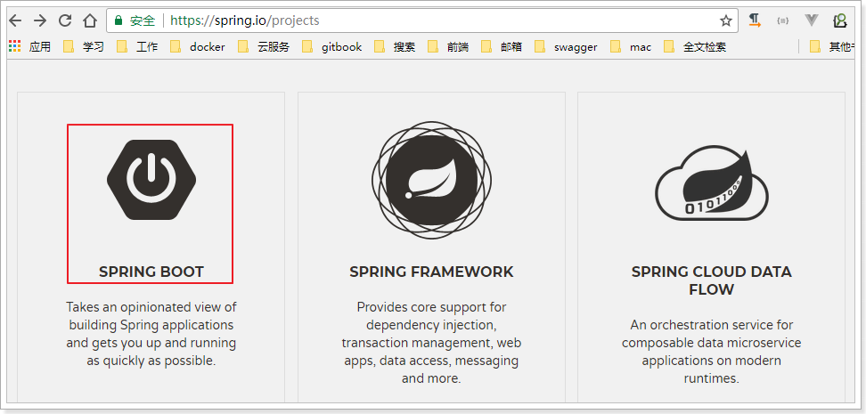

# 0.学习目标

- 了解SpringBoot的作用
- 掌握java配置的方式
- 了解SpringBoot自动配置原理
- 掌握SpringBoot的基本使用
- 了解Thymeleaf的基本使用


# 1. 了解SpringBoot

在这一部分，我们主要了解以下3个问题：

- 什么是SpringBoot
- 为什么要学习SpringBoot
- SpringBoot的特点

## 1.1.什么是SpringBoot

SpringBoot是Spring项目中的一个子工程，与我们所熟知的Spring-framework 同属于spring的产品:



我们可以看到下面的一段介绍：

> Takes an opinionated view of building production-ready Spring applications. Spring Boot favors convention over configuration and is designed to get you up and running as quickly as possible.

翻译一下：

> 用一些固定的方式来构建生产级别的spring应用。Spring Boot 推崇约定大于配置的方式以便于你能够尽可能快速的启动并运行程序。

其实人们把Spring Boot 称为搭建程序的`脚手架`。其最主要作用就是帮我们快速的构建庞大的spring项目，并且尽可能的减少一切xml配置，做到开箱即用，迅速上手，让我们关注与业务而非配置。


## 1.2.为什么要学习SpringBoot

java一直被人诟病的一点就是臃肿、麻烦。当我们还在辛苦的搭建项目时，可能Python程序员已经把功能写好了，究其原因注意是两点：

- 复杂的配置，

  项目各种配置其实是开发时的损耗， 因为在思考 Spring 特性配置和解决业务问题之间需要进行思维切换，所以写配置挤占了写应用程序逻辑的时间。

- 一个是混乱的依赖管理。

  项目的依赖管理也是件吃力不讨好的事情。决定项目里要用哪些库就已经够让人头痛的了，你还要知道这些库的哪个版本和其他库不会有冲突，这难题实在太棘手。并且，依赖管理也是一种损耗，添加依赖不是写应用程序代码。一旦选错了依赖的版本，随之而来的不兼容问题毫无疑问会是生产力杀手。


而SpringBoot让这一切成为过去！

> Spring Boot 简化了基于Spring的应用开发，只需要“run”就能创建一个独立的、生产级别的Spring应用。Spring Boot为Spring平台及第三方库提供开箱即用的设置（提供默认设置，存放默认配置的包就是启动器），这样我们就可以简单的开始。多数Spring Boot应用只需要很少的Spring配置。

我们可以使用SpringBoot创建java应用，并使用java –jar 启动它，就能得到一个生产级别的web工程。

## 1.3.SpringBoot的特点

Spring Boot 主要目标是：

- 为所有 Spring 的开发者提供一个非常快速的、广泛接受的入门体验
- 开箱即用（启动器starter-其实就是SpringBoot提供的一个jar包），但通过自己设置参数（.properties），即可快速摆脱这种方式。
-  提供了一些大型项目中常见的非功能性特性，如内嵌服务器、安全、指标，健康检测、外部化配置等
- 绝对没有代码生成，也无需 XML 配置。

更多细节，大家可以到[官网](http://projects.spring.io/spring-boot/)查看。


# 2.快速入门

接下来，我们就来利用SpringBoot搭建一个web工程，体会一下SpringBoot的魅力所在！

## 2.1.创建工程

我们先新建一个空的工程：


工程名为demo：

 

新建一个model：

 

使用maven来构建：


然后填写项目坐标：

 

目录结构：

 

项目结构：

 

## 2.2.添加依赖

看到这里很多同学会有疑惑，前面说传统开发的问题之一就是依赖管理混乱，怎么这里我们还需要管理依赖呢？难道SpringBoot不帮我们管理吗？

别着急，现在我们的项目与SpringBoot还没有什么关联。SpringBoot提供了一个名为spring-boot-starter-parent的工程，里面已经对各种常用依赖（并非全部）的版本进行了管理，我们的项目需要以这个项目为父工程，这样我们就不用操心依赖的版本问题了，需要什么依赖，直接引入坐标即可！

### 2.2.1.添加父工程坐标

```xml
    <parent>
        <groupId>org.springframework.boot</groupId>
        <artifactId>spring-boot-starter-parent</artifactId>
        <version>2.0.0.RELEASE</version>
    </parent>
```

### 2.2.2.添加web启动器

为了让SpringBoot帮我们完成各种自动配置，我们必须引入SpringBoot提供的自动配置依赖，我们称为`启动器`。因为我们是web项目，这里我们引入web启动器：

```xml
    <dependencies>
        <dependency>
            <groupId>org.springframework.boot</groupId>
            <artifactId>spring-boot-starter-web</artifactId>
        </dependency>
    </dependencies>
```

需要注意的是，我们并没有在这里指定版本信息。因为SpringBoot的父工程已经对版本进行了管理了。

这个时候，我们会发现项目中多出了大量的依赖：

 

这些都是SpringBoot根据spring-boot-starter-web这个依赖自动引入的，而且所有的版本都已经管理好，不会出现冲突。

### 2.2.3.管理jdk版本

默认情况下，maven工程的jdk版本是1.5，而我们开发使用的是1.8，因此这里我们需要修改jdk版本，只需要简单的添加以下属性即可：

```xml
    <properties>
        <java.version>1.8</java.version>
    </properties>
```

### 2.2.4.完整pom

```xml
<?xml version="1.0" encoding="UTF-8"?>
<project xmlns="http://maven.apache.org/POM/4.0.0"
         xmlns:xsi="http://www.w3.org/2001/XMLSchema-instance"
         xsi:schemaLocation="http://maven.apache.org/POM/4.0.0 http://maven.apache.org/xsd/maven-4.0.0.xsd">
    <modelVersion>4.0.0</modelVersion>

    <groupId>com.leyou.demo</groupId>
    <artifactId>springboot-demo</artifactId>
    <version>1.0-SNAPSHOT</version>

    <properties>
        <java.version>1.8</java.version>
    </properties>

    <parent>
        <groupId>org.springframework.boot</groupId>
        <artifactId>spring-boot-starter-parent</artifactId>
        <version>2.0.0.RELEASE</version>
    </parent>

    <dependencies>
        <dependency>
            <groupId>org.springframework.boot</groupId>
            <artifactId>spring-boot-starter-web</artifactId>
        </dependency>
    </dependencies>
</project>
```


## 2.3.启动类

Spring Boot项目通过main函数即可启动，我们需要创建一个启动类：

 

然后编写main函数：

```java
@SpringBootApplication
public class Application {
    public static void main(String[] args) {
        SpringApplication.run(Application.class, args);
    }
}
```

## 2.4.编写controller

接下来，我们就可以像以前那样开发SpringMVC的项目了！

我们编写一个controller：

 

代码：

```java
@RestController
public class HelloController {

    @GetMapping("hello")
    public String hello(){
        return "hello, spring boot!";
    }
}

```

## 2.5.启动测试

接下来，我们运行main函数，查看控制台：

 

并且可以看到监听的端口信息：

 

- 1）监听的端口是8080
- 2）SpringMVC的映射路径是：/
- 3）`/hello`路径已经映射到了`HelloController`中的`hello()`方法

打开页面访问：http://localhost:8080/hello

 


测试成功了！

# 3.Java配置

在入门案例中，我们没有任何的配置，就可以实现一个SpringMVC的项目了，快速、高效！

但是有同学会有疑问，如果没有任何的xml，那么我们如果要配置一个Bean该怎么办？比如我们要配置一个数据库连接池，以前会这么玩：

```xml
<!-- 配置连接池 -->
<bean id="dataSource" class="com.alibaba.druid.pool.DruidDataSource"
      init-method="init" destroy-method="close">
    <property name="url" value="${jdbc.url}" />
    <property name="username" value="${jdbc.username}" />
    <property name="password" value="${jdbc.password}" />
</bean>
```

现在该怎么做呢？


## 3.1.回顾历史

事实上，在Spring3.0开始，Spring官方就已经开始推荐使用java配置来代替传统的xml配置了，我们不妨来回顾一下Spring的历史：

- Spring1.0时代

  在此时因为jdk1.5刚刚出来，注解开发并未盛行，因此一切Spring配置都是xml格式，想象一下所有的bean都用xml配置，细思极恐啊，心疼那个时候的程序员2秒

- Spring2.0时代

  Spring引入了注解开发，但是因为并不完善，因此并未完全替代xml，此时的程序员往往是把xml与注解进行结合，貌似我们之前都是这种方式。

- Spring3.0及以后

  3.0以后Spring的注解已经非常完善了，因此Spring推荐大家使用完全的java配置来代替以前的xml，不过似乎在国内并未推广盛行。然后当SpringBoot来临，人们才慢慢认识到java配置的优雅。

有句古话说的好：拥抱变化，拥抱未来。所以我们也应该顺应时代潮流，做时尚的弄潮儿，一起来学习下java配置的玩法。

## 3.2.尝试java配置

java配置主要靠java类和一些注解，比较常用的注解有：

- `@Configuration`：声明一个类作为配置类，代替xml文件
- `@Bean`：声明在方法上，将方法的返回值加入Bean容器，代替`<bean>`标签
- `@value`：属性注入
- `@PropertySource`：指定外部属性文件，

我们接下来用java配置来尝试实现连接池配置：

首先引入Druid连接池依赖：

```xml
<dependency>
    <groupId>com.alibaba</groupId>
    <artifactId>druid</artifactId>
    <version>1.1.6</version>
</dependency>
```

创建一个jdbc.properties文件，编写jdbc属性：

```properties
jdbc.driverClassName=com.mysql.jdbc.Driver
jdbc.url=jdbc:mysql://127.0.0.1:3306/leyou
jdbc.username=root
jdbc.password=123
```

然后编写代码：

```java
@Configuration
@PropertySource("classpath:jdbc.properties")
public class JdbcConfig {

    @Value("${jdbc.url}")
    String url;
    @Value("${jdbc.driverClassName}")
    String driverClassName;
    @Value("${jdbc.username}")
    String username;
    @Value("${jdbc.password}")
    String password;

    @Bean
    public DataSource dataSource() {
        DruidDataSource dataSource = new DruidDataSource();
        dataSource.setUrl(url);
        dataSource.setDriverClassName(driverClassName);
        dataSource.setUsername(username);
        dataSource.setPassword(password);
        return dataSource;
    }
}
```

解读：

- `@Configuration`：声明我们`JdbcConfig`是一个配置类
- `@PropertySource`：指定属性文件的路径是:`classpath:jdbc.properties`
- 通过`@Value`为属性注入值
- 通过@Bean将 `dataSource()`方法声明为一个注册Bean的方法，Spring会自动调用该方法，将方法的返回值加入Spring容器中。

然后我们就可以在任意位置通过`@Autowired`注入DataSource了！


我们在`HelloController`中测试：

```java
@RestController
public class HelloController {

    @Autowired
    private DataSource dataSource;

    @GetMapping("hello")
    public String hello() {
        return "hello, spring boot!" + dataSource;
    }
}
```

然后Debug运行并查看：


属性注入成功了！


## 3.3.SpringBoot的属性注入

在上面的案例中，我们实验了java配置方式。不过属性注入使用的是@Value注解。这种方式虽然可行，但是不够强大，因为它只能注入基本类型值。

在SpringBoot中，提供了一种新的属性注入方式，支持各种java基本数据类型及复杂类型的注入。

1）我们新建一个类，用来进行属性注入：

```java
@ConfigurationProperties(prefix = "jdbc")
public class JdbcProperties {
    private String url;
    private String driverClassName;
    private String username;
    private String password;
    // ... 略
    // getters 和 setters
}

```

- 在类上通过@ConfigurationProperties注解声明当前类为属性读取类

- `prefix="jdbc"`读取属性文件中，前缀为jdbc的值。

- 在类上定义各个属性，名称必须与属性文件中`jdbc.`后面部分一致

- 需要注意的是，这里我们并没有指定属性文件的地址，所以我们需要把jdbc.properties名称改为application.properties，这是SpringBoot默认读取的属性文件名：

   

2）在JdbcConfig中使用这个属性：

```java
@Configuration
@EnableConfigurationProperties(JdbcProperties.class)
public class JdbcConfig {

    @Bean
    public DataSource dataSource(JdbcProperties jdbc) {
        DruidDataSource dataSource = new DruidDataSource();
        dataSource.setUrl(jdbc.getUrl());
        dataSource.setDriverClassName(jdbc.getDriverClassName());
        dataSource.setUsername(jdbc.getUsername());
        dataSource.setPassword(jdbc.getPassword());
        return dataSource;
    }
}
```

- 通过`@EnableConfigurationProperties(JdbcProperties.class)`来声明要使用`JdbcProperties`这个类的对象

- 然后你可以通过以下方式注入JdbcProperties：

  - @Autowired注入

    ```java
    @Autowired
    private JdbcProperties prop;
    ```

  - 构造函数注入

    ```java
    private JdbcProperties prop;
    public JdbcConfig(Jdbcproperties prop){
        this.prop = prop;
    }
    ```

  - 声明有@Bean的方法参数注入

    ```java
    @Bean
    public Datasource dataSource(JdbcProperties prop){
        // ...
    }
    ```

本例中，我们采用第三种方式。

3）测试结果：


大家会觉得这种方式似乎更麻烦了，事实上这种方式有更强大的功能，也是SpringBoot推荐的注入方式。两者对比关系：


优势：

- Relaxed binding：松散绑定

  - 不严格要求属性文件中的属性名与成员变量名一致。支持驼峰，中划线，下划线等等转换，甚至支持对象引导。比如：user.friend.name：代表的是user对象中的friend属性中的name属性，显然friend也是对象。@value注解就难以完成这样的注入方式。

  - meta-data support：元数据支持，帮助IDE生成属性提示（写开源框架会用到）。

    ​

## 3.4、更优雅的注入

事实上，如果一段属性只有一个Bean需要使用，我们无需将其注入到一个类（JdbcProperties）中。而是直接在需要的地方声明即可：

```java
@Configuration
public class JdbcConfig {
    
    @Bean
    // 声明要注入的属性前缀，SpringBoot会自动把相关属性通过set方法注入到DataSource中
    @ConfigurationProperties(prefix = "jdbc")
    public DataSource dataSource() {
        DruidDataSource dataSource = new DruidDataSource();
        return dataSource;
    }
}
```

我们直接把`@ConfigurationProperties(prefix = "jdbc")`声明在需要使用的`@Bean`的方法上，然后SpringBoot就会自动调用这个Bean（此处是DataSource）的set方法，然后完成注入。使用的前提是：**该类必须有对应属性的set方法！**

我们将jdbc的url改成：/heima，再次测试：


# 4.自动配置原理

使用SpringBoot之后，一个整合了SpringMVC的WEB工程开发，变的无比简单，那些繁杂的配置都消失不见了，这是如何做到的？

一切魔力的开始，都是从我们的main函数来的，所以我们再次来看下启动类：

 

我们发现特别的地方有两个：

- 注解：@SpringBootApplication
- run方法：SpringApplication.run()

我们分别来研究这两个部分。

## 4.1.了解@SpringBootApplication

点击进入，查看源码：


这里重点的注解有3个：

- @SpringBootConfiguration
- @EnableAutoConfiguration
- @ComponentScan

### 4.1.1.@SpringBootConfiguration

我们继续点击查看源码：


通过这段我们可以看出，在这个注解上面，又有一个`@Configuration`注解。通过上面的注释阅读我们知道：这个注解的作用就是声明当前类是一个配置类，然后Spring会自动扫描到添加了`@Configuration`的类，并且读取其中的配置信息。而`@SpringBootConfiguration`是来声明当前类是SpringBoot应用的配置类，项目中只能有一个。所以一般我们无需自己添加。


### 4.1.2.@EnableAutoConfiguration

关于这个注解，官网上有一段说明：

> The second class-level annotation is `@EnableAutoConfiguration`. This annotation
> tells Spring Boot to “guess” how you want to configure Spring, based on the jar
> dependencies that you have added. Since `spring-boot-starter-web` added Tomcat
> and Spring MVC, the auto-configuration assumes that you are developing a web
> application and sets up Spring accordingly.

简单翻译以下：

> 第二级的注解`@EnableAutoConfiguration`，告诉SpringBoot基于你所添加的依赖，去“猜测”你想要如何配置Spring。比如我们引入了`spring-boot-starter-web`，而这个启动器中帮我们添加了`tomcat`、`SpringMVC`的依赖。此时自动配置就知道你是要开发一个web应用，所以就帮你完成了web及SpringMVC的默认配置了！

总结，SpringBoot内部对大量的第三方库或Spring内部库进行了默认配置，这些配置是否生效，取决于我们是否引入了对应库所需的依赖，如果有那么默认配置就会生效。

所以，我们使用SpringBoot构建一个项目，只需要引入所需框架的依赖，配置就可以交给SpringBoot处理了。除非你不希望使用SpringBoot的默认配置，它也提供了自定义配置的入口。


#### 4.1.3.@ComponentScan

我们跟进源码：

 

并没有看到什么特殊的地方。我们查看注释：

 

大概的意思：

> 配置组件扫描的指令。提供了类似与`<context:component-scan>`标签的作用
>
> 通过basePackageClasses或者basePackages属性来指定要扫描的包。如果没有指定这些属性，那么将从声明这个注解的类所在的包开始，扫描包及子包

而我们的@SpringBootApplication注解声明的类就是main函数所在的启动类，因此扫描的包是该类所在包及其子包。因此，**一般启动类会放在一个比较前的包目录中。**


## 4.2.默认配置原理

### 4.2.1默认配置类

通过刚才的学习，我们知道@EnableAutoConfiguration会开启SpringBoot的自动配置，并且根据你引入的依赖来生效对应的默认配置。那么问题来了：

- 这些默认配置是在哪里定义的呢？
- 为何依赖引入就会触发配置呢？

其实在我们的项目中，已经引入了一个依赖：spring-boot-autoconfigure，其中定义了大量自动配置类：

 

还有：

 

非常多，几乎涵盖了现在主流的开源框架，例如：

- redis
- jms
- amqp
- jdbc
- jackson
- mongodb
- jpa
- solr
- elasticsearch

... 等等

我们来看一个我们熟悉的，例如SpringMVC，查看mvc 的自动配置类：

 

打开WebMvcAutoConfiguration：


我们看到这个类上的4个注解：

- `@Configuration`：声明这个类是一个配置类


- `@ConditionalOnWebApplication(type = Type.SERVLET)`

  ConditionalOn，翻译就是在某个条件下，此处就是满足项目的类是是Type.SERVLET类型，也就是一个普通web工程，显然我们就是

- `@ConditionalOnClass({ Servlet.class, DispatcherServlet.class, WebMvcConfigurer.class })`

  这里的条件是OnClass，也就是满足以下类存在：Servlet、DispatcherServlet、WebMvcConfigurer，其中Servlet只要引入了tomcat依赖自然会有，后两个需要引入SpringMVC才会有。这里就是判断你是否引入了相关依赖，引入依赖后该条件成立，当前类的配置才会生效！

- `@ConditionalOnMissingBean(WebMvcConfigurationSupport.class)`

  这个条件与上面不同，OnMissingBean，是说环境中没有指定的Bean这个才生效。其实这就是自定义配置的入口，也就是说，如果我们自己配置了一个WebMVCConfigurationSupport的类，那么这个默认配置就会失效！

接着，我们查看该类中定义了什么：

视图解析器：

 

处理器适配器（HandlerAdapter）：

 

还有很多，这里就不一一截图了。

### 4.2.2.默认配置属性

另外，这些默认配置的属性来自哪里呢？


我们看到，这里通过@EnableAutoConfiguration注解引入了两个属性：WebMvcProperties和ResourceProperties。这不正是SpringBoot的属性注入玩法嘛。

我们查看这两个属性类：

 

找到了内部资源视图解析器的prefix和suffix属性。

ResourceProperties中主要定义了静态资源（.js,.html,.css等)的路径：

 

如果我们要覆盖这些默认属性，只需要在application.properties中定义与其前缀prefix和字段名一致的属性即可。

## 4.3.总结

SpringBoot为我们提供了默认配置，而默认配置生效的条件一般有两个：

- 你引入了相关依赖
- 你自己没有配置

1）启动器

所以，我们如果不想配置，只需要引入依赖即可，而依赖版本我们也不用操心，因为只要引入了SpringBoot提供的stater（启动器），就会自动管理依赖及版本了。

因此，玩SpringBoot的第一件事情，就是找启动器，SpringBoot提供了大量的默认启动器，参考课前资料中提供的《SpringBoot启动器.txt》

2）全局配置

另外，SpringBoot的默认配置，都会读取默认属性，而这些属性可以通过自定义`application.properties`文件来进行覆盖。这样虽然使用的还是默认配置，但是配置中的值改成了我们自定义的。

因此，玩SpringBoot的第二件事情，就是通过`application.properties`来覆盖默认属性值，形成自定义配置。我们需要知道SpringBoot的默认属性key，非常多，参考课前资料提供的：《SpringBoot全局属性.md》


# 5.SpringBoot实践

接下来，我们来看看如何用SpringBoot来玩转以前的SSM,我们沿用之前讲解SSM用到的数据库tb_user和实体类User

## 5.1.整合SpringMVC

虽然默认配置已经可以使用SpringMVC了，不过我们有时候需要进行自定义配置。

### 5.1.1.修改端口

查看SpringBoot的全局属性可知，端口通过以下方式配置：

```properties
# 映射端口
server.port=80
```

重启服务后测试：

 

### 5.1.2.访问静态资源

现在，我们的项目是一个jar工程，那么就没有webapp，我们的静态资源该放哪里呢？

回顾我们上面看的源码，有一个叫做ResourceProperties的类，里面就定义了静态资源的默认查找路径：

 

默认的静态资源路径为：

- classpath:/META-INF/resources/
- classpath:/resources/
- classpath:/static/
- classpath:/public

只要静态资源放在这些目录中任何一个，SpringMVC都会帮我们处理。

我们习惯会把静态资源放在`classpath:/static/`目录下。我们创建目录，并且添加一些静态资源：

 

重启项目后测试：

 


### 5.1.3.添加拦截器

拦截器也是我们经常需要使用的，在SpringBoot中该如何配置呢？

拦截器不是一个普通属性，而是一个类，所以就要用到java配置方式了。在SpringBoot官方文档中有这么一段说明：

> If you want to keep Spring Boot MVC features and you want to add additional [MVC configuration](https://docs.spring.io/spring/docs/5.0.5.RELEASE/spring-framework-reference/web.html#mvc) (interceptors, formatters, view controllers, and other features), you can add your own `@Configuration` class of type `WebMvcConfigurer` but **without** `@EnableWebMvc`. If you wish to provide custom instances of `RequestMappingHandlerMapping`, `RequestMappingHandlerAdapter`, or `ExceptionHandlerExceptionResolver`, you can declare a `WebMvcRegistrationsAdapter` instance to provide such components.
>
> If you want to take complete control of Spring MVC, you can add your own `@Configuration` annotated with `@EnableWebMvc`.

翻译：

> 如果你想要保持Spring Boot 的一些默认MVC特征，同时又想自定义一些MVC配置（包括：拦截器，格式化器, 视图控制器、消息转换器 等等），你应该让一个类实现`WebMvcConfigurer`，并且添加`@Configuration`注解，但是**千万不要**加`@EnableWebMvc`注解。如果你想要自定义`HandlerMapping`、`HandlerAdapter`、`ExceptionResolver`等组件，你可以创建一个`WebMvcRegistrationsAdapter`实例 来提供以上组件。
>
> 如果你想要完全自定义SpringMVC，不保留SpringBoot提供的一切特征，你可以自己定义类并且添加`@Configuration`注解和`@EnableWebMvc`注解


总结：通过实现`WebMvcConfigurer`并添加`@Configuration`注解来实现自定义部分SpringMvc配置。

首先我们定义一个拦截器：

```java
public class LoginInterceptor implements HandlerInterceptor {

    private Logger logger = LoggerFactory.getLogger(LoginInterceptor.class);
    @Override
    public boolean preHandle(HttpServletRequest request, HttpServletResponse response, Object handler) {
        logger.debug("preHandle method is now running!");
        return true;
    }

    @Override
    public void postHandle(HttpServletRequest request, HttpServletResponse response, Object handler, ModelAndView modelAndView) {
        logger.debug("postHandle method is now running!");
    }

    @Override
    public void afterCompletion(HttpServletRequest request, HttpServletResponse response, Object handler, Exception ex) {
        logger.debug("afterCompletion method is now running!");
    }
}
```


然后，我们定义配置类，注册拦截器：

```java
@Configuration
public class MvcConfig implements WebMvcConfigurer{
    /**
     * 通过@Bean注解，将我们定义的拦截器注册到Spring容器
     * @return
     */
    @Bean
    public LoginInterceptor loginInterceptor(){
        return new LoginInterceptor();
    }

    /**
     * 重写接口中的addInterceptors方法，添加自定义拦截器
     * @param registry
     */
    @Override
    public void addInterceptors(InterceptorRegistry registry) {
        // 通过registry来注册拦截器，通过addPathPatterns来添加拦截路径
        registry.addInterceptor(this.loginInterceptor()).addPathPatterns("/**");
    }
}
```

结构如下：

 

接下来运行并查看日志：

你会发现日志中什么都没有，因为我们记录的log级别是debug，默认是显示info以上，我们需要进行配置。

SpringBoot通过`logging.level.*=debug`来配置日志级别，*填写包名

```properties
# 设置com.leyou包的日志级别为debug
logging.level.com.leyou=debug
```

再次运行查看：

```verilog
2018-05-05 17:50:01.811 DEBUG 4548 --- [p-nio-80-exec-1] com.leyou.interceptor.LoginInterceptor   : preHandle method is now running!
2018-05-05 17:50:01.854 DEBUG 4548 --- [p-nio-80-exec-1] com.leyou.interceptor.LoginInterceptor   : postHandle method is now running!
2018-05-05 17:50:01.854 DEBUG 4548 --- [p-nio-80-exec-1] com.leyou.interceptor.LoginInterceptor   : afterCompletion method is now running!
```


## 5.2.整合jdbc和事务

spring中的jdbc连接和事务是配置中的重要一环，在SpringBoot中该如何处理呢？

答案是不需要处理，我们只要找到SpringBoot提供的启动器即可：

```xml
<dependency>
    <groupId>org.springframework.boot</groupId>
    <artifactId>spring-boot-starter-jdbc</artifactId>
</dependency>
```

当然，不要忘了数据库驱动，SpringBoot并不知道我们用的什么数据库，这里我们选择MySQL：

```xml
<dependency>
    <groupId>mysql</groupId>
    <artifactId>mysql-connector-java</artifactId>
</dependency>
```

至于事务，SpringBoot中通过注解来控制。就是我们熟知的`@Transactional`

```java
@Service
public class UserService {

    @Autowired
    private UserMapper userMapper;

    public User queryById(Long id){
        return this.userMapper.selectByPrimaryKey(id);
    }

    @Transactional
    public void deleteById(Long id){
        this.userMapper.deleteByPrimaryKey(id);
    }
}
```


## 5.3.整合连接池

其实，在刚才引入jdbc启动器的时候，SpringBoot已经自动帮我们引入了一个连接池：

 

HikariCP应该是目前速度最快的连接池了，我们看看它与c3p0的对比：

 

因此，我们只需要指定连接池参数即可：

```properties
# 连接四大参数
spring.datasource.url=jdbc:mysql://localhost:3306/heima
spring.datasource.username=root
spring.datasource.password=123
# 可省略，SpringBoot自动推断
spring.datasource.driverClassName=com.mysql.jdbc.Driver

spring.datasource.hikari.idle-timeout=60000
spring.datasource.hikari.maximum-pool-size=30
spring.datasource.hikari.minimum-idle=10
```


当然，如果你更喜欢Druid连接池，也可以使用Druid官方提供的启动器：

```xml
<!-- Druid连接池 -->
<dependency>
    <groupId>com.alibaba</groupId>
    <artifactId>druid-spring-boot-starter</artifactId>
    <version>1.1.6</version>
</dependency>
```

而连接信息的配置与上面是类似的，只不过在连接池特有属性上，方式略有不同：

```properties
#初始化连接数
spring.datasource.druid.initial-size=1
#最小空闲连接
spring.datasource.druid.min-idle=1
#最大活动连接
spring.datasource.druid.max-active=20
#获取连接时测试是否可用
spring.datasource.druid.test-on-borrow=true
#监控页面启动
spring.datasource.druid.stat-view-servlet.allow=true

```

## 5.4.整合mybatis

### 5.4.1.mybatis

SpringBoot官方并没有提供Mybatis的启动器，不过Mybatis[官网](https://github.com/mybatis/spring-boot-starter)自己实现了：

```xml
<!--mybatis -->
<dependency>
    <groupId>org.mybatis.spring.boot</groupId>
    <artifactId>mybatis-spring-boot-starter</artifactId>
    <version>1.3.2</version>
</dependency>

```

配置，基本没有需要配置的：

```properties
# mybatis 别名扫描
mybatis.type-aliases-package=com.heima.pojo
# mapper.xml文件位置,如果没有映射文件，请注释掉
mybatis.mapper-locations=classpath:mappers/*.xml
```

需要注意，这里没有配置mapper接口扫描包，因此我们需要给每一个Mapper接口添加`@Mapper`注解，才能被识别。

```java
@Mapper
public interface UserMapper {
}
```


### 5.4.2.通用mapper

通用Mapper的作者也为自己的插件编写了启动器，我们直接引入即可：

```xml
<!-- 通用mapper -->
<dependency>
    <groupId>tk.mybatis</groupId>
    <artifactId>mapper-spring-boot-starter</artifactId>
    <version>2.0.2</version>
</dependency>
```

不需要做任何配置就可以使用了。

```java
@Mapper
public interface UserMapper extends tk.mybatis.mapper.common.Mapper<User>{
}
```

## 5.5.启动测试

将controller进行简单改造：

```java
@RestController
public class HelloController {

    @Autowired
    private UserService userService;

    @GetMapping("/hello")
    public User hello() {
        User user = this.userService.queryById(8L);
        return user;
    }
}

```


我们启动项目，查看：

 


# 6.Thymeleaf快速入门

SpringBoot并不推荐使用jsp，但是支持一些模板引擎技术：


以前大家用的比较多的是Freemarker，但是我们今天的主角是Thymeleaf！


## 6.1.为什么是Thymeleaf？

简单说， Thymeleaf 是一个跟 Velocity、FreeMarker 类似的模板引擎，它可以完全替代 JSP 。相较与其他的模板引擎，它有如下三个极吸引人的特点：

- 动静结合：Thymeleaf 在有网络和无网络的环境下皆可运行，即它可以让美工在浏览器查看页面的静态效果，也可以让程序员在服务器查看带数据的动态页面效果。这是由于它支持 html 原型，然后在 html 标签里增加额外的属性来达到模板+数据的展示方式。浏览器解释 html 时会忽略未定义的标签属性，所以 thymeleaf 的模板可以静态地运行；当有数据返回到页面时，Thymeleaf 标签会动态地替换掉静态内容，使页面动态显示。
- 开箱即用：它提供标准和spring标准两种方言，可以直接套用模板实现JSTL、 OGNL表达式效果，避免每天套模板、该jstl、改标签的困扰。同时开发人员也可以扩展和创建自定义的方言。
- 多方言支持：Thymeleaf 提供spring标准方言和一个与 SpringMVC 完美集成的可选模块，可以快速的实现表单绑定、属性编辑器、国际化等功能。
- 与SpringBoot完美整合，SpringBoot提供了Thymeleaf的默认配置，并且为Thymeleaf设置了视图解析器，我们可以像以前操作jsp一样来操作Thymeleaf。代码几乎没有任何区别，就是在模板语法上有区别。


接下来，我们就通过入门案例来体会Thymeleaf的魅力：


## 6.2.编写接口

编写一个controller，返回一些用户数据，放入模型中，等会在页面渲染

```java
@GetMapping("/all")
public String all(ModelMap model) {
    // 查询用户
    List<User> users = this.userService.queryAll();
    // 放入模型
    model.addAttribute("users", users);
    // 返回模板名称（就是classpath:/templates/目录下的html文件名）
    return "users";
}
```


## 6.3.引入启动器

直接引入启动器：

```xml
<dependency>
    <groupId>org.springframework.boot</groupId>
    <artifactId>spring-boot-starter-thymeleaf</artifactId>
</dependency>
```

SpringBoot会自动为Thymeleaf注册一个视图解析器：

 

与解析JSP的InternalViewResolver类似，Thymeleaf也会根据前缀和后缀来确定模板文件的位置：

 

- 默认前缀：`classpath:/templates/`
- 默认后缀：`.html`

所以如果我们返回视图：`users`，会指向到 `classpath:/templates/users.html`

一般我们无需进行修改，默认即可。

## 6.4.静态页面

根据上面的文档介绍，模板默认放在classpath下的templates文件夹，我们新建一个html文件放入其中：

 

编写html模板，渲染模型中的数据：

注意，把html 的名称空间，改成：`xmlns:th="http://www.thymeleaf.org"` 会有语法提示

```html
<!DOCTYPE html>
<html xmlns:th="http://www.thymeleaf.org">
<head>
    <meta charset="UTF-8">
    <title>首页</title>
    <style type="text/css">
        table {border-collapse: collapse; font-size: 14px; width: 80%; margin: auto}
        table, th, td {border: 1px solid darkslategray;padding: 10px}
    </style>
</head>
<body>
<div style="text-align: center">
    <span style="color: darkslategray; font-size: 30px">欢迎光临！</span>
    <hr/>
    <table class="list">
        <tr>
            <th>id</th>
            <th>姓名</th>
            <th>用户名</th>
            <th>年龄</th>
            <th>性别</th>
            <th>生日</th>
            <th>备注</th>
        </tr>
        <tr th:each="user : ${users}">
            <td th:text="${user.id}">1</td>
            <td th:text="${user.name}">张三</td>
            <td th:text="${user.userName}">zhangsan</td>
            <td th:text="${user.age}">20</td>
            <td th:text="${user.sex} == 1 ? '男': '女'">男</td>
            <td th:text="${#dates.format(user.birthday, 'yyyy-MM-dd')}">1980-02-30</td>
            <td th:text="${user.note}">1</td>
        </tr>
    </table>
</div>
</body>
</html>
```

我们看到这里使用了以下语法：

- `${}` ：这个类似与el表达式，但其实是ognl的语法，比el表达式更加强大
- `th-`指令：`th-`是利用了Html5中的自定义属性来实现的。如果不支持H5，可以用`data-th-`来代替
  - `th:each`：类似于`c:foreach`  遍历集合，但是语法更加简洁
  - `th:text`：声明标签中的文本
    - 例如`<td th-text='${user.id}'>1</td>`，如果user.id有值，会覆盖默认的1
    - 如果没有值，则会显示td中默认的1。这正是thymeleaf能够动静结合的原因，模板解析失败不影响页面的显示效果，因为会显示默认值！

## 6.5.测试

接下来，我们打开页面测试一下：


## 6.6.模板缓存

Thymeleaf会在第一次对模板解析之后进行缓存，极大的提高了并发处理能力。但是这给我们开发带来了不便，修改页面后并不会立刻看到效果，我们开发阶段可以关掉缓存使用：

```properties
# 开发阶段关闭thymeleaf的模板缓存
spring.thymeleaf.cache=false
```

**注意**：

​	在Idea中，我们需要在修改页面后按快捷键：`Ctrl + Shift + F9` 对项目进行rebuild才可以。

​	eclipse中没有测试过。

我们可以修改页面，测试一下。