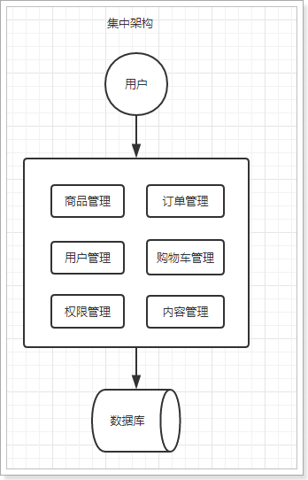
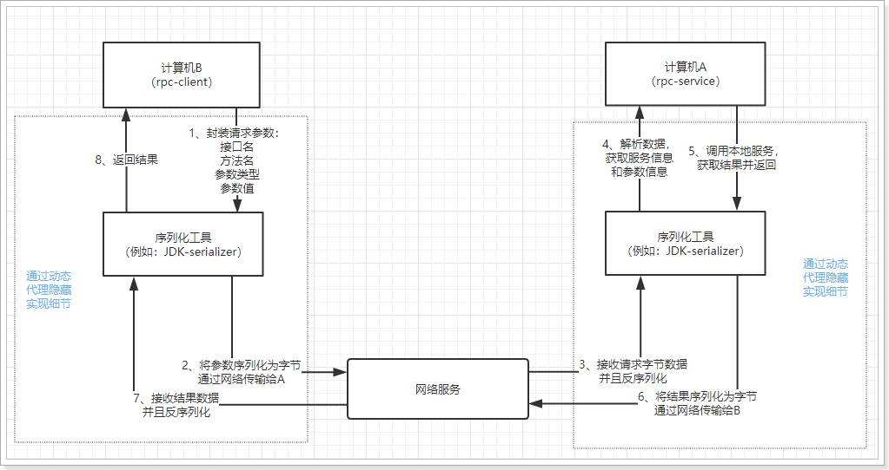
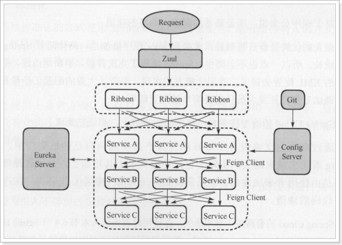
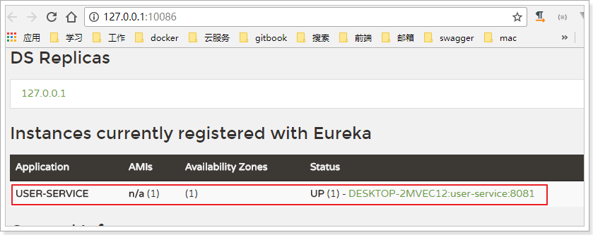
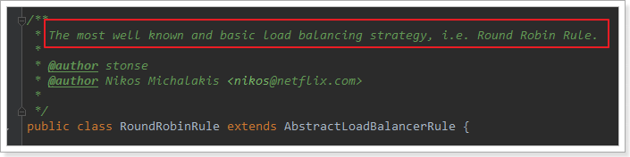

# 0.学习目标

- 了解系统架构的演变
- 了解RPC与Http的区别
- 掌握HttpClient的简单使用
- 知道什么是SpringCloud
- 独立搭建Eureka注册中心
- 独立配置Robbin负载均衡


-Xms128m -Xmx128m

# 1.系统架构演变

随着互联网的发展，网站应用的规模不断扩大。需求的激增，带来的是技术上的压力。系统架构也因此也不断的演进、升级、迭代。从单一应用，到垂直拆分，到分布式服务，到SOA，以及现在火热的微服务架构，还有在Google带领下来势汹涌的Service Mesh。我们到底是该乘坐微服务的船只驶向远方，还是偏安一隅得过且过？

其实生活不止眼前的苟且，还有诗和远方。所以我们今天就回顾历史，看一看系统架构演变的历程；把握现在，学习现在最火的技术架构；展望未来，争取成为一名优秀的Java工程师。

## 1.1. 集中式架构

当网站流量很小时，只需一个应用，将所有功能都部署在一起，以减少部署节点和成本。此时，用于简化增删改查工作量的数据访问框架(ORM)是影响项目开发的关键。

 

存在的问题：

- 代码耦合，开发维护困难
- 无法针对不同模块进行针对性优化
- 无法水平扩展
- 单点容错率低，并发能力差


## 1.2.垂直拆分

当访问量逐渐增大，单一应用无法满足需求，此时为了应对更高的并发和业务需求，我们根据业务功能对系统进行拆分：

 

优点：

- 系统拆分实现了流量分担，解决了并发问题
- 可以针对不同模块进行优化
- 方便水平扩展，负载均衡，容错率提高

缺点：

- 系统间相互独立，会有很多重复开发工作，影响开发效率

## 1.3.分布式服务

当垂直应用越来越多，应用之间交互不可避免，将核心业务抽取出来，作为独立的服务，逐渐形成稳定的服务中心，使前端应用能更快速的响应多变的市场需求。此时，用于提高业务复用及整合的分布式调用是关键。

 

优点：

- 将基础服务进行了抽取，系统间相互调用，提高了代码复用和开发效率

缺点：

- 系统间耦合度变高，调用关系错综复杂，难以维护


## 1.4.服务治理（SOA）

当服务越来越多，容量的评估，小服务资源的浪费等问题逐渐显现，此时需增加一个调度中心基于访问压力实时管理集群容量，提高集群利用率。此时，用于提高机器利用率的资源调度和治理中心(SOA)是关键


以前出现了什么问题？

- 服务越来越多，需要管理每个服务的地址
- 调用关系错综复杂，难以理清依赖关系
- 服务过多，服务状态难以管理，无法根据服务情况动态管理

服务治理要做什么？

- 服务注册中心，实现服务自动注册和发现，无需人为记录服务地址
- 服务自动订阅，服务列表自动推送，服务调用透明化，无需关心依赖关系
-  动态监控服务状态监控报告，人为控制服务状态

缺点：

- 服务间会有依赖关系，一旦某个环节出错会影响较大
- 服务关系复杂，运维、测试部署困难，不符合DevOps思想

## 1.5.微服务

前面说的SOA，英文翻译过来是面向服务。微服务，似乎也是服务，都是对系统进行拆分。因此两者非常容易混淆，但其实缺有一些差别：


微服务的特点：

- 单一职责：微服务中每一个服务都对应唯一的业务能力，做到单一职责
- 微：微服务的服务拆分粒度很小，例如一个用户管理就可以作为一个服务。每个服务虽小，但“五脏俱全”。
- 面向服务：面向服务是说每个服务都要对外暴露服务接口API。并不关心服务的技术实现，做到与平台和语言无关，也不限定用什么技术实现，只要提供Rest的接口即可。
- 自治：自治是说服务间互相独立，互不干扰
  - 团队独立：每个服务都是一个独立的开发团队，人数不能过多。
  - 技术独立：因为是面向服务，提供Rest接口，使用什么技术没有别人干涉
  - 前后端分离：采用前后端分离开发，提供统一Rest接口，后端不用再为PC、移动段开发不同接口
  - 数据库分离：每个服务都使用自己的数据源
  - 部署独立，服务间虽然有调用，但要做到服务重启不影响其它服务。有利于持续集成和持续交付。每个服务都是独立的组件，可复用，可替换，降低耦合，易维护


微服务结构图：


# 2.远程调用方式

无论是微服务还是SOA，都面临着服务间的远程调用。那么服务间的远程调用方式有哪些呢？

常见的远程调用方式有以下几种：

- RPC：Remote Produce Call远程过程调用，类似的还有RMI。自定义数据格式，基于原生TCP通信，速度快，效率高。早期的webservice，现在热门的dubbo，都是RPC的典型

- Http：http其实是一种网络传输协议，基于TCP，规定了数据传输的格式。现在客户端浏览器与服务端通信基本都是采用Http协议。也可以用来进行远程服务调用。缺点是消息封装臃肿。

  现在热门的Rest风格，就可以通过http协议来实现。

## 2.1.认识RPC

RPC，即 Remote Procedure Call（远程过程调用），是一个计算机通信协议。 该协议允许运行于一台计算机的程序调用另一台计算机的子程序，而程序员无需额外地为这个交互作用编程。说得通俗一点就是：A计算机提供一个服务，B计算机可以像调用本地服务那样调用A计算机的服务。

通过上面的概念，我们可以知道，实现RPC主要是做到两点： 

- 实现远程调用其他计算机的服务
  - 要实现远程调用，肯定是通过网络传输数据。A程序提供服务，B程序通过网络将请求参数传递给A，A本地执行后得到结果，再将结果返回给B程序。这里需要关注的有两点：
    - 1）采用何种网络通讯协议？
      - 现在比较流行的RPC框架，都会采用TCP作为底层传输协议
    - 2）数据传输的格式怎样？
      - 两个程序进行通讯，必须约定好数据传输格式。就好比两个人聊天，要用同一种语言，否则无法沟通。所以，我们必须定义好请求和响应的格式。另外，数据在网路中传输需要进行序列化，所以还需要约定统一的序列化的方式。
- 像调用本地服务一样调用远程服务 
  - 如果仅仅是远程调用，还不算是RPC，因为RPC强调的是过程调用，调用的过程对用户而言是应该是透明的，用户不应该关心调用的细节，可以像调用本地服务一样调用远程服务。所以RPC一定要对调用的过程进行封装

RPC调用流程图：



想要了解详细的RPC实现，给大家推荐一篇文章：[自己动手实现RPC](https://legacy.gitbook.com/book/huge0612/tour-of-rpc/details)


## 2.2.认识Http

Http协议：超文本传输协议，是一种应用层协议。规定了网络传输的请求格式、响应格式、资源定位和操作的方式等。但是底层采用什么网络传输协议，并没有规定，不过现在都是采用TCP协议作为底层传输协议。说到这里，大家可能觉得，Http与RPC的远程调用非常像，都是按照某种规定好的数据格式进行网络通信，有请求，有响应。没错，在这点来看，两者非常相似，但是还是有一些细微差别。

- RPC并没有规定数据传输格式，这个格式可以任意指定，不同的RPC协议，数据格式不一定相同。
- Http中还定义了资源定位的路径，RPC中并不需要
- 最重要的一点：RPC需要满足像调用本地服务一样调用远程服务，也就是对调用过程在API层面进行封装。Http协议没有这样的要求，因此请求、响应等细节需要我们自己去实现。
  - 优点：RPC方式更加透明，对用户更方便。Http方式更灵活，没有规定API和语言，跨语言、跨平台
  - 缺点：RPC方式需要在API层面进行封装，限制了开发的语言环境。

例如我们通过浏览器访问网站，就是通过Http协议。只不过浏览器把请求封装，发起请求以及接收响应，解析响应的事情都帮我们做了。如果是不通过浏览器，那么这些事情都需要自己去完成。


## 2.3.如何选择？

既然两种方式都可以实现远程调用，我们该如何选择呢？

- 速度来看，RPC要比http更快，虽然底层都是TCP，但是http协议的信息往往比较臃肿，不过可以采用gzip压缩。
- 难度来看，RPC实现较为复杂，http相对比较简单
- 灵活性来看，http更胜一筹，因为它不关心实现细节，跨平台、跨语言。

因此，两者都有不同的使用场景：

- 如果对效率要求更高，并且开发过程使用统一的技术栈，那么用RPC还是不错的。
- 如果需要更加灵活，跨语言、跨平台，显然http更合适


那么我们该怎么选择呢？

微服务，更加强调的是独立、自治、灵活。而RPC方式的限制较多，因此微服务框架中，一般都会采用基于Http的Rest风格服务。


# 3.Http客户端工具

既然微服务选择了Http，那么我们就需要考虑自己来实现对请求和响应的处理。不过开源世界已经有很多的http客户端工具，能够帮助我们做这些事情，例如：

- HttpClient
- OKHttp
- URLConnection

接下来，我们就一起了解一款比较流行的客户端工具：HttpClient

## 3.1.HttpClient

### 3.1.1.介绍

HttpClient是Apache公司的产品，是Http Components下的一个组件。

[官网地址：http://hc.apache.org/index.html](http://hc.apache.org/index.html)


特点：

- 基于标准、纯净的Java语言。实现了Http1.0和Http1.1
- 以可扩展的面向对象的结构实现了Http全部的方法（GET, POST, PUT, DELETE, HEAD, OPTIONS, and TRACE）
- 支持HTTPS协议。
-  通过Http代理建立透明的连接。
-  自动处理Set-Cookie中的Cookie。


### 3.1.2.使用

我们导入课前资料提供的demo工程：《http-demo》

发起get请求：

```java
    @Test
    public void testGet() throws IOException {
        HttpGet request = new HttpGet("http://www.baidu.com");
        String response = this.httpClient.execute(request, new BasicResponseHandler());
        System.out.println(response);
    }

```

发起Post请求：

```java
@Test
public void testPost() throws IOException {
    HttpPost request = new HttpPost("http://www.oschina.net/");
    request.setHeader("User-Agent",
                      "Mozilla/5.0 (Windows NT 10.0; WOW64) AppleWebKit/537.36 (KHTML, like Gecko) Chrome/56.0.2924.87 Safari/537.36");
    String response = this.httpClient.execute(request, new BasicResponseHandler());
    System.out.println(response);
}
```

尝试访问昨天编写的接口：http://localhost/hello

这个接口返回一个User对象

```java
@Test
public void testGetPojo() throws IOException {
    HttpGet request = new HttpGet("http://localhost/hello");
    String response = this.httpClient.execute(request, new BasicResponseHandler());
    System.out.println(response);
}
```

我们实际得到的是一个json字符串：

```json
{
    "id": 8,
    "userName": "liuyan",
    "password": "123456",
    "name": "柳岩",
    "age": 21,
    "sex": 2,
    "birthday": "1995-08-07T16:00:00.000+0000",
    "created": "2014-09-20T03:41:15.000+0000",
    "updated": "2014-09-20T03:41:15.000+0000",
    "note": "柳岩同学在传智播客学表演"
}
```

如果想要得到对象，我们还需要手动进行Json反序列化，这一点比较麻烦。

### 3.1.3.Json转换工具

HttpClient请求数据后是json字符串，需要我们自己把Json字符串反序列化为对象，我们会使用JacksonJson工具来实现。

`JacksonJson`是SpringMVC内置的json处理工具，其中有一个`ObjectMapper`类，可以方便的实现对json的处理：

#### 对象转json

```java
// json处理工具
    private ObjectMapper mapper = new ObjectMapper();
    @Test
    public void testJson() throws JsonProcessingException {
        User user = new User();
        user.setId(8L);
        user.setAge(21);
        user.setName("柳岩");
        user.setUserName("liuyan");
        // 序列化
        String json = mapper.writeValueAsString(user);
        System.out.println("json = " + json);
    }
```

结果：


#### json转普通对象

```java
// json处理工具
private ObjectMapper mapper = new ObjectMapper();
@Test
public void testJson() throws IOException {
    User user = new User();
    user.setId(8L);
    user.setAge(21);
    user.setName("柳岩");
    user.setUserName("liuyan");
    // 序列化
    String json = mapper.writeValueAsString(user);

    // 反序列化，接收两个参数：json数据，反序列化的目标类字节码
    User result = mapper.readValue(json, User.class);
    System.out.println("result = " + result);
}
```

结果：


#### json转集合

json转集合比较麻烦，因为你无法同时把集合的class和元素的class同时传递到一个参数。

因此Jackson做了一个类型工厂，用来解决这个问题：

```java
// json处理工具
private ObjectMapper mapper = new ObjectMapper();
@Test
public void testJson() throws IOException {
    User user = new User();
    user.setId(8L);
    user.setAge(21);
    user.setName("柳岩");
    user.setUserName("liuyan");

    // 序列化,得到对象集合的json字符串
    String json = mapper.writeValueAsString(Arrays.asList(user, user));

    // 反序列化，接收两个参数：json数据，反序列化的目标类字节码
    List<User> users = mapper.readValue(json, mapper.getTypeFactory().constructCollectionType(List.class, User.class));
    for (User u : users) {
        System.out.println("u = " + u);
    }
}
```

结果：


#### json转任意复杂类型

当对象泛型关系复杂时，类型工厂也不好使了。这个时候Jackson提供了TypeReference来接收类型泛型，然后底层通过反射来获取泛型上的具体类型。实现数据转换。

```java
// json处理工具
private ObjectMapper mapper = new ObjectMapper();
@Test
public void testJson() throws IOException {
    User user = new User();
    user.setId(8L);
    user.setAge(21);
    user.setName("柳岩");
    user.setUserName("liuyan");

    // 序列化,得到对象集合的json字符串
    String json = mapper.writeValueAsString(Arrays.asList(user, user));

    // 反序列化，接收两个参数：json数据，反序列化的目标类字节码
    List<User> users = mapper.readValue(json, new TypeReference<List<User>>(){});
    for (User u : users) {
        System.out.println("u = " + u);
    }
}
```

结果：

 


## 3.3.Spring的RestTemplate

Spring提供了一个RestTemplate模板工具类，对基于Http的客户端进行了封装，并且实现了对象与json的序列化和反序列化，非常方便。RestTemplate并没有限定Http的客户端类型，而是进行了抽象，目前常用的3种都有支持：

- HttpClient
- OkHttp
- JDK原生的URLConnection（默认的）

首先在项目中注册一个`RestTemplate`对象，可以在启动类位置注册：

```java
@SpringBootApplication
public class HttpDemoApplication {

	public static void main(String[] args) {
		SpringApplication.run(HttpDemoApplication.class, args);
	}

	@Bean
	public RestTemplate restTemplate() {
        // 默认的RestTemplate，底层是走JDK的URLConnection方式。
		return new RestTemplate();
	}
}
```


在测试类中直接`@Autowired`注入：

```java
@RunWith(SpringRunner.class)
@SpringBootTest(classes = HttpDemoApplication.class)
public class HttpDemoApplicationTests {

	@Autowired
	private RestTemplate restTemplate;

	@Test
	public void httpGet() {
		User user = this.restTemplate.getForObject("http://localhost/hello", User.class);
		System.out.println(user);
	}
}
```

- 通过RestTemplate的getForObject()方法，传递url地址及实体类的字节码，RestTemplate会自动发起请求，接收响应，并且帮我们对响应结果进行反序列化。


学习完了Http客户端工具，接下来就可以正式学习微服务了。

# 4.初始SpringCloud

微服务是一种架构方式，最终肯定需要技术架构去实施。

微服务的实现方式很多，但是最火的莫过于Spring Cloud了。为什么？

- 后台硬：作为Spring家族的一员，有整个Spring全家桶靠山，背景十分强大。
- 技术强：Spring作为Java领域的前辈，可以说是功力深厚。有强力的技术团队支撑，一般人还真比不了
- 群众基础好：可以说大多数程序员的成长都伴随着Spring框架，试问：现在有几家公司开发不用Spring？SpringCloud与Spring的各个框架无缝整合，对大家来说一切都是熟悉的配方，熟悉的味道。
- 使用方便：相信大家都体会到了SpringBoot给我们开发带来的便利，而SpringCloud完全支持SpringBoot的开发，用很少的配置就能完成微服务框架的搭建


## 4.1.简介

SpringCloud是Spring旗下的项目之一，[官网地址：http://projects.spring.io/spring-cloud/](http://projects.spring.io/spring-cloud/)

Spring最擅长的就是集成，把世界上最好的框架拿过来，集成到自己的项目中。

SpringCloud也是一样，它将现在非常流行的一些技术整合到一起，实现了诸如：配置管理，服务发现，智能路由，负载均衡，熔断器，控制总线，集群状态等等功能。其主要涉及的组件包括：

netflix

- Eureka：注册中心
- Zuul：服务网关
- Ribbon：负载均衡
- Feign：服务调用
- Hystix：熔断器

以上只是其中一部分，架构图：



## 4.2.版本

SpringCloud的版本命名比较特殊，因为它不是一个组件，而是许多组件的集合，它的命名是以A到Z的为首字母的一些单词组成：

 

我们在项目中，会是以Finchley的版本。

其中包含的组件，也都有各自的版本，如下表：

| Component                 | Edgware.SR3    | Finchley.RC1     | Finchley.BUILD-SNAPSHOT |
| ------------------------- | -------------- | ---------------- | ----------------------- |
| spring-cloud-aws          | 1.2.2.RELEASE  | 2.0.0.RC1        | 2.0.0.BUILD-SNAPSHOT    |
| spring-cloud-bus          | 1.3.2.RELEASE  | 2.0.0.RC1        | 2.0.0.BUILD-SNAPSHOT    |
| spring-cloud-cli          | 1.4.1.RELEASE  | 2.0.0.RC1        | 2.0.0.BUILD-SNAPSHOT    |
| spring-cloud-commons      | 1.3.3.RELEASE  | 2.0.0.RC1        | 2.0.0.BUILD-SNAPSHOT    |
| spring-cloud-contract     | 1.2.4.RELEASE  | 2.0.0.RC1        | 2.0.0.BUILD-SNAPSHOT    |
| spring-cloud-config       | 1.4.3.RELEASE  | 2.0.0.RC1        | 2.0.0.BUILD-SNAPSHOT    |
| spring-cloud-netflix      | 1.4.4.RELEASE  | 2.0.0.RC1        | 2.0.0.BUILD-SNAPSHOT    |
| spring-cloud-security     | 1.2.2.RELEASE  | 2.0.0.RC1        | 2.0.0.BUILD-SNAPSHOT    |
| spring-cloud-cloudfoundry | 1.1.1.RELEASE  | 2.0.0.RC1        | 2.0.0.BUILD-SNAPSHOT    |
| spring-cloud-consul       | 1.3.3.RELEASE  | 2.0.0.RC1        | 2.0.0.BUILD-SNAPSHOT    |
| spring-cloud-sleuth       | 1.3.3.RELEASE  | 2.0.0.RC1        | 2.0.0.BUILD-SNAPSHOT    |
| spring-cloud-stream       | Ditmars.SR3    | Elmhurst.RELEASE | Elmhurst.BUILD-SNAPSHOT |
| spring-cloud-zookeeper    | 1.2.1.RELEASE  | 2.0.0.RC1        | 2.0.0.BUILD-SNAPSHOT    |
| spring-boot               | 1.5.10.RELEASE | 2.0.1.RELEASE    | 2.0.0.BUILD-SNAPSHOT    |
| spring-cloud-task         | 1.2.2.RELEASE  | 2.0.0.RC1        | 2.0.0.RELEASE           |
| spring-cloud-vault        | 1.1.0.RELEASE  | 2.0.0.RC1        | 2.0.0.BUILD-SNAPSHOT    |
| spring-cloud-gateway      | 1.0.1.RELEASE  | 2.0.0.RC1        | 2.0.0.BUILD-SNAPSHOT    |
| spring-cloud-openfeign    |                | 2.0.0.RC1        | 2.0.0.BUILD-SNAPSHOT    |

接下来，我们就一一学习SpringCloud中的重要组件。

# 5.微服务场景模拟

首先，我们需要模拟一个服务调用的场景。方便后面学习微服务架构

## 5.1.服务提供者

我们新建一个项目，对外提供查询用户的服务。

### 5.1.1.Spring脚手架创建工程

借助于Spring提供的快速搭建工具：


填写项目信息：

 

添加web依赖：


添加mybatis依赖：


填写项目位置：


生成的项目结构：

 

依赖也已经全部自动引入：

```xml
<?xml version="1.0" encoding="UTF-8"?>
<project xmlns="http://maven.apache.org/POM/4.0.0" xmlns:xsi="http://www.w3.org/2001/XMLSchema-instance"
	xsi:schemaLocation="http://maven.apache.org/POM/4.0.0 http://maven.apache.org/xsd/maven-4.0.0.xsd">
	<modelVersion>4.0.0</modelVersion>

	<groupId>com.leyou.demo</groupId>
	<artifactId>user-service-demo</artifactId>
	<version>0.0.1-SNAPSHOT</version>
	<packaging>jar</packaging>

	<name>user-service-demo</name>
	<description>Demo project for Spring Boot</description>

	<parent>
		<groupId>org.springframework.boot</groupId>
		<artifactId>spring-boot-starter-parent</artifactId>
		<version>2.0.1.RELEASE</version>
		<relativePath/> <!-- lookup parent from repository -->
	</parent>

	<properties>
		<project.build.sourceEncoding>UTF-8</project.build.sourceEncoding>
		<project.reporting.outputEncoding>UTF-8</project.reporting.outputEncoding>
		<java.version>1.8</java.version>
	</properties>

	<dependencies>
		<dependency>
			<groupId>org.springframework.boot</groupId>
			<artifactId>spring-boot-starter-jdbc</artifactId>
		</dependency>
		<dependency>
			<groupId>org.springframework.boot</groupId>
			<artifactId>spring-boot-starter-web</artifactId>
		</dependency>
		<dependency>
			<groupId>org.mybatis.spring.boot</groupId>
			<artifactId>mybatis-spring-boot-starter</artifactId>
			<version>1.3.2</version>
		</dependency>
		<dependency>
			<groupId>mysql</groupId>
			<artifactId>mysql-connector-java</artifactId>
			<scope>runtime</scope>
		</dependency>
		<dependency>
			<groupId>org.springframework.boot</groupId>
			<artifactId>spring-boot-starter-test</artifactId>
			<scope>test</scope>
		</dependency>
	</dependencies>

	<build>
		<plugins>
			<plugin>
				<groupId>org.springframework.boot</groupId>
				<artifactId>spring-boot-maven-plugin</artifactId>
			</plugin>
		</plugins>
	</build>
</project>

```

当然，因为要使用通用mapper，所以我们需要手动加一条依赖：

```xml
<dependency>
    <groupId>tk.mybatis</groupId>
    <artifactId>mapper-spring-boot-starter</artifactId>
    <version>2.0.2</version>
</dependency>
```

非常快捷啊！

### 5.1.2.编写代码

添加一个对外查询的接口：

```java
@RestController
@RequestMapping("user")
public class UserController {

    @Autowired
    private UserService userService;

    @GetMapping("/{id}")
    public User queryById(@PathVariable("id") Long id) {
        return this.userService.queryById(id);
    }
}
```

Service：

```java
@Service
public class UserService {

    @Autowired
    private UserMapper userMapper;

    public User queryById(Long id) {
        return this.userMapper.selectByPrimaryKey(id);
    }
}
```

mapper:

```java
@Mapper
public interface UserMapper extends tk.mybatis.mapper.common.Mapper<User>{
}
```

实体类：

```java
@Table(name = "tb_user")
public class User implements Serializable {

    private static final long serialVersionUID = 1L;

    @Id
    @GeneratedValue(strategy = GenerationType.IDENTITY)
    private Long id;

    // 用户名
    private String userName;

    // 密码
    private String password;

    // 姓名
    private String name;

    // 年龄
    private Integer age;

    // 性别，1男性，2女性
    private Integer sex;

    // 出生日期
    private Date birthday;

    // 创建时间
    private Date created;

    // 更新时间
    private Date updated;

    // 备注
    private String note;

   // 。。。省略getters和setters
}

```

属性文件,这里我们采用了yaml语法，而不是properties：

```yaml
server:
  port: 8081
spring:
  datasource:
    url: jdbc:mysql://localhost:3306/mydb01
    username: root
    password: 123
    hikari:
      maximum-pool-size: 20
      minimum-idle: 10
mybatis:
  type-aliases-package: com.leyou.userservice.pojo
```


项目结构：

 

### 5.1.3.启动并测试：

启动项目，访问接口：http://localhost:8081/user/7

 


## 5.2.服务调用者

### 5.2.1.创建工程

与上面类似，这里不再赘述，需要注意的是，我们调用user-service的功能，因此不需要mybatis相关依赖了。

pom：

```xml
<?xml version="1.0" encoding="UTF-8"?>
<project xmlns="http://maven.apache.org/POM/4.0.0" xmlns:xsi="http://www.w3.org/2001/XMLSchema-instance"
	xsi:schemaLocation="http://maven.apache.org/POM/4.0.0 http://maven.apache.org/xsd/maven-4.0.0.xsd">
	<modelVersion>4.0.0</modelVersion>

	<groupId>com.leyou.demo</groupId>
	<artifactId>user-consumer-demo</artifactId>
	<version>0.0.1-SNAPSHOT</version>
	<packaging>jar</packaging>

	<name>user-consumer-demo</name>
	<description>Demo project for Spring Boot</description>

	<parent>
		<groupId>org.springframework.boot</groupId>
		<artifactId>spring-boot-starter-parent</artifactId>
		<version>2.0.1.RELEASE</version>
		<relativePath/> <!-- lookup parent from repository -->
	</parent>

	<properties>
		<project.build.sourceEncoding>UTF-8</project.build.sourceEncoding>
		<project.reporting.outputEncoding>UTF-8</project.reporting.outputEncoding>
		<java.version>1.8</java.version>
	</properties>

	<dependencies>
		<dependency>
			<groupId>org.springframework.boot</groupId>
			<artifactId>spring-boot-starter-web</artifactId>
		</dependency>
        <!-- 添加OkHttp支持 -->
		<dependency>
			<groupId>com.squareup.okhttp3</groupId>
			<artifactId>okhttp</artifactId>
			<version>3.9.0</version>
		</dependency>
	</dependencies>

	<build>
		<plugins>
			<plugin>
				<groupId>org.springframework.boot</groupId>
				<artifactId>spring-boot-maven-plugin</artifactId>
			</plugin>
		</plugins>
	</build>

</project>

```

### 5.2.2.编写代码

首先在启动类中注册`RestTemplate`：

```java
@SpringBootApplication
public class UserConsumerDemoApplication {

    @Bean
    public RestTemplate restTemplate() {
        // 这次我们使用了OkHttp客户端,只需要注入工厂即可
        return new RestTemplate(new OkHttp3ClientHttpRequestFactory());
    }

    public static void main(String[] args) {
        SpringApplication.run(UserConsumerDemoApplication.class, args);
    }
}
```


然后编写UserDao，注意，这里不是调用mapper查数据库，而是通过RestTemplate远程查询user-service-demo中的接口：

```java
@Component
public class UserDao {

    @Autowired
    private RestTemplate restTemplate;

    public User queryUserById(Long id){
        String url = "http://localhost:8081/user/" + id;
        return this.restTemplate.getForObject(url, User.class);
    }
}
```


然后编写user-service，循环查询UserDAO信息：

```java
@Service
public class UserService {

    @Autowired
    private UserDao userDao;

    public List<User> querUserByIds(List<Long> ids){
        List<User> users = new ArrayList<>();
        for (Long id : ids) {
            User user = this.userDao.queryUserById(id);
            users.add(user);
        }
        return users;
    }
}
```

编写controller：

```java
@RestController
@RequestMapping("consume")
public class ConsumerController {

    @Autowired
    private UserService userService;

    @GetMapping
    public List<User> consume(@RequestParam("ids") List<Long> ids) {
        return this.userService.queryUserByIds(ids);
    }
}
```


### 5.2.3.启动测试：

因为我们没有配置端口，那么默认就是8080，我们访问：http://localhost:8080/consume?ids=6,7,8

 

一个简单的远程服务调用案例就实现了。

## 5.3.有没有问题？

简单回顾一下，刚才我们写了什么：

- use-service-demo：一个提供根据id查询用户的微服务
- consumer-demo：一个服务调用者，通过RestTemplate远程调用user-service-demo

流程如下：


存在什么问题？

- 在consumer中，我们把url地址硬编码到了代码中，不方便后期维护
- consumer需要记忆user-service的地址，如果出现变更，可能得不到通知，地址将失效
- consumer不清楚user-service的状态，服务宕机也不知道
- user-service只有1台服务，不具备高可用性
- 即便user-service形成集群，consumer还需自己实现负载均衡

其实上面说的问题，概括一下就是分布式服务必然要面临的问题：

- 服务管理
  - 如何自动注册和发现
  - 如何实现状态监管
  - 如何实现动态路由
- 服务如何实现负载均衡
- 服务如何解决容灾问题
- 服务如何实现统一配置

以上的问题，我们都将在SpringCloud中得到答案。


# 6.Eureka注册中心

## 6.1.认识Eureka

首先我们来解决第一问题，服务的管理。

> 问题分析

在刚才的案例中，user-service对外提供服务，需要对外暴露自己的地址。而consumer（调用者）需要记录服务提供者的地址。将来地址出现变更，还需要及时更新。这在服务较少的时候并不觉得有什么，但是在现在日益复杂的互联网环境，一个项目肯定会拆分出十几，甚至数十个微服务。此时如果还人为管理地址，不仅开发困难，将来测试、发布上线都会非常麻烦，这与DevOps的思想是背道而驰的。

> 网约车

这就好比是 网约车出现以前，人们出门叫车只能叫出租车。一些私家车想做出租却没有资格，被称为黑车。而很多人想要约车，但是无奈出租车太少，不方便。私家车很多却不敢拦，而且满大街的车，谁知道哪个才是愿意载人的。一个想要，一个愿意给，就是缺少引子，缺乏管理啊。

此时滴滴这样的网约车平台出现了，所有想载客的私家车全部到滴滴注册，记录你的车型（服务类型），身份信息（联系方式）。这样提供服务的私家车，在滴滴那里都能找到，一目了然。

此时要叫车的人，只需要打开APP，输入你的目的地，选择车型（服务类型），滴滴自动安排一个符合需求的车到你面前，为你服务，完美！

> Eureka做什么？

Eureka就好比是滴滴，负责管理、记录服务提供者的信息。服务调用者无需自己寻找服务，而是把自己的需求告诉Eureka，然后Eureka会把符合你需求的服务告诉你。

同时，服务提供方与Eureka之间通过`“心跳”`机制进行监控，当某个服务提供方出现问题，Eureka自然会把它从服务列表中剔除。

这就实现了服务的自动注册、发现、状态监控。

## 6.2.原理图

> 基本架构：

 


- Eureka：就是服务注册中心（可以是一个集群），对外暴露自己的地址
- 提供者：启动后向Eureka注册自己信息（地址，提供什么服务）
- 消费者：向Eureka订阅服务，Eureka会将对应服务的所有提供者地址列表发送给消费者，并且定期更新
- 心跳(续约)：提供者定期通过http方式向Eureka刷新自己的状态


## 6.3.入门案例

### 6.3.1.编写EurekaServer

接下来我们创建一个项目，启动一个EurekaServer：

依然使用spring提供的快速搭建工具：


选择依赖：


完整的Pom文件：

```xml
<?xml version="1.0" encoding="UTF-8"?>
<project xmlns="http://maven.apache.org/POM/4.0.0" xmlns:xsi="http://www.w3.org/2001/XMLSchema-instance"
	xsi:schemaLocation="http://maven.apache.org/POM/4.0.0 http://maven.apache.org/xsd/maven-4.0.0.xsd">
	<modelVersion>4.0.0</modelVersion>

	<groupId>com.leyou.demo</groupId>
	<artifactId>eureka-demo</artifactId>
	<version>0.0.1-SNAPSHOT</version>
	<packaging>jar</packaging>

	<name>eureka-demo</name>
	<description>Demo project for Spring Boot</description>

	<parent>
		<groupId>org.springframework.boot</groupId>
		<artifactId>spring-boot-starter-parent</artifactId>
		<version>2.0.1.RELEASE</version>
		<relativePath/> <!-- lookup parent from repository -->
	</parent>

	<properties>
		<project.build.sourceEncoding>UTF-8</project.build.sourceEncoding>
		<project.reporting.outputEncoding>UTF-8</project.reporting.outputEncoding>
		<java.version>1.8</java.version>
        <!-- SpringCloud版本，是最新的F系列 -->
		<spring-cloud.version>Finchley.RC1</spring-cloud.version>
	</properties>

	<dependencies>
        <!-- Eureka服务端 -->
		<dependency>
			<groupId>org.springframework.cloud</groupId>
			<artifactId>spring-cloud-starter-netflix-eureka-server</artifactId>
		</dependency>
	</dependencies>

	<dependencyManagement>
		<dependencies>
            <!-- SpringCloud依赖，一定要放到dependencyManagement中，起到管理版本的作用即可 -->
			<dependency>
				<groupId>org.springframework.cloud</groupId>
				<artifactId>spring-cloud-dependencies</artifactId>
				<version>${spring-cloud.version}</version>
				<type>pom</type>
				<scope>import</scope>
			</dependency>
		</dependencies>
	</dependencyManagement>

	<build>
		<plugins>
			<plugin>
				<groupId>org.springframework.boot</groupId>
				<artifactId>spring-boot-maven-plugin</artifactId>
			</plugin>
		</plugins>
	</build>

	<repositories>
		<repository>
			<id>spring-milestones</id>
			<name>Spring Milestones</name>
			<url>https://repo.spring.io/milestone</url>
			<snapshots>
				<enabled>false</enabled>
			</snapshots>
		</repository>
	</repositories>
</project>
```

编写启动类：

```java
@SpringBootApplication
@EnableEurekaServer // 声明这个应用是一个EurekaServer
public class EurekaDemoApplication {

	public static void main(String[] args) {
		SpringApplication.run(EurekaDemoApplication.class, args);
	}
}
```

编写配置：

```yaml
server:
  port: 10086 # 端口
spring:
  application:
    name: eureka-server # 应用名称，会在Eureka中显示
eureka:
  client:
    register-with-eureka: false # 是否注册自己的信息到EurekaServer，默认是true
    fetch-registry: false # 是否拉取其它服务的信息，默认是true
    service-url: # EurekaServer的地址，现在是自己的地址，如果是集群，需要加上其它Server的地址。
      defaultZone: http://127.0.0.1:${server.port}/eureka

```

启动服务，并访问：http://127.0.0.1:10086/eureka


### 6.3.2.将user-service注册到Eureka

注册服务，就是在服务上添加Eureka的客户端依赖，客户端代码会自动把服务注册到EurekaServer中。


> 我们在user-service-demo中添加Eureka客户端依赖：

先添加SpringCloud依赖：

```xml
<!-- SpringCloud的依赖 -->
<dependencyManagement>
    <dependencies>
        <dependency>
            <groupId>org.springframework.cloud</groupId>
            <artifactId>spring-cloud-dependencies</artifactId>
            <version>Finchley.RC1</version>
            <type>pom</type>
            <scope>import</scope>
        </dependency>
    </dependencies>
</dependencyManagement>
<!-- Spring的仓库地址 -->
<repositories>
    <repository>
        <id>spring-milestones</id>
        <name>Spring Milestones</name>
        <url>https://repo.spring.io/milestone</url>
        <snapshots>
            <enabled>false</enabled>
        </snapshots>
    </repository>
</repositories>
```

然后是Eureka客户端：

```xml
<!-- Eureka客户端 -->
<dependency>
    <groupId>org.springframework.cloud</groupId>
    <artifactId>spring-cloud-starter-netflix-eureka-client</artifactId>
</dependency>
```


> 在启动类上开启Eureka客户端功能

通过添加`@EnableDiscoveryClient`来开启Eureka客户端功能

```java
@SpringBootApplication
@EnableDiscoveryClient // 开启EurekaClient功能
public class UserServiceDemoApplication {
	public static void main(String[] args) {
		SpringApplication.run(UserServiceDemoApplication.class, args);
	}
}
```


> 编写配置

```yaml
server:
  port: 8081
spring:
  datasource:
    url: jdbc:mysql://localhost:3306/mydb01
    username: root
    password: 123
    hikari:
      maximum-pool-size: 20
      minimum-idle: 10
  application:
    name: user-service # 应用名称
mybatis:
  type-aliases-package: com.leyou.userservice.pojo
eureka:
  client:
    service-url: # EurekaServer地址
      defaultZone: http://127.0.0.1:10086/eureka
  instance:
    prefer-ip-address: true # 当调用getHostname获取实例的hostname时，返回ip而不是host名称
    ip-address: 127.0.0.1 # 指定自己的ip信息，不指定的话会自己寻找
```

注意：

- 这里我们添加了spring.application.name属性来指定应用名称，将来会作为应用的id使用。
- 不用指定register-with-eureka和fetch-registry，因为默认是true


> 重启项目，访问[Eureka监控页面](http://127.0.0.1:10086/eureka)查看



我们发现user-service服务已经注册成功了


### 6.3.3.消费者从Eureka获取服务

接下来我们修改consumer-demo，尝试从EurekaServer获取服务。

方法与消费者类似，只需要在项目中添加EurekaClient依赖，就可以通过服务名称来获取信息了！

1）添加依赖：

先添加SpringCloud依赖：

```xml
<!-- SpringCloud的依赖 -->
<dependencyManagement>
    <dependencies>
        <dependency>
            <groupId>org.springframework.cloud</groupId>
            <artifactId>spring-cloud-dependencies</artifactId>
            <version>Finchley.RC1</version>
            <type>pom</type>
            <scope>import</scope>
        </dependency>
    </dependencies>
</dependencyManagement>
<!-- Spring的仓库地址 -->
<repositories>
    <repository>
        <id>spring-milestones</id>
        <name>Spring Milestones</name>
        <url>https://repo.spring.io/milestone</url>
        <snapshots>
            <enabled>false</enabled>
        </snapshots>
    </repository>
</repositories>
```

然后是Eureka客户端：

```xml
<!-- Eureka客户端 -->
<dependency>
    <groupId>org.springframework.cloud</groupId>
    <artifactId>spring-cloud-starter-netflix-eureka-client</artifactId>
</dependency>
```


2）在启动类开启Eureka客户端

```java
@SpringBootApplication
@EnableDiscoveryClient // 开启Eureka客户端
public class UserConsumerDemoApplication {
    @Bean
    public RestTemplate restTemplate() {
        return new RestTemplate(new OkHttp3ClientHttpRequestFactory());
    }
    public static void main(String[] args) {
        SpringApplication.run(UserConsumerDemoApplication.class, args);
    }
}

```

3）修改配置：

```yaml
server:
  port: 8080
spring:
  application:
    name: consumer # 应用名称
eureka:
  client:
    service-url: # EurekaServer地址
      defaultZone: http://127.0.0.1:10086/eureka
  instance:
    prefer-ip-address: true # 当其它服务获取地址时提供ip而不是hostname
    ip-address: 127.0.0.1 # 指定自己的ip信息，不指定的话会自己寻找
```

4）修改代码，用DiscoveryClient类的方法，根据服务名称，获取服务实例：

```java
@Service
public class UserService {

    @Autowired
    private RestTemplate restTemplate;

    @Autowired
    private DiscoveryClient discoveryClient;// Eureka客户端，可以获取到服务实例信息

    public List<User> queryUserByIds(List<Long> ids) {
        List<User> users = new ArrayList<>();
        // String baseUrl = "http://localhost:8081/user/";
        // 根据服务名称，获取服务实例
        List<ServiceInstance> instances = discoveryClient.getInstances("user-service");
        // 因为只有一个UserService,因此我们直接get(0)获取
        ServiceInstance instance = instances.get(0);
        // 获取ip和端口信息
        String baseUrl = "http://"+instance.getHost() + ":" + instance.getPort()+"/user/";
        ids.forEach(id -> {
            // 我们测试多次查询，
            users.add(this.restTemplate.getForObject(baseUrl + id, User.class));
            // 每次间隔500毫秒
            try {
                Thread.sleep(500);
            } catch (InterruptedException e) {
                e.printStackTrace();
            }
        });
        return users;
    }
}
```


5）Debug跟踪运行：


生成的URL：


访问结果：

 


## 6.4.Eureka详解

接下来我们详细讲解Eureka的原理及配置。

### 6.4.1.基础架构

Eureka架构中的三个核心角色：

- 服务注册中心

  Eureka的服务端应用，提供服务注册和发现功能，就是刚刚我们建立的eureka-demo

- 服务提供者

  提供服务的应用，可以是SpringBoot应用，也可以是其它任意技术实现，只要对外提供的是Rest风格服务即可。本例中就是我们实现的user-service-demo

- 服务消费者

  消费应用从注册中心获取服务列表，从而得知每个服务方的信息，知道去哪里调用服务方。本例中就是我们实现的consumer-demo

### 6.4.2.高可用的Eureka Server

Eureka Server即服务的注册中心，在刚才的案例中，我们只有一个EurekaServer，事实上EurekaServer也可以是一个集群，形成高可用的Eureka中心。

> 服务同步

多个Eureka Server之间也会互相注册为服务，当服务提供者注册到Eureka Server集群中的某个节点时，该节点会把服务的信息同步给集群中的每个节点，从而实现**数据同步**。因此，无论客户端访问到Eureka Server集群中的任意一个节点，都可以获取到完整的服务列表信息。


> 动手搭建高可用的EurekaServer

我们假设要搭建两条EurekaServer的集群，端口分别为：10086和10087

1）我们修改原来的EurekaServer配置：

```yaml
server:
  port: 10086 # 端口
spring:
  application:
    name: eureka-server # 应用名称，会在Eureka中显示
eureka:
  client:
    service-url: # 配置其他Eureka服务的地址，而不是自己，比如10087
      defaultZone: http://127.0.0.1:10087/eureka

```

所谓的高可用注册中心，其实就是把EurekaServer自己也作为一个服务进行注册，这样多个EurekaServer之间就能互相发现对方，从而形成集群。因此我们做了以下修改：

- 删除了register-with-eureka=false和fetch-registry=false两个配置。因为默认值是true，这样就会吧自己注册到注册中心了。
- 把service-url的值改成了另外一台EurekaServer的地址，而不是自己

2）另外一台配置恰好相反：

```yaml
server:
  port: 10087 # 端口
spring:
  application:
    name: eureka-server # 应用名称，会在Eureka中显示
eureka:
  client:
    service-url: # 配置其他Eureka服务的地址，而不是自己，比如10087
      defaultZone: http://127.0.0.1:10086/eureka

```

注意：idea中一个应用不能启动两次，我们需要重新配置一个启动器：

 

 


然后启动即可。

3）启动测试：


4）客户端注册服务到集群

因为EurekaServer不止一个，因此注册服务的时候，service-url参数需要变化：

```yaml
eureka:
  client:
    service-url: # EurekaServer地址,多个地址以','隔开
      defaultZone: http://127.0.0.1:10086/eureka,http://127.0.0.1:10087/eureka
```


### 6.4.3.服务提供者

服务提供者要向EurekaServer注册服务，并且完成服务续约等工作。

> 服务注册

服务提供者在启动时，会检测配置属性中的：`eureka.client.register-with-erueka=true`参数是否正确，事实上默认就是true。如果值确实为true，则会向EurekaServer发起一个Rest请求，并携带自己的元数据信息，Eureka Server会把这些信息保存到一个双层Map结构中。第一层Map的Key就是服务名称，第二层Map的key是服务的实例id。

> 服务续约

在注册服务完成以后，服务提供者会维持一个心跳（定时向EurekaServer发起Rest请求），告诉EurekaServer：“我还活着”。这个我们称为服务的续约（renew）；

有两个重要参数可以修改服务续约的行为：

```yaml
eureka:
  instance:
    lease-expiration-duration-in-seconds: 90
    lease-renewal-interval-in-seconds: 30
```

- lease-renewal-interval-in-seconds：服务续约(renew)的间隔，默认为30秒
- lease-expiration-duration-in-seconds：服务失效时间，默认值90秒

也就是说，默认情况下每个30秒服务会向注册中心发送一次心跳，证明自己还活着。如果超过90秒没有发送心跳，EurekaServer就会认为该服务宕机，会从服务列表中移除，这两个值在生产环境不要修改，默认即可。

但是在开发时，这个值有点太长了，经常我们关掉一个服务，会发现Eureka依然认为服务在活着。所以我们在开发阶段可以适当调小。

```yaml
eureka:
  instance:
    lease-expiration-duration-in-seconds: 10 # 10秒即过期
    lease-renewal-interval-in-seconds: 5 # 5秒一次心跳
```


> 实例id

先来看一下服务状态信息：

在Eureka监控页面，查看服务注册信息：


在status一列中，显示以下信息：

- UP(1)：代表现在是启动了1个示例，没有集群
- DESKTOP-2MVEC12:user-service:8081：是示例的名称（instance-id），
  - 默认格式是：`${hostname} + ${spring.application.name} + ${server.port}`
  - instance-id是区分同一服务的不同实例的唯一标准，因此不能重复。

我们可以通过instance-id属性来修改它的构成：

```yaml
eureka:
  instance:
    instance-id: ${spring.application.name}:${server.port}
```

重启服务再试试看：


### 6.4.4.服务消费者

> 获取服务列表

当服务消费者启动是，会检测`eureka.client.fetch-registry=true`参数的值，如果为true，则会从Eureka Server服务的列表只读备份，然后缓存在本地。并且`每隔30秒`会重新获取并更新数据。我们可以通过下面的参数来修改：

```yaml
eureka:
  client:
    registry-fetch-interval-seconds: 5
```

生产环境中，我们不需要修改这个值。

但是为了开发环境下，能够快速得到服务的最新状态，我们可以将其设置小一点。


### 6.4.5.失效剔除和自我保护

> 失效剔除

有些时候，我们的服务提供方并不一定会正常下线，可能因为内存溢出、网络故障等原因导致服务无法正常工作。Eureka Server需要将这样的服务剔除出服务列表。因此它会开启一个定时任务，每隔60秒对所有失效的服务（超过90秒未响应）进行剔除。

可以通过`eureka.server.eviction-interval-timer-in-ms`参数对其进行修改，单位是毫秒，生成环境不要修改。

这个会对我们开发带来极大的不变，你对服务重启，隔了60秒Eureka才反应过来。开发阶段可以适当调整，比如10S

> 自我保护

我们关停一个服务，就会在Eureka面板看到一条警告：


这是触发了Eureka的自我保护机制。当一个服务未按时进行心跳续约时，Eureka会统计最近15分钟心跳失败的服务实例的比例是否超过了85%。在生产环境下，因为网络延迟等原因，心跳失败实例的比例很有可能超标，但是此时就把服务剔除列表并不妥当，因为服务可能没有宕机。Eureka就会把当前实例的注册信息保护起来，不予剔除。生产环境下这很有效，保证了大多数服务依然可用。

但是这给我们的开发带来了麻烦， 因此开发阶段我们都会关闭自我保护模式：

```yaml
eureka:
  server:
    enable-self-preservation: false # 关闭自我保护模式（缺省为打开）
    eviction-interval-timer-in-ms: 1000 # 扫描失效服务的间隔时间（缺省为60*1000ms）
```


# 7.负载均衡Robbin

在刚才的案例中，我们启动了一个user-service，然后通过DiscoveryClient来获取服务实例信息，然后获取ip和端口来访问。

但是实际环境中，我们往往会开启很多个user-service的集群。此时我们获取的服务列表中就会有多个，到底该访问哪一个呢？

一般这种情况下我们就需要编写负载均衡算法，在多个实例列表中进行选择。

不过Eureka中已经帮我们集成了负载均衡组件：Ribbon，简单修改代码即可使用。

什么是Ribbon：


接下来，我们就来使用Ribbon实现负载均衡。


## 7.1.启动两个服务实例

首先我们启动两个user-service实例，一个8081，一个8082。

 

Eureka监控面板：


## 7.2.开启负载均衡

因为Eureka中已经集成了Ribbon，所以我们无需引入新的依赖。直接修改代码：

在RestTemplate的配置方法上添加`@LoadBalanced`注解：

```java
@Bean
@LoadBalanced
public RestTemplate restTemplate() {
    return new RestTemplate(new OkHttp3ClientHttpRequestFactory());
}
```


修改调用方式，不再手动获取ip和端口，而是直接通过服务名称调用：

```java
@Service
public class UserService {

    @Autowired
    private RestTemplate restTemplate;

    @Autowired
    private DiscoveryClient discoveryClient;

    public List<User> queryUserByIds(List<Long> ids) {
        List<User> users = new ArrayList<>();
        // 地址直接写服务名称即可
        String baseUrl = "http://user-service/user/";
        ids.forEach(id -> {
            // 我们测试多次查询，
            users.add(this.restTemplate.getForObject(baseUrl + id, User.class));
            // 每次间隔500毫秒
            try {
                Thread.sleep(500);
            } catch (InterruptedException e) {
                e.printStackTrace();
            }
        });
        return users;
    }
}
```

访问页面，查看结果：

 

完美！

## 7.3.源码跟踪

为什么我们只输入了service名称就可以访问了呢？之前还要获取ip和端口。

显然有人帮我们根据service名称，获取到了服务实例的ip和端口。它就是`LoadBalancerInterceptor`

我们进行源码跟踪：


继续跟入execute方法：发现获取了8082端口的服务


再跟下一次，发现获取的是8081：

 


## 7.4.负载均衡策略

Ribbon默认的负载均衡策略是简单的轮询，我们可以测试一下：

编写测试类，在刚才的源码中我们看到拦截中是使用RibbonLoadBalanceClient来进行负载均衡的，其中有一个choose方法，是这样介绍的：

 

现在这个就是负载均衡获取实例的方法。

我们对注入这个类的对象，然后对其测试：

```java
@RunWith(SpringRunner.class)
@SpringBootTest(classes = UserConsumerDemoApplication.class)
public class LoadBalanceTest {

    @Autowired
    RibbonLoadBalancerClient client;

    @Test
    public void test(){
        for (int i = 0; i < 100; i++) {
            ServiceInstance instance = this.client.choose("user-service");
            System.out.println(instance.getHost() + ":" + instance.getPort());
        }
    }
}

```

结果：

 

符合了我们的预期推测，确实是轮询方式。


我们是否可以修改负载均衡的策略呢？

继续跟踪源码，发现这么一段代码：

 

我们看看这个rule是谁：

 

这里的rule默认值是一个`RoundRobinRule`，看类的介绍：

 

这不就是轮询的意思嘛。

我们注意到，这个类其实是实现了接口IRule的，查看一下：

 

定义负载均衡的规则接口。

它有以下实现：

 

SpringBoot也帮我们提供了修改负载均衡规则的配置入口：

```yaml
user-service:
  ribbon:
    NFLoadBalancerRuleClassName: com.netflix.loadbalancer.RandomRule
```

格式是：`{服务名称}.ribbon.NFLoadBalancerRuleClassName`，值就是IRule的实现类。


再次测试，发现结果变成了随机：

 


## 7.5.重试机制

Eureka的服务治理强调了CAP原则中的AP，即可用性和可靠性。它与Zookeeper这一类强调CP（一致性，可靠性）的服务治理框架最大的区别在于：Eureka为了实现更高的服务可用性，牺牲了一定的一致性，极端情况下它宁愿接收故障实例也不愿丢掉健康实例，正如我们上面所说的自我保护机制。

但是，此时如果我们调用了这些不正常的服务，调用就会失败，从而导致其它服务不能正常工作！这显然不是我们愿意看到的。

我们现在关闭一个user-service实例：

 

因为服务剔除的延迟，consumer并不会立即得到最新的服务列表，此时再次访问你会得到错误提示：


但是此时，8081服务其实是正常的。

因此Spring Cloud 整合了Spring Retry 来增强RestTemplate的重试能力，当一次服务调用失败后，不会立即抛出一次，而是再次重试另一个服务。

只需要简单配置即可实现Ribbon的重试：

```yaml
spring:
  cloud:
    loadbalancer:
      retry:
        enabled: true # 开启Spring Cloud的重试功能
user-service:
  ribbon:
    ConnectTimeout: 250 # Ribbon的连接超时时间
    ReadTimeout: 1000 # Ribbon的数据读取超时时间
    OkToRetryOnAllOperations: true # 是否对所有操作都进行重试
    MaxAutoRetriesNextServer: 1 # 切换实例的重试次数
    MaxAutoRetries: 1 # 对当前实例的重试次数
```

根据如上配置，当访问到某个服务超时后，它会再次尝试访问下一个服务实例，如果不行就再换一个实例，如果不行，则返回失败。切换次数取决于`MaxAutoRetriesNextServer`参数的值

引入spring-retry依赖

```xml
<dependency>
    <groupId>org.springframework.retry</groupId>
    <artifactId>spring-retry</artifactId>
</dependency>
```


我们重启user-consumer-demo，测试，发现即使user-service2宕机，也能通过另一台服务实例获取到结果！

 


