# 学习目标

- 会创建Vue实例，知道Vue的常见属性
- 会使用Vue的生命周期的钩子函数
- 会使用vue常见指令
- 会使用vue计算属性和watch监控
- 会编写Vue组件
- 掌握组件间通信


# 0.前言

前几天我们已经对后端的技术栈有了初步的了解、并且已经搭建了整个后端微服务的平台。接下来要做的事情就是功能开发了。但是没有前端页面，我们肯定无从下手，因此今天我们就要来了解一下前端的一些技术，完成前端页面搭建。

先聊一下前端开发模式的发展。

> 静态页面

- 最初的网页以HTML为主，是纯静态的网页。网页是只读的，信息流只能从服务的到客户端单向流通。**开发人员也只关心页面的样式和内容**即可。

> 异步刷新，操作DOM

- 1995年，网景工程师Brendan Eich 花了10天时间设计了JavaScript语言.

  随着JavaScript的诞生，我们可以操作页面的DOM元素及样式，页面有了一些动态的效果，但是依然是以静态为主。
- ajax盛行：
  - 2005年开始，ajax逐渐被前端开发人员所重视，因为不用刷新页面就可以更新页面的数据和渲染效果。
  - 此时的**开发人员不仅仅要编写HTML样式，还要懂ajax与后端交互，然后通过JS操作Dom元素来实现页面动态效果**。比较流行的框架如Jquery就是典型代表。

> MVVM，关注模型和视图

- 2008年，google的Chrome发布，随后就以极快的速度占领市场，超过IE成为浏览器市场的主导者。

- 2009年，Ryan Dahl在谷歌的Chrome V8引擎基础上，打造了基于事件循环的异步IO框架：Node.js。

  - 基于时间循环的异步IO
  - 单线程运行，避免多线程的变量同步问题
  - JS可以编写后台diamante，前后台统一编程语言

- node.js的伟大之处不在于让JS迈向了后端开发，而是构建了一个庞大的生态系统。

- 2010年，NPM作为node.js的包管理系统首次发布，开发人员可以遵循Common.js规范来编写Node.js模块，然后发布到NPM上供其他开发人员使用。目前已经是世界最大的包模块管理系统。

- 随后，在node的基础上，涌现出了一大批的前端框架：

   


> MVVM模式

- M：即Model，模型，包括数据和一些基本操作
- V：即View，视图，页面渲染结果
- VM：即View-Model，模型与视图间的双向操作（无需开发人员干涉）

在MVVM之前，开发人员从后端获取需要的数据模型，然后要通过DOM操作Model渲染到View中。而后当用户操作视图，我们还需要通过DOM获取View中的数据，然后同步到Model中。

而MVVM中的VM要做的事情就是把DOM操作完全封装起来，开发人员不用再关心Model和View之间是如何互相影响的：

- 只要我们Model发生了改变，View上自然就会表现出来。
- 当用户修改了View，Model中的数据也会跟着改变。

把开发人员从繁琐的DOM操作中解放出来，把关注点放在如何操作Model上。

 


而我们今天要学习的，就是一款MVVM模式的框架：Vue


# 1.认识Vue

Vue (读音 /vjuː/，类似于 **view**) 是一套用于构建用户界面的**渐进式框架**。与其它大型框架不同的是，Vue 被设计为可以自底向上逐层应用。Vue 的核心库只关注视图层，不仅易于上手，还便于与第三方库或既有项目整合。另一方面，当与[现代化的工具链](https://cn.vuejs.org/v2/guide/single-file-components.html)以及各种[支持类库](https://github.com/vuejs/awesome-vue#libraries--plugins)结合使用时，Vue 也完全能够为复杂的单页应用提供驱动。

​	前端框架三巨头：Vue.js、React.js、AngularJS，vue.js以期轻量易用著称，vue.js和React.js发展速度最快，AngularJS还是老大。

官网：https://cn.vuejs.org/

参考：https://cn.vuejs.org/v2/guide/


Git地址：https://github.com/vuejs


**尤雨溪**，Vue.js 创作者，Vue Technology创始人，致力于Vue的研究开发。

# 2.Node和NPM

前面说过，NPM是Node提供的模块管理工具，可以非常方便的下载安装很多前端框架，包括Jquery、AngularJS、VueJs都有。为了后面学习方便，我们先安装node及NPM工具。

## 2.1.下载Node.js

下载地址：[https://nodejs.org/en/download/](https://nodejs.org/en/download/)

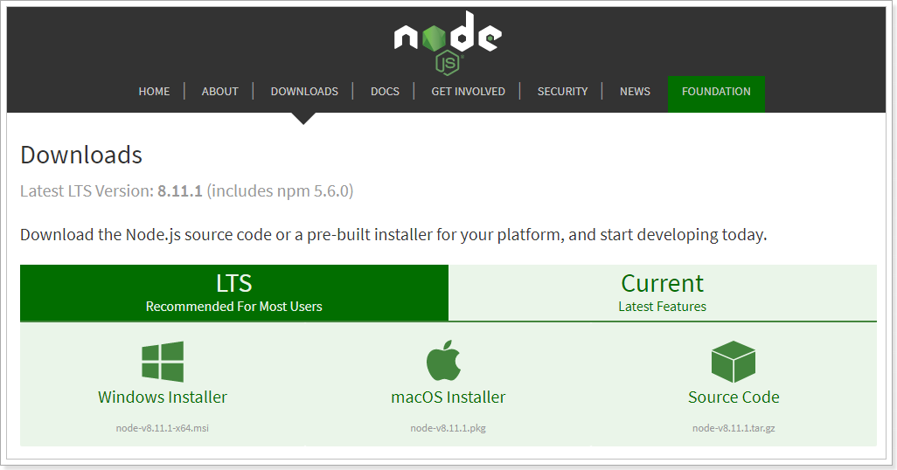

推荐下载LTS版本。

课程中采用的是8.9.0版本。目前最新的是8.11.1。大家自行下载。然后下一步安装即可。

完成以后，在控制台输入：

```powershell
node -v
```

看到版本信息：

 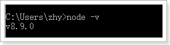

## 2.2.NPM

安装完成Node应该自带了NPM了，在控制台输入`npm -v`查看：

 


npm默认的仓库地址是在国外网站，速度较慢，建议大家设置到淘宝镜像。但是切换镜像是比较麻烦的。推荐一款切换镜像的工具：nrm

我们首先安装nrm，这里`-g`代表全局安装

```
npm install nrm -g
```

然后通过`nrm ls`命令查看npm的仓库列表,带*的就是当前选中的镜像仓库：

 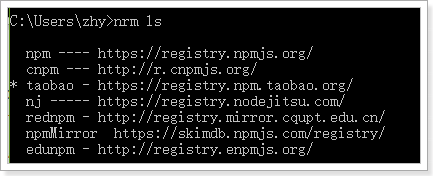

通过`nrm use taobao`来指定要使用的镜像源：

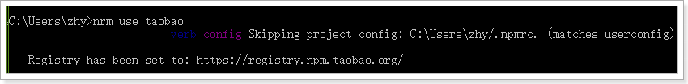

然后通过`nrm test npm `来测试速度：

 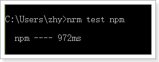


注意：

- 有教程推荐大家使用cnpm命令，但是使用发现cnpm有时会有bug，不推荐。
- 安装完成请一定要重启下电脑！！！
- 安装完成请一定要重启下电脑！！！
- 安装完成请一定要重启下电脑！！！


# 3.快速入门

接下来，我们快速领略下vue的魅力

## 3.1.创建工程

创建一个新的工程：

 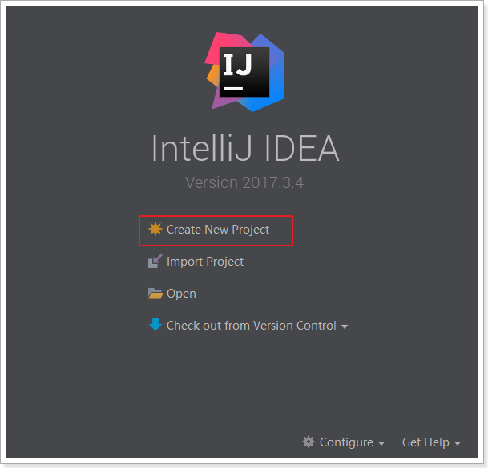

选中一个空的：

 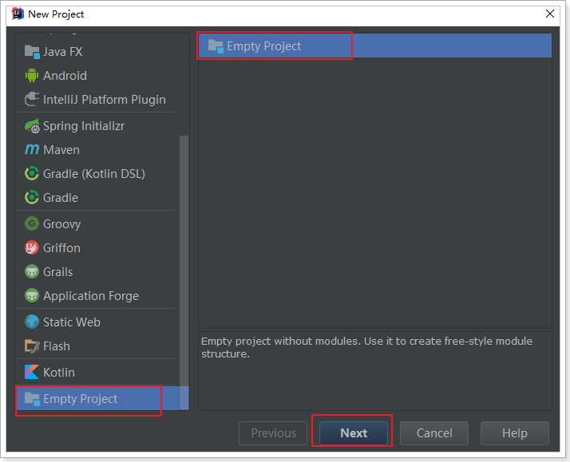

然后新建一个module：

 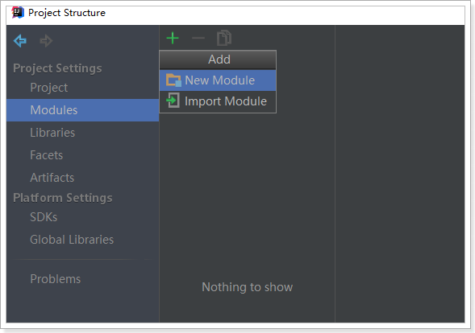

选中static web，静态web项目：

 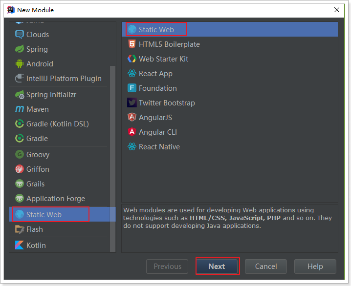

位置信息：

 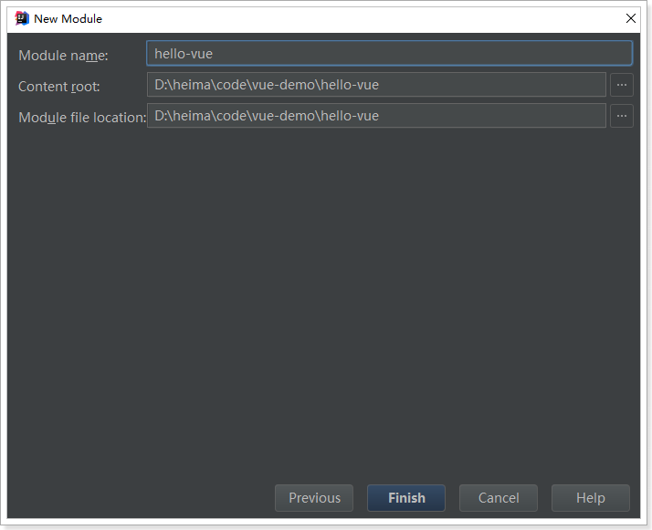


## 3.2.安装vue

### 3.2.1.下载安装

下载地址：https://github.com/vuejs/vue

可以下载2.5.16版本https://github.com/vuejs/vue/archive/v2.5.16.zip

下载解压，得到vue.js文件。

### 3.2.2.使用CDN

或者也可以直接使用公共的CDN服务：

```html
<!-- 开发环境版本，包含了用帮助的命令行警告 -->
<script src="https://cdn.jsdelivr.net/npm/vue/dist/vue.js"></script>
```

或者：

```html
<!-- 生产环境版本，优化了尺寸和速度 -->
<script src="https://cdn.jsdelivr.net/npm/vue"></script>
```


### 3.2.3.推荐npm安装

在idea的左下角，有个Terminal按钮，点击打开控制台：

 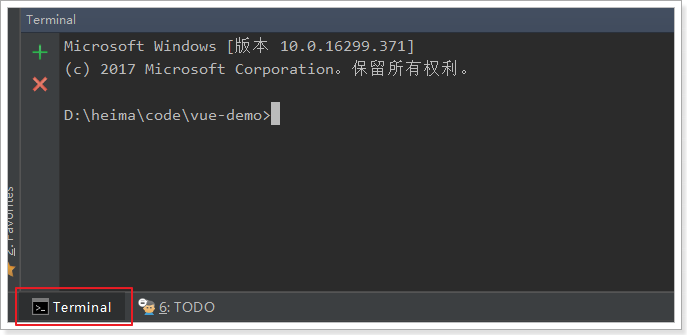

进入hello-vue目录：

 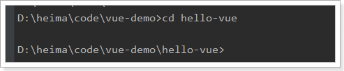


先输入：`npm init -y` 进行初始化

  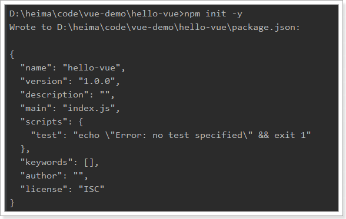

安装Vue，输入命令：`npm install vue --save`

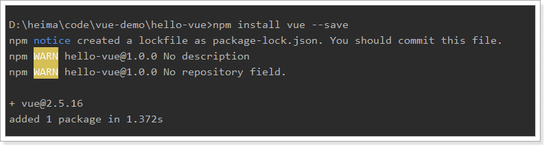

然后就会在hello-vue目录发现一个node_modules目录，并且在下面有一个vue目录。

 

node_modules是通过npm安装的所有模块的默认位置。

## 3.3.vue入门案例

### 3.3.1.HTML模板

 在hello-vue目录新建一个HTML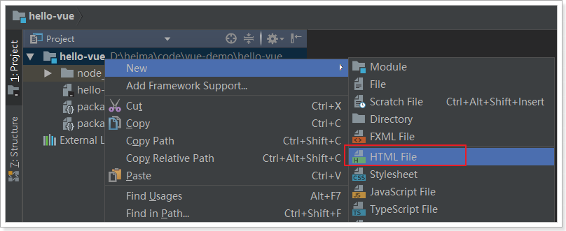

在hello.html中，我们编写一段简单的代码：

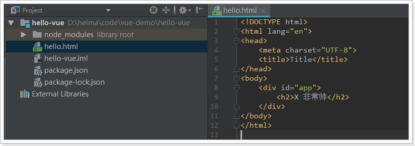

h2中要输出一句话：xx 非常帅。前面的xx是要渲染的数据。

### 3.3.2.vue渲染

然后我们通过Vue进行渲染：

```html
<div id="app">
    <h2>{{name}} 非常帅</h2>
</div>
<script src="./node_modules/vue/dist/vue.js"></script>
<script type="text/javascript">
    // 生成一个Vue实例
    var app = new Vue({
        el:"#app", // el,即element。要渲染的的页面元素
        data:{ // 数据
            name:"虎哥"
        }
    })
</script>
```

- 首先通过 new Vue()来创建Vue实例
- 然后构造函数接收一个对象，对象中有一些属性：
  - el：是element的缩写，通过id选中要渲染的页面元素，本例中是一个div
  - data：数据，数据是一个对象，里面有很多属性，都可以渲染到视图中
    - name：这里我们指定了一个name属性
- 页面中的`h2`元素中，我们通过{{name}}的方式，来渲染刚刚定义的name属性。

打开页面查看效果：

 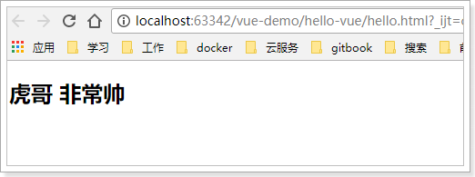

更神奇的在于，当你修改name属性时，页面会跟着变化：

 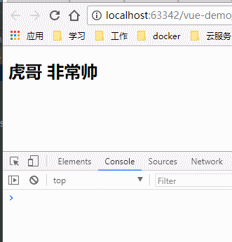


### 3.3.3.双向绑定

我们对刚才的案例进行简单修改：

```html
<div id="app">
    <input type="text" v-model="num">
    <h2>
        {{name}} 非常帅,
        有{{num}}位女神为他着迷。
    </h2>
</div>
<script src="./node_modules/vue/dist/vue.js"></script>
<script type="text/javascript">
    // 生成一个Vue实例
    var app = new Vue({
        el:"#app", // el,即element。要渲染的的页面元素
        data:{ // 数据
            name:"虎哥",
            num:1
        }
    })
</script>
```

- 我们在data添加了新的属性：`num`
- 在页面中有一个`input`元素，通过`v-model`与`num`进行绑定。
- 同时通过`{{num}}`在页面输出

效果：

 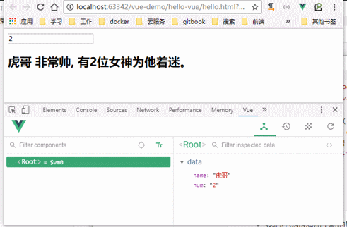

我们可以观察到，输入框的变化引起了data中的num的变化，同时页面输出也跟着变化。

- input与num绑定，input的value值变化，影响到了data中的num值
- 页面`{{num}}`与数据num绑定，因此num值变化，引起了页面效果变化。

没有任何dom操作，这就是双向绑定的魅力。

### 3.3.4.事件处理

我们在页面添加一个按钮：

```html
<button v-on:click="num++">点我</button>
```

- 这里用`v-on`指令绑定点击事件，而不是普通的`onclick`，然后直接操作num
- 普通click是无法直接操作num的。

效果：

 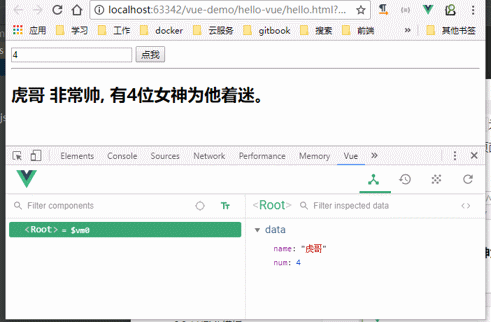


# 4.Vue实例

## 4.1.创建Vue实例

每个 Vue 应用都是通过用 `Vue` 函数创建一个新的 **Vue 实例**开始的：

```javascript
var vm = new Vue({
  // 选项
})
```

在构造函数中传入一个对象，并且在对象中声明各种Vue需要的数据和方法，包括：

- el
- data
- methods

等等

接下来我们一 一介绍。


## 4.2.模板或元素

每个Vue实例都需要关联一段Html模板，Vue会基于此模板进行视图渲染。

我们可以通过el属性来指定。

例如一段html模板：

```html
<div id="app">
    
</div>
```

然后创建Vue实例，关联这个div

```js
var vm = new Vue({
	el:"#app"
})
```

这样，Vue就可以基于id为`app`的div元素作为模板进行渲染了。在这个div范围以外的部分是无法使用vue特性的。

## 4.3.数据

当Vue实例被创建时，它会尝试获取在data中定义的所有属性，用于视图的渲染，并且监视data中的属性变化，当data发生改变，所有相关的视图都将重新渲染，这就是“响应式“系统。

html：

```html
<div id="app">
    <input type="text" v-model="name"/>
</div>
```

js:

```js
var vm = new Vue({
    el:"#app",
    data:{
        name:"刘德华"
    }
})
```

- name的变化会影响到`input`的值
- input中输入的值，也会导致vm中的name发生改变


## 4.4.方法

Vue实例中除了可以定义data属性，也可以定义方法，并且在Vue的作用范围内使用。

html:

```html
<div id="app">
    {{num}}
    <button v-on:click="add">加</button>
</div>
```

js:

```js
var vm = new Vue({
    el:"#app",
    data:{
        num: 0
    },
    methods:{
        add:function(){
            // this代表的当前vue实例
            this.num++;
        }
    }
})
```

## 4.5.生命周期钩子

### 4.5.1.生命周期

每个 Vue 实例在被创建时都要经过一系列的初始化过程 ：创建实例，装载模板，渲染模板等等。Vue为生命周期中的每个状态都设置了钩子函数（监听函数）。每当Vue实例处于不同的生命周期时，对应的函数就会被触发调用。

生命周期：


### 4.5.2.钩子函数

例如：created代表在vue实例创建后；

我们可以在Vue中定义一个created函数，代表这个时期的构造函数：


html:

```html
<div id="app">
    {{hello}}
</div>
```

js:

```js
var vm = new Vue({
    el:"#app",
    data:{
        hello: '' // hello初始化为空
    },
    created(){
        this.hello = "hello, world！ 我出生了！";
    }
})
```

结果：

 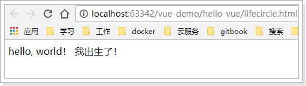


### 4.5.3.this

我们可以看下在vue内部的this变量是谁，我们在created的时候，打印this

```js
var vm = new Vue({
    el:"#app",
    data:{
        hello: '' // hello初始化为空
    },
    created(){
        this.hello = "hello, world！ 我出生了！";
        console.log(this);
    }
})
```

 控制台的输出：

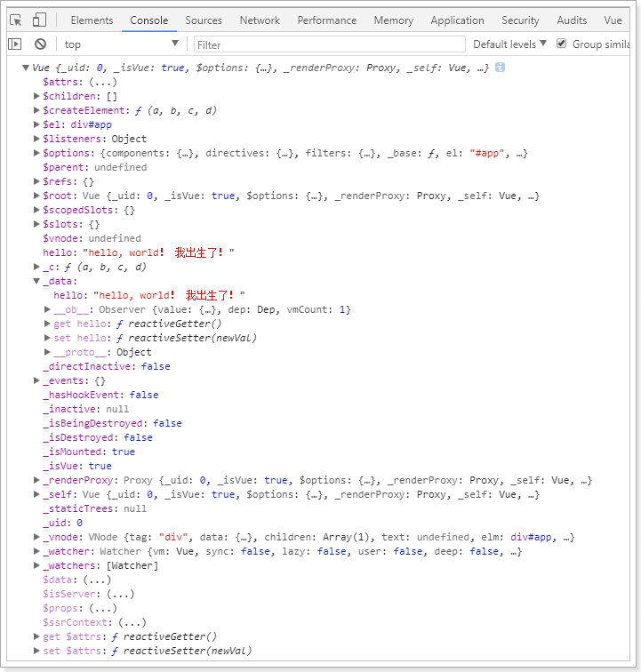

 


# 5.指令

什么是指令？

指令 (Directives) 是带有 `v-` 前缀的特殊特性。指令特性的预期值是：**单个 JavaScript 表达式**。指令的职责是，当表达式的值改变时，将其产生的连带影响，响应式地作用于 DOM。 

例如我们在入门案例中的v-on，代表绑定事件。


## 5.1.插值表达式

### 5.1.1.花括号

格式：

```
{{表达式}}
```

说明：

- 该表达式支持JS语法，可以调用js内置函数（必须有返回值）
- 表达式必须有返回结果。例如 1 + 1，没有结果的表达式不允许使用，如：var a = 1 + 1;
- 可以直接获取Vue实例中定义的数据或函数

示例：

HTML：

```html
<div id="app">{{name}}</div>
```

JS:

```js
var app = new Vue({
    el:"#app",
    data:{
        name:"Jack"
    }
})
```


### 5.1.2.插值闪烁

使用{{}}方式在网速较慢时会出现问题。在数据未加载完成时，页面会显示出原始的`{{}}`，加载完毕后才显示正确数据，我们称为插值闪烁。

我们将网速调慢一些，然后试试看刚才的案例：

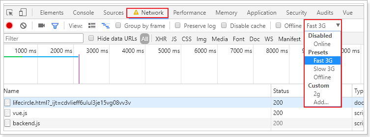

刷新页面：

 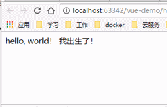


### 5.1.3.v-text和v-html

使用v-text和v-html指令来替代`{{}}`

说明：

- v-text：将数据输出到元素内部，如果输出的数据有HTML代码，会作为普通文本输出
- v-html：将数据输出到元素内部，如果输出的数据有HTML代码，会被渲染

示例：

HTML:

```html
<div id="app">
    v-text:<span v-text="hello"></span> <br/>
    v-html:<span v-html="hello"></span>
</div>
```

JS:

```js
var vm = new Vue({
    el:"#app",
    data:{
        hello: "<h1>大家好，我是虎哥</h1>"
    }
})
```

效果：

 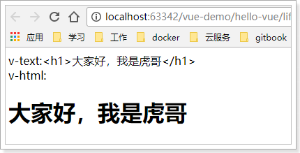


并且不会出现插值闪烁，当没有数据时，会显示空白。


## 5.2.v-model

刚才的v-text和v-html可以看做是单向绑定，数据影响了视图渲染，但是反过来就不行。接下来学习的v-model是双向绑定，视图（View）和模型（Model）之间会互相影响。

既然是双向绑定，一定是在视图中可以修改数据，这样就限定了视图的元素类型。目前v-model的可使用元素有：

- input
- select
- textarea
- checkbox
- radio
- components（Vue中的自定义组件）

基本上除了最后一项，其它都是表单的输入项。

举例：

html：

```html
<div id="app">
    <input type="checkbox" v-model="language" value="Java" />Java<br/>
    <input type="checkbox" v-model="language" value="PHP" />PHP<br/>
    <input type="checkbox" v-model="language" value="Swift" />Swift<br/>
    <h1>
        你选择了：{{language.join(',')}}
    </h1>
</div>
<script src="./node_modules/vue/dist/vue.js"></script>
<script type="text/javascript">
    var vm = new Vue({
        el:"#app",
        data:{
            language: []
        }
    })
</script>
```

- 多个`CheckBox`对应一个model时，model的类型是一个数组，单个checkbox值是boolean类型
- radio对应的值是input的value值
- `input` 和`textarea` 默认对应的model是字符串
- `select`单选对应字符串，多选对应也是数组

效果：

 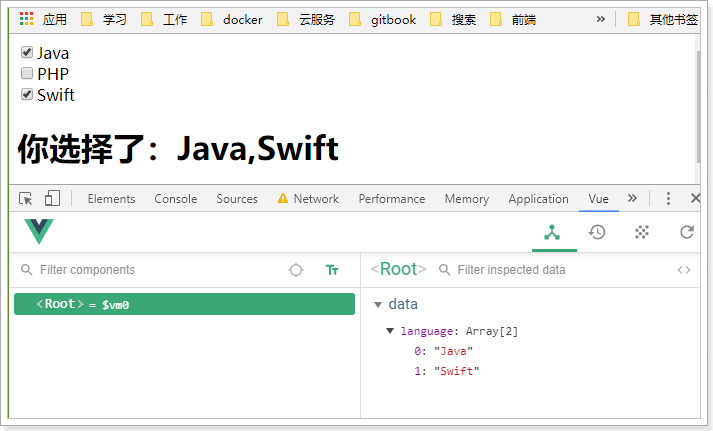


## 5.3.v-on

### 5.3.1.基本用法

v-on指令用于给页面元素绑定事件。

语法：

```
v-on:事件名="js片段或函数名"
```

示例：

```html
<div id="app">
    <!--事件中直接写js片段-->
    <button v-on:click="num++">增加</button><br/>
    <!--事件指定一个回调函数，必须是Vue实例中定义的函数-->
    <button v-on:click="decrement">减少</button><br/>
    <h1>num: {{num}}</h1>
</div>
<script src="./node_modules/vue/dist/vue.js"></script>
<script type="text/javascript">
    var app = new Vue({
        el:"#app",
        data:{
            num:1
        },
        methods:{
            decrement(){
                this.num--;
            }
        }
    })
</script>
```

效果：

 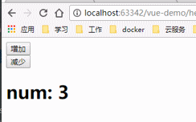

另外，事件绑定可以简写，例如`v-on:click='add'`可以简写为`@click='add'`


### 5.3.2.事件修饰符

在事件处理程序中调用 `event.preventDefault()` 或 `event.stopPropagation()` 是非常常见的需求。尽管我们可以在方法中轻松实现这点，但更好的方式是：方法只有纯粹的数据逻辑，而不是去处理 DOM 事件细节。

为了解决这个问题，Vue.js 为 `v-on` 提供了**事件修饰符**。之前提过，修饰符是由点开头的指令后缀来表示的。

- `.stop` ：阻止事件冒泡
- `.prevent`：阻止默认事件发生
- `.capture`：使用事件捕获模式
- `.self`：只有元素自身触发事件才执行。（冒泡或捕获的都不执行）
- `.once`：只执行一次


### 5.3.3.按键修饰符

在监听键盘事件时，我们经常需要检查常见的键值。Vue 允许为 `v-on` 在监听键盘事件时添加按键修饰符： 

```html
<!-- 只有在 `keyCode` 是 13 时调用 `vm.submit()` -->
<input v-on:keyup.13="submit">
```


记住所有的 `keyCode` 比较困难，所以 Vue 为最常用的按键提供了别名：

```html
<!-- 同上 -->
<input v-on:keyup.enter="submit">

<!-- 缩写语法 -->
<input @keyup.enter="submit">
```

全部的按键别名：

- `.enter`
- `.tab`
- `.delete` (捕获“删除”和“退格”键)
- `.esc`
- `.space`
- `.up`
- `.down`
- `.left`
- `.right`

### 5.3.4.组合按钮

可以用如下修饰符来实现仅在按下相应按键时才触发鼠标或键盘事件的监听器。

- `.ctrl`
- `.alt`
- `.shift`

例如：

```html
<!-- Alt + C -->
<input @keyup.alt.67="clear">

<!-- Ctrl + Click -->
<div @click.ctrl="doSomething">Do something</div>
```


## 5.4.v-for

遍历数据渲染页面是非常常用的需求，Vue中通过v-for指令来实现。

### 5.4.1.遍历数组

> 语法：

```
v-for="item in items"
```

- items：要遍历的数组，需要在vue的data中定义好。
- item：迭代得到的数组元素的别名

> 示例

```html
<div id="app">
    <ul>
        <li v-for="user in users">
            {{user.name}} : {{user.gender}} : {{user.age}}
        </li>
    </ul>
</div>
<script src="./node_modules/vue/dist/vue.js"></script>
<script type="text/javascript">
    var vm = new Vue({
        el:"#app",
        data:{
            users:[
                {name:'柳岩', gender:'女', age: 21},
                {name:'虎哥', gender:'男', age: 30},
                {name:'范冰冰', gender:'女', age: 24},
                {name:'刘亦菲', gender:'女', age: 18},
                {name:'古力娜扎', gender:'女', age: 25}
            ]
        }
    })
</script>
```

效果：

 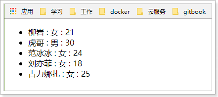


### 5.4.2.数组角标

在遍历的过程中，如果我们需要知道数组角标，可以指定第二个参数：

> 语法

```
v-for="(item,index) in items"
```

- items：要迭代的数组
- item：迭代得到的数组元素别名
- index：迭代到的当前元素索引，从0开始。

> 示例

```html
    <div id="app">
        <ul>
            <li v-for="(user,index) in users">
                {{index}} - {{user.name}} : {{user.gender}} : {{user.age}}
            </li>
        </ul>
    </div>
```

> 效果：

 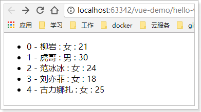

### 5.4.3.遍历对象

v-for除了可以迭代数组，也可以迭代对象。语法基本类似

> 语法：

```
v-for="value in object"
v-for="(value,key) in object"
v-for="(value,key,index) in object"
```

- 1个参数时，得到的是对象的值
- 2个参数时，第一个是值，第二个是键
- 3个参数时，第三个是索引，从0开始

> 示例：

```html
<div id="app">
    <ul>
        <li v-for="(value,key,index) in user">
            {{index}} - {{key}} : {{value}}
        </li>
    </ul>
</div>
<script src="./node_modules/vue/dist/vue.js"></script>
<script type="text/javascript">
    var vm = new Vue({
        el:"#app",
        data:{
            user:{name:'柳岩', gender:'女', age: 21}
        }
    })
</script>
```

> 效果：

 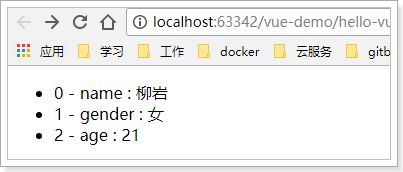


### 5.4.4.key

当 Vue.js 用 `v-for` 正在更新已渲染过的元素列表时，它默认用“就地复用”策略。如果数据项的顺序被改变，Vue 将不会移动 DOM 元素来匹配数据项的顺序， 而是简单复用此处每个元素，并且确保它在特定索引下显示已被渲染过的每个元素。 

这个功能可以有效的提高渲染的效率。

但是要实现这个功能，你需要给Vue一些提示，以便它能跟踪每个节点的身份，从而重用和重新排序现有元素，你需要为每项提供一个唯一 `key` 属性。理想的 `key` 值是每项都有的且唯一的 id。 

示例：

```html
<ul>
    <li v-for="(item,index) in items" :key=index></li>
</ul>
```

- 这里使用了一个特殊语法：`:key=""` 我们后面会讲到，它可以让你读取vue中的属性，并赋值给key属性
- 这里我们绑定的key是数组的索引，应该是唯一的

## 5.5.v-if和v-show

### 5.5.1.基本使用

v-if，顾名思义，条件判断。当得到结果为true时，所在的元素才会被渲染。

> 语法：

```
v-if="布尔表达式"
```

> 示例：

```html
    <div id="app">
        <!--事件中直接写js片段-->
        <button v-on:click="show = !show">点击切换</button><br/>
        <h1 v-if="show">
            你好
        </h1>
    </div>
    <script src="./node_modules/vue/dist/vue.js"></script>
    <script type="text/javascript">
        var app = new Vue({
            el:"#app",
            data:{
                show:true
            }
        })
    </script>
```

> 效果：

 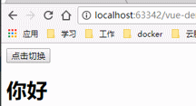

### 5.5.2.与v-for结合

当v-if和v-for出现在一起时，v-for优先级更高。也就是说，会先遍历，再判断条件。

示例：

```html
    <div id="app">
        <ul>
            <li v-for="(user,index) in users" v-if="user.gender === '女'">
                {{index}} - {{user.name}} : {{user.gender}} : {{user.age}}
            </li>
        </ul>
    </div>
    <script src="./node_modules/vue/dist/vue.js"></script>
    <script type="text/javascript">
        var vm = new Vue({
            el:"#app",
            data:{
                users:[
                    {name:'柳岩', gender:'女', age: 21},
                    {name:'虎哥', gender:'男', age: 30},
                    {name:'范冰冰', gender:'女', age: 24},
                    {name:'刘亦菲', gender:'女', age: 18},
                    {name:'古力娜扎', gender:'女', age: 25}
                ]
            }
        })
    </script>
```

效果：

 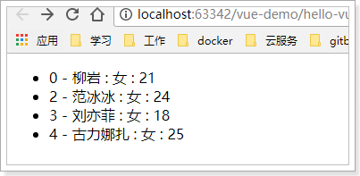

### 5.5.3.v-else

你可以使用 `v-else` 指令来表示 `v-if` 的“else 块”：

```
<div v-if="Math.random() > 0.5">
  Now you see me
</div>
<div v-else>
  Now you don't
</div>
```

`v-else` 元素必须紧跟在带 `v-if` 或者 `v-else-if` 的元素的后面，否则它将不会被识别。


`v-else-if`，顾名思义，充当 `v-if` 的“else-if 块”，可以连续使用：

```
<div v-if="type === 'A'">
  A
</div>
<div v-else-if="type === 'B'">
  B
</div>
<div v-else-if="type === 'C'">
  C
</div>
<div v-else>
  Not A/B/C
</div>
```

类似于 `v-else`，`v-else-if` 也必须紧跟在带 `v-if` 或者 `v-else-if` 的元素之后。

### 5.5.4.v-show

另一个用于根据条件展示元素的选项是 `v-show` 指令。用法大致一样：

```
<h1 v-show="ok">Hello!</h1>
```

不同的是带有 `v-show` 的元素始终会被渲染并保留在 DOM 中。`v-show` 只是简单地切换元素的 CSS 属性 `display`。

示例：

```html
    <div id="app">
        <!--事件中直接写js片段-->
        <button v-on:click="show = !show">点击切换</button><br/>
        <h1 v-if="show">
            你好
        </h1>
    </div>
    <script src="./node_modules/vue/dist/vue.js"></script>
    <script type="text/javascript">
        var app = new Vue({
            el:"#app",
            data:{
                show:true
            }
        })
    </script>
```


代码：

 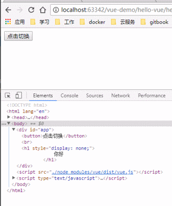

## 5.6.v-bind

### 5.6.1.绑定class样式

假如我们想动态的修改页面元素的属性，比如class属性，这样写是错误的：

```html
<div class="{{isAcctive}}"></div>
```

因为插值表达式不能用在属性的值中。

Vue对class属性进行了特殊处理，可以接收数组或对象格式：

> 数组语法

我们可以借助于`v-bind`指令来实现：

HTML：

```html
<div v-bind:class="isActive"></div>
```

你的data属性：

```js
data:{
    isActive:['active','hasError']
}
```

渲染后的效果：

```
<div class="active hasError"></div>
```

> 对象语法

我们可以传给 `v-bind:class` 一个对象，以动态地切换 class：

```html
<div v-bind:class="{ active: isActive }"></div>
```

上面的语法表示 `active` 这个 class 存在与否将取决于数据属性 `isActive` 的 [truthiness](https://developer.mozilla.org/zh-CN/docs/Glossary/Truthy)。

你可以在对象中传入更多属性来动态切换多个 class。此外，`v-bind:class` 指令也可以与普通的 class 属性共存。当有如下模板:

```html
<div class="static"
     v-bind:class="{ active: isActive, 'text-danger': hasError }">
</div>
```

和如下 data：

```js
data: {
  isActive: true,
  hasError: false
}
```

结果渲染为：

```html
<div class="static active"></div>
```

当 `isActive` 或者 `hasError` 变化时，class 列表将相应地更新。例如，如果 `hasError`的值为 `true`，class 列表将变为 `"static active text-danger"`。

### 5.6.2.简写

`v-bind:class`可以简写为`:class`


## 5.7.计算属性

在插值表达式中使用js表达式是非常方便的，而且也经常被用到。

但是如果表达式的内容很长，就会显得不够优雅，而且后期维护起来也不方便，例如下面的场景，我们有一个日期的数据，但是是毫秒值：

```js
data:{
    birthday:1529032123201 // 毫秒值
}
```

我们在页面渲染，希望得到yyyy-MM-dd的样式：

```html
<h1>您的生日是：{{
    new Date(birthday).getFullYear() + '-'+ new Date(birthday).getMonth()+ '-' + new Date(birthday).getDay()
    }}
</h1>
```

虽然能得到结果，但是非常麻烦。

Vue中提供了计算属性，来替代复杂的表达式：

```js
var vm = new Vue({
    el:"#app",
    data:{
        birthday:1429032123201 // 毫秒值
    },
    computed:{
        birth(){// 计算属性本质是一个方法，但是必须返回结果
            const d = new Date(this.birthday);
            return d.getFullYear() + "-" + d.getMonth() + "-" + d.getDay();
        }
    }
})
```

- 计算属性本质就是方法，但是一定要返回数据。然后页面渲染时，可以把这个方法当成一个变量来使用。

页面使用：

```html
    <div id="app">
       <h1>您的生日是：{{birth}} </h1>
    </div>
```

效果：

 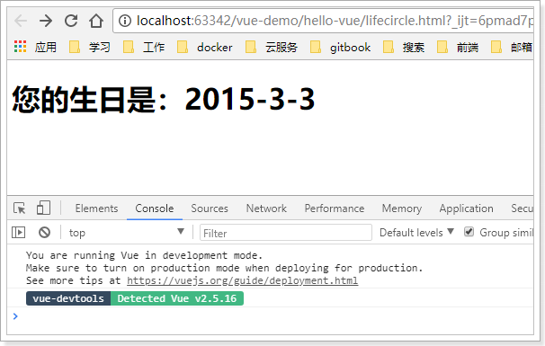


## 5.8.watch

watch可以让我们监控一个值的变化。从而做出相应的反应。

示例：

```html
<div id="app">
    <input type="text" v-model="message">
</div>
<script src="./node_modules/vue/dist/vue.js"></script>
<script type="text/javascript">
    var vm = new Vue({
        el:"#app",
        data:{
            message:""
        },
        watch:{
            message(newVal, oldVal){
                console.log(newVal, oldVal);
            }
        }
    })
</script>
```

效果：

 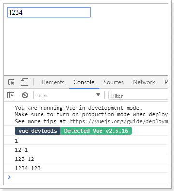


# 6.组件化

在大型应用开发的时候，页面可以划分成很多部分。往往不同的页面，也会有相同的部分。例如可能会有相同的头部导航。

但是如果每个页面都独自开发，这无疑增加了我们开发的成本。所以我们会把页面的不同部分拆分成独立的组件，然后在不同页面就可以共享这些组件，避免重复开发。


## 6.1.定义全局组件

我们通过Vue的component方法来定义一个全局组件。

```html
<div id="app">
    <!--使用定义好的全局组件-->
    <counter></counter>
</div>
<script src="./node_modules/vue/dist/vue.js"></script>
<script type="text/javascript">
    // 定义全局组件，两个参数：1，组件名称。2，组件参数
    Vue.component("counter",{
        template:'<button v-on:click="count++">你点了我 {{ count }} 次，我记住了.</button>',
        data(){
            return {
                count:0
            }
        }
    })
    var app = new Vue({
        el:"#app"
    })
</script>
```

- 组件其实也是一个Vue实例，因此它在定义时也会接收：data、methods、生命周期函数等
- 不同的是组件不会与页面的元素绑定，否则就无法复用了，因此没有el属性。
- 但是组件渲染需要html模板，所以增加了template属性，值就是HTML模板
- 全局组件定义完毕，任何vue实例都可以直接在HTML中通过组件名称来使用组件了。
- data的定义方式比较特殊，必须是一个函数。

效果：

 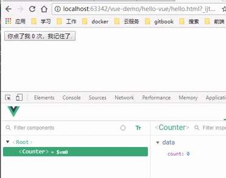


## 6.2.组件的复用

定义好的组件，可以任意复用多次：

```html
<div id="app">
    <!--使用定义好的全局组件-->
    <counter></counter>
    <counter></counter>
    <counter></counter>
</div>
```

效果：

 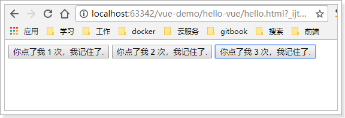

你会发现每个组件互不干扰，都有自己的count值。怎么实现的？

> **组件的data属性必须是函数**！

当我们定义这个 `<counter>` 组件时，它的data 并不是像这样直接提供一个对象：

```js
data: {
  count: 0
}

```

取而代之的是，一个组件的 data 选项必须是一个函数，因此每个实例可以维护一份被返回对象的独立的拷贝：

```js
data: function () {
  return {
    count: 0
  }
}
```

如果 Vue 没有这条规则，点击一个按钮就会影响到其它所有实例！


## 6.2.局部注册

一旦全局注册，就意味着即便以后你不再使用这个组件，它依然会随着Vue的加载而加载。

因此，对于一些并不频繁使用的组件，我们会采用局部注册。

我们先在外部定义一个对象，结构与创建组件时传递的第二个参数一致：

```js
const counter = {
    template:'<button v-on:click="count++">你点了我 {{ count }} 次，我记住了.</button>',
    data(){
        return {
            count:0
        }
    }
};
```

然后在Vue中使用它：

```js
var app = new Vue({
    el:"#app",
    components:{
        counter:counter // 将定义的对象注册为组件
    }
})
```

- components就是当前vue对象子组件集合。
  - 其key就是子组件名称
  - 其值就是组件对象的属性
- 效果与刚才的全局注册是类似的，不同的是，这个counter组件只能在当前的Vue实例中使用

## 6.3.组件通信

通常一个单页应用会以一棵嵌套的组件树的形式来组织：


- 页面首先分成了顶部导航、左侧内容区、右侧边栏三部分
- 左侧内容区又分为上下两个组件
- 右侧边栏中又包含了3个子组件

各个组件之间以嵌套的关系组合在一起，那么这个时候不可避免的会有组件间通信的需求。

### 6.3.1.父向子传递props

比如我们有一个子组件：

```js
Vue.component("introduce",{
    // 直接使用props接收到的属性来渲染页面
    template:'<h3>{{title}}</h3>',
    props:[title] // 通过props来接收一个父组件传递的属性
})
```

- 这个子组件中要使用title属性渲染页面，但是自己并没有title属性
- 通过props来接收父组件属性，名为title

父组件使用子组件，同时传递title属性：

```html
<div id="app">
    <h1>打个招呼：</h1>
    <!--使用子组件，同时传递title属性-->
    <introduce title="大家好，我是虎哥"/>
</div>
<script src="./node_modules/vue/dist/vue.js"></script>
<script type="text/javascript">
    Vue.component("introduce",{
        // 直接使用props接收到的属性来渲染页面
        template:'<h1>{{title}}</h1>',
        props:['title'] // 通过props来接收一个父组件传递的属性
    })
    var app = new Vue({
        el:"#app"
    })
</script>
```

效果：

  


### 6.3.2.传递复杂数据

我们定义一个子组件：

```js
const myList = {
    template:'\
        <ul>\
        	<li v-for="item in items" :key="item.id">{{item.id}} : {{item.name}}</li>\
        </ul>\
        ',
    props:{ // 通过props来接收父组件传递来的属性
        items:{// 这里定义items属性
            type:Array,// 要求必须是Array类型
            default:[] // 如果父组件没有传，那么给定默认值是[]
        }
	}
}
```

- 这个子组件可以对 items 进行迭代，并输出到页面。
- 但是组件中并未定义items属性。
- 通过props来定义需要从父组件中接收的属性
  - items：是要接收的属性名称
    - type：限定父组件传递来的必须是数组，否则报错
    - default：默认值

我们在父组件中使用它：

```html
<div id="app">
    <h2>传智播客已开设如下课程：</h2>
    <!-- 使用子组件的同时，传递属性，这里使用了v-bind，指向了父组件自己的属性lessons -->
    <my-list :items="lessons"/>
</div>
```

```js
var app = new Vue({
    el:"#app",
    components:{
        myList // 当key和value一样时，可以只写一个
    },
    data:{
        lessons:[
            {id:1, name: 'java'},
            {id:2, name: 'php'},
            {id:3, name: 'ios'},
        ]
    }
})
```

效果：

  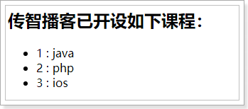

### 6.3.3.子向父的通信

来看这样的一个案例：

```html
<div id="app">
    <h2>num: {{num}}</h2>
    <!--使用子组件的时候，传递num到子组件中-->
    <counter :num="num"></counter>
</div>
<script src="./node_modules/vue/dist/vue.js"></script>
<script type="text/javascript">
    Vue.component("counter", {// 子组件，定义了两个按钮，点击数字num会加或减
        template:'\
            <div>\
                <button @click="num++">加</button>  \
                <button @click="num--">减</button>  \
            </div>',
        props:['num']// count是从父组件获取的。
    })
    var app = new Vue({
        el:"#app",
        data:{
            num:0
        }
    })
</script>
```

- 子组件接收父组件的num属性
- 子组件定义点击按钮，点击后对num进行加或减操作

我们尝试运行：

 

好像没问题，点击按钮试试：

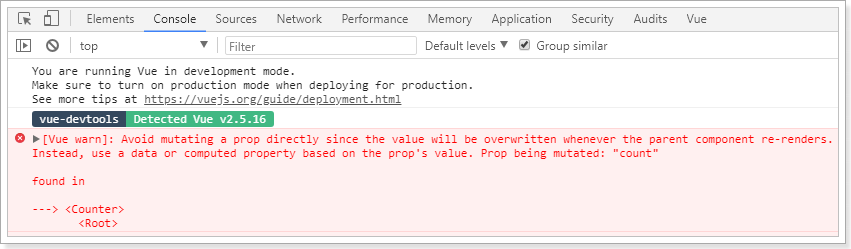

子组件接收到父组件属性后，默认是不允许修改的。怎么办？

既然只有父组件能修改，那么加和减的操作一定是放在父组件：

```js
var app = new Vue({
    el:"#app",
    data:{
        num:0
    },
    methods:{ // 父组件中定义操作num的方法
        increment(){
            this.num++;
        },
        decrement(){
            this.num--;
        }
    }
})
```


但是，点击按钮是在子组件中，那就是说需要子组件来调用父组件的函数，怎么做？

我们可以**通过v-on指令将父组件的函数绑定到子组件**上：

```html
<div id="app">
    <h2>num: {{num}}</h2>
    <counter :count="num" @inc="increment" @dec="decrement"></counter>
</div>
```

然后，当子组件中按钮被点击时，调用绑定的函数：

```js
        Vue.component("counter", {
            template:'\
                <div>\
                    <button @click="plus">加</button>  \
                    <button @click="reduce">减</button>  \
                </div>',
            props:['count'],
            methods:{
                plus(){
                    this.$emit("inc");
                },
                reduce(){
                    this.$emit("dec");
                }
            }
        })
```

- vue提供了一个内置的this.$emit函数，用来调用父组件绑定的函数

效果：

 


