# 0.学习目标

- 了解vue-router使用
- 了解webpack使用
- 会使用vue-cli搭建项目
- 独立搭建后台管理系统
- 了解系统基本结构


# 1.路由vue-router

## 1.1.场景模拟

现在我们来实现这样一个功能：

一个页面，包含登录和注册，点击不同按钮，实现登录和注册页切换：

 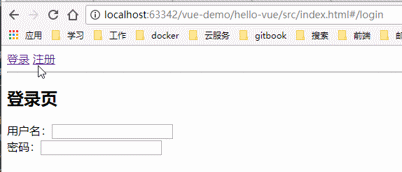


### 1.1.1.编写父组件

为了让接下来的功能比较清晰，我们先新建一个文件夹：src:

 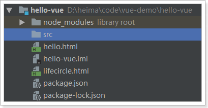

然后新建一个HTML文件，作为入口：index.html

 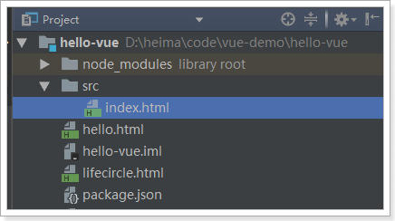

然后编写页面的基本结构：

```html
<div id="app">
    <span>登录</span>
    <span>注册</span>
    <hr/>
    <div>
        登录页/注册页
    </div>
</div>
<script src="../node_modules/vue/dist/vue.js"></script>
<script type="text/javascript">
    var vm = new Vue({
        el:"#app"
    })
</script>
```

样式：

 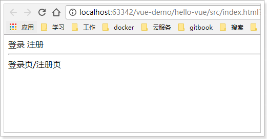


### 1.1.2.编写登录组件

接下来我们来实现登录组件，以前我们都是写在一个文件中，但是为了复用性，开发中都会把组件放如独立的JS文件中，我们新建一个login.js

 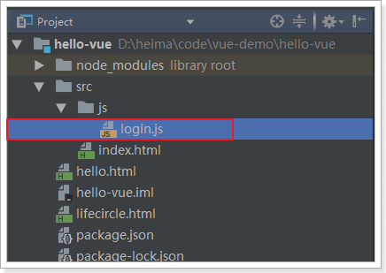

编写组件，这里我们只写模板，不写功能：

```js
const loginForm = {
    template:'\
    <div>\
    <h2>登录页</h2> \
    用户名：<input type="text"><br/>\
    密码：<input type="password"><br/>\
    </div>\
    '
}
```

### 1.1.3.编写注册组件

新建单文件组件：register.js

 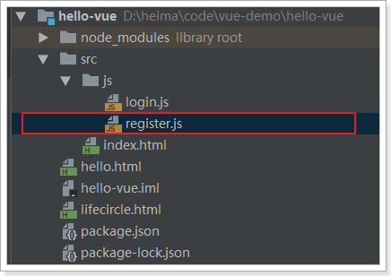

编写模板：

```js
const registerForm = {
    template:'\
    <div>\
    <h2>注册页</h2> \
    用户名：<input type="text"><br/>\
    密码：<input type="password"><br/>\
    确认密码：<input type="password"><br/>\
    </div>\
    '
}
```

### 1.1.4.在父组件中引用

在index.html中使用刚刚编写的两个组件

```html
    <div id="app">
        <span>登录</span>
        <span>注册</span>
        <hr/>
        <div>
            <login-form></login-form>
            <register-form></register-form>
        </div>
    </div>
    <script src="../node_modules/vue/dist/vue.js"></script>
    <script src="js/login.js"></script>
    <script src="js/register.js"></script>
    <script type="text/javascript">
        var vm = new Vue({
            el:"#app",
            components:{// 引用登录和注册组件
                loginForm,
                registerForm
            }
        })
    </script>
```

效果：

 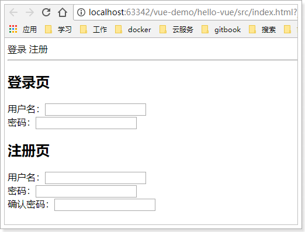

### 1.1.5.问题

我们期待的是，当点击登录或注册按钮，分别显示登录页或注册页，而不是一起显示。

但是，如何才能动态加载组件，实现组件切换呢？

虽然使用原生的Html5和JS也能实现，但是官方推荐我们使用vue-router模块。


## 1.2.vue-router简介和安装

使用vue-router和vue可以非常方便的实现 复杂单页应用的动态路由功能。

官网：https://router.vuejs.org/zh-cn/

使用npm安装：`npm install vue-router --save` 

 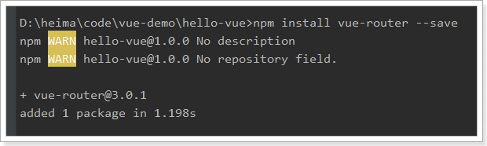

在index.html中引入依赖：

```html
<script src="../node_modules/vue-router/dist/vue-router.js"></script>
```


## 1.3.快速入门

新建vue-router对象，并且指定路由规则：

```js
// 创建VueRouter对象
const router = new VueRouter({
    routes:[ // 编写多个路由规则
        {
            path:"/login", // 请求路径
            component:loginForm // 组件名称
        },
        {path:"/register",component:registerForm},
    ]
})
```

- 创建VueRouter对象，并指定路由参数
- routes：路由规则的数组，可以指定多个对象，每个对象是一条路由规则，包含以下属性：
  - path：路由的路径
  - component：组件名称

在父组件中引入router对象：

```js
var vm = new Vue({
    el:"#app",
    components:{// 引用登录和注册组件
        loginForm,
        registerForm
    },
    router // 引用上面定义的router对象
})
```


页面跳转控制：

```html
<div id="app">
    <!--router-link来指定跳转的路径-->
    <span><router-link to="/login">登录</router-link></span>
    <span><router-link to="/register">注册</router-link></span>
    <hr/>
    <div>
        <!--vue-router的锚点-->
        <router-view></router-view>
    </div>
</div>
```

- 通过`<router-view>`来指定一个锚点，当路由的路径匹配时，vue-router会自动把对应组件放到锚点位置进行渲染
- 通过`<router-link>`指定一个跳转链接，当点击时，会触发vue-router的路由功能，路径中的hash值会随之改变

效果：

 


**注意**：单页应用中，页面的切换并不是页面的跳转。仅仅是地址最后的hash值变化。

事实上，我们总共就一个HTML：index.html


## 1.4.父子组件


# 2.webpack

## 2.1.认识webpack

Webpack 是一个前端资源的打包工具，它可以将js、image、css等资源当成一个模块进行打包。

中文官方网站：https://www.webpackjs.com/


官网给出的解释：

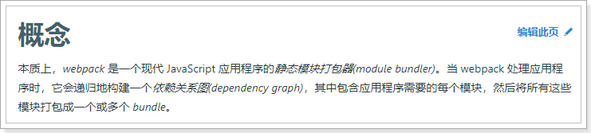

为什么需要打包？

- 将许多碎小文件打包成一个整体，减少单页面内的衍生请求次数，提高网站效率。
- 将ES6的高级语法进行转换编译，以兼容老版本的浏览器。
- 将代码打包的同时进行混淆，提高代码的安全性。

## 2.2.四个核心概念

学习Webpack，你需要先理解四个**核心概念**：

- 入口(entry)

  webpack打包的启点，可以有一个或多个，一般是js文件。webpack会从启点文件开始，寻找启点直接或间接依赖的其它所有的依赖，包括JS、CSS、图片资源等，作为将来打包的原始数据

- 输出(output)

  出口一般包含两个属性：path和filename。用来告诉webpack打包的目标文件夹，以及文件的名称。目的地也可以有多个。

- 加载器（loader）

  webpack本身只识别Js文件，如果要加载非JS文件，必须指定一些额外的加载器（loader），例如css-loader。然后将这些文件转为webpack能处理的有效模块，最后利用webpack的打包能力去处理。

- 插件(plugins)

  插件可以扩展webpack的功能，让webpack不仅仅是完成打包，甚至各种更复杂的功能，或者是对打包功能进行优化、压缩，提高效率。


## 2.3.安装

webpack支持全局安装和本地安装，官方推荐是本地安装，我们按照官方的来。

输入命令：`npm install webpack webpack-cli --save-dev`

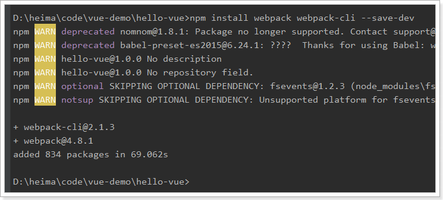

此时，我们注意下项目中文件夹下，会有一个package.json文件。（其实早就有了）

 

打开文件，可以看到我们之前用npm安装过的文件都会出现在这里：

 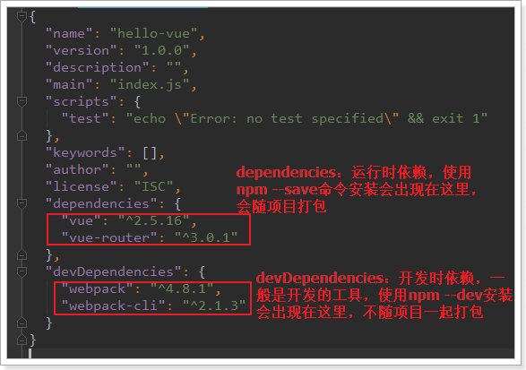


## 2.4.编写webpack配置

接下来，我们编写一个webpack的配置，来指定一些打包的配置项。配置文件的名称，默认就是webpack.config.js，我们放到hello-vue的根目录：

 

配置文件中就是要指定上面说的四个核心概念，入口、出口、加载器、插件。

不过，加载器和插件是可选的。我们先编写入口和出口


### 2.4.1.入口entry

webpack打包的启点，可以有一个或多个，一般是js文件。现在思考一下我们有没有一个入口？貌似没有，我们所有的东西都集中在index.html，不是一个js，那怎么办？

我们新建一个js，把index.html中的部分内容进行集中，然后在index.html中引用这个js不就OK了！

 

然后把原来index.html中的js代码全部移动到main.js中

```js
// 使用es6的语法导入js模块
import Vue from '../node_modules/vue/dist/vue';
import VueRouter from '../node_modules/vue-router/dist/vue-router'
import loginForm from './js/login'
import registerForm from './js/register'

Vue.use(VueRouter)

// 创建VueRouter对象
const router = new VueRouter({
    routes:[ // 编写多个路由规则
        {
            path:"/login", // 请求路径
            component:loginForm // 组件名称
        },
        {path:"/register",component:registerForm},
    ]
})
var vm = new Vue({
    el:"#app",
    components:{// 引用登录和注册组件
        loginForm,
        registerForm
    },
    router
})
```

- 原来的index.html中引入了很多其它js，在这里我们使用es6的import语法进行导入。

  注意，要使用import，就需要在login.js和register.js中添加export导出语句：

  ```js
  const loginForm = {
      template:`
      <div> 
      <h2>登录页</h2> 
      用户名：<input type="text"><br/>
      密码：<input type="password"><br/>
      </div>
      `
  }
  export default loginForm;
  ```

  register.js:

  ```js
  const registerForm = {
      template:`
      <div>
      <h2>注册页</h2> 
      用户名：<input type="text"><br/>
      密码：<input type="password"><br/>
      确认密码：<input type="password"><br/>
      </div>
      `
  }
  export default registerForm;
  
  ```

  

- vue-router使用模块话加载后，必须增加一句：Vue.use(VueRouter)

这样，main.js就成了我们整个配置的入口了。


我们在webpack.config.js中添加以下内容：

```js
module.exports={
    entry:'./src/main.js',  //指定打包的入口文件
}
```

### 2.4.2.出口output

出口，就是输出的目的地。一般我们会用一个dist目录，作为打包输出的文件夹：

 

然后，编写webpack.config.js，添加出口配置：

```js
module.exports={
    entry:'./src/main.js',  //指定打包的入口文件
    output:{
        // path: 输出的目录，__dirname是相对于webpack.config.js配置文件的绝对路径
        path : __dirname+'/dist',  
        filename:'build.js'	 //输出的js文件名
    }
}
```


## 2.5.执行打包

在控制台输入以下命令：

```
npx webpack --config webpack.config.js

```


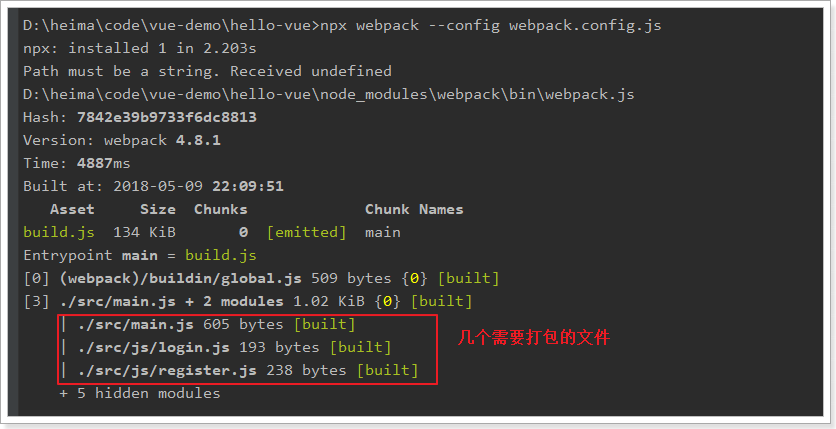

随后，查看dist目录：

 

尝试打开build.js，你根本看不懂：

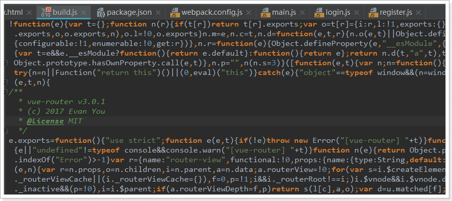

所有的js合并为1个，并且对变量名进行了随机打乱，这样就起到了 压缩、混淆的作用。


## 2.6.测试运行

在index.html中引入刚刚生成的build.js文件，

```html
<!DOCTYPE html>
<html lang="en">
<head>
    <meta charset="UTF-8">
    <title>Title</title>
</head>
<body>
    <div id="app">
        <!--router-link来指定跳转的路径-->
        <span><router-link to="/login">登录</router-link></span>
        <span><router-link to="/register">注册</router-link></span>
        <hr/>
        <div>
            <!--vue-router的锚点-->
            <router-view></router-view>
        </div>
    </div>
    <script src="../dist/build.js"></script>
</body>
</html>
```


然后运行：

 


## 2.7.打包CSS

### 2.7.1.编写css文件

我们来编写一段CSS代码，对index的样式做一些美化：

 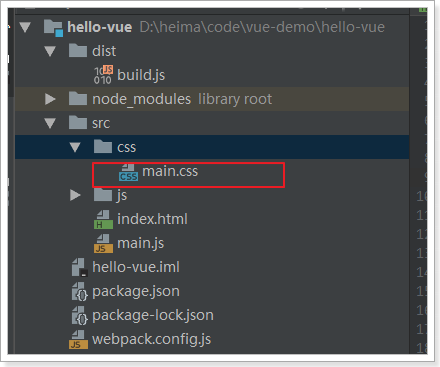

内容：

```css
#app a{
    display: inline-block;
    width: 150px;
    line-height: 30px;
    background-color: dodgerblue;
    color: white;
    font-size: 16px;
    text-decoration: none;
}
#app a:hover{
    background-color: whitesmoke;
    color: dodgerblue;
}
#app div{
    width: 300px;
    height: 150px;
}
#app{
    width: 305px;
    border: 1px solid dodgerblue;
}
```

### 2.7.2.安装加载器

前面说过，webpack默认只支持js加载。要加载CSS文件，必须安装加载器：

命令：

```
npm install style-loader css-loader --save-dev

```


此时，在package.json中能看到新安装的：

 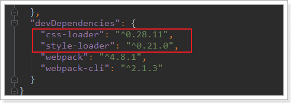


### 2.7.3.在main.js引入css文件

因为入口在main.js，因此css文件也要在这里引入。依然使用ES6 的模块语法：

```js
import './css/main.css'
```

### 2.7.4.在webpack.config.js添加加载器

```js
module.exports = {
    entry: './src/main.js',  //指定打包的入口文件
    output: {
        path: __dirname + '/dist', // 注意：__dirname表示webpack.config.js所在目录的绝对路径
        filename: 'build.js'  //输出文件
    },
    module: {
        rules: [
            {
                test: /\.css$/, // 通过正则表达式匹配所有以.css后缀的文件
                use: [ // 要使用的加载器，这两个顺序一定不要乱
                    'style-loader',
                    'css-loader'
                ]
            }
        ]
    }
}
```

### 2.7.5.重新打包

再次输入打包指令：`npx webpack --config webpack.config.js`

 

效果：

 


## 2.8.script脚本

我们每次使用npm安装，都会在package.json中留下痕迹，事实上，package.json中不仅可以记录安装的内容，还可编写脚本，让我们运行命令更加快捷。

我们可以把webpack的命令编入其中：

 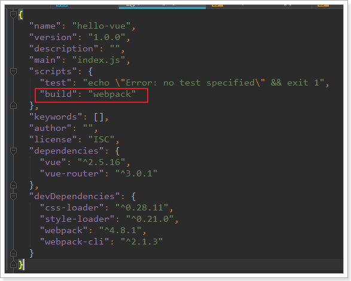

以后，如果要打包，就可以直接输入：`npm run build`即可。

- `npm run` ：执行npm脚本，后面跟的是脚本的名称`build`

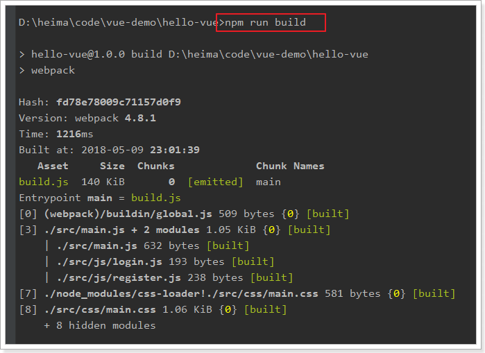

## 2.9.打包HTML

之前的打包过程中，除了HTML文件外的其它文件都被打包了，当在线上部署时，我们还得自己复制HTML到dist，然后手动添加生成的js到HTML中，这非常不友好。

webpack中的一个插件：html-webpack-plugin，可以解决这个问题。

1）安装插件：`npm install --save-dev html-webpack-plugin`

需要在webpack.config.js中添加插件：

```js
const HtmlWebpackPlugin = require('html-webpack-plugin');

module.exports = {
    entry: './src/main.js',  //指定打包的入口文件
    output: {
        path: __dirname + '/dist',  // 注意：__dirname表示webpack.config.js所在目录的绝对路径
        filename: 'build.js'		   //输出文件
    },
    module: {
        rules: [
            {
                test: /\.css$/, // 通过正则表达式匹配所有以.css后缀的文件
                use: [ // 要使用的加载器，这两个顺序一定不要乱
                    'style-loader',
                    'css-loader'
                ]
            }
        ]
    },
    plugins:[
        new HtmlWebpackPlugin({
            title: '首页',  //生成的页面标题<head><title>首页</title></head>
            filename: 'index.html', // dist目录下生成的文件名
            template: './src/index.html' // 我们原来的index.html，作为模板
        })
    ]
}
```


2）将原来HTML中的引入js代码删除：

  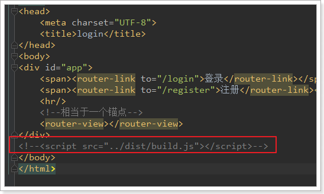

3）再次打包：`npm run build`

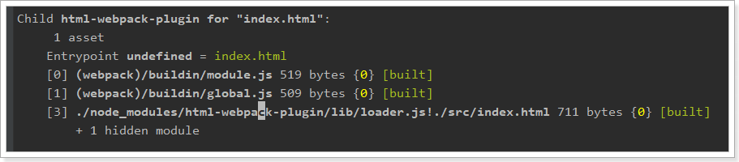

4）查看dist目录：

 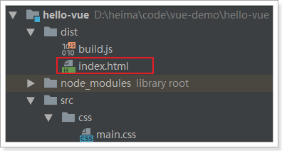

打开index.html，发现已经自动添加了当前目录下的build.js

```html
<!DOCTYPE html>
<html lang="en">
<head>
    <meta charset="UTF-8">
    <title>Title</title>
</head>
<body>
    <div id="app">
        <!--router-link来指定跳转的路径-->
        <span><router-link to="/login">登录</router-link></span>
        <span><router-link to="/register">注册</router-link></span>
        <div>
            <!--vue-router的锚点-->
            <router-view></router-view>
        </div>
    </div>
<script type="text/javascript" src="build.js"></script></body>
</html>
```


## 2.10.热更新的web服务

刚才的案例中，每次修改任何js或css内容，都必须重新打包，非常麻烦。


webpack给我们提供了一个插件，可以帮我们运行一个web服务，加载页面内容，并且修改js后不需要重新加载就能看到最新结果：

1）安装插件：

```
npm install webpack-dev-server --save-dev
```

2）添加启动脚本

在package.json中配置script

```js
  "scripts": {
    "dev": "webpack-dev-server --inline --hot --open --port 8080 --host 127.0.0.1"
  },
```

--inline：自动刷新

--hot：热加载

--port：指定端口

--open：自动在默认浏览器打开

--host：可以指定服务器的 ip，不指定则为127.0.0.1


3）运行脚本：

```
npm run dev
```


 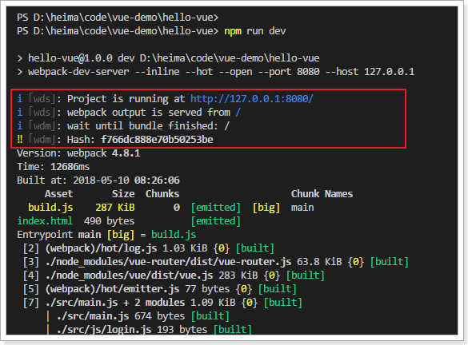

4）效果：

 

# 3.vue-cli

## 3.1.介绍和安装

在开发中，需要打包的东西不止是js、css、html。还有更多的东西要处理，这些插件和加载器如果我们一一去添加就会比较麻烦。

幸好，vue官方提供了一个快速搭建vue项目的脚手架：vue-cli

使用它能快速的构建一个web工程模板。

官网：https://github.com/vuejs/vue-cli

安装命令：

```
npm install -g vue-cli
```


## 3.2.快速上手

我们新建一个module：

 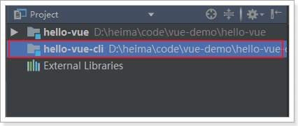

打开终端并进入目录：

 

用vue-cli命令，快速搭建一个webpack的项目：`vue init webpack`


 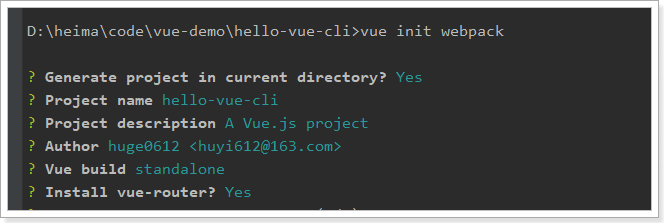

前面几项都走默认或yes

下面这些我们选no

 

最后，再选yes，使用 npm安装

 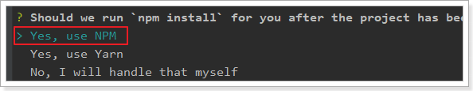


## 3.3.项目结构

安装好的项目结构：

 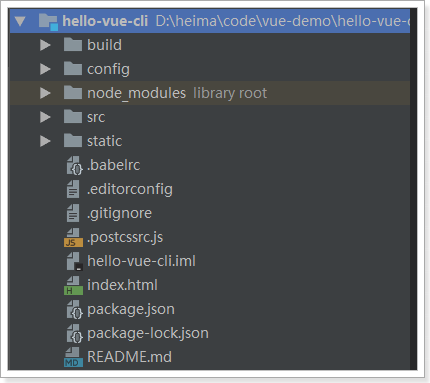


入口文件：


## 3.4.单文件组件

需要注意的是，我们看到有一类后缀名为.vue的文件，我们称为单文件组件

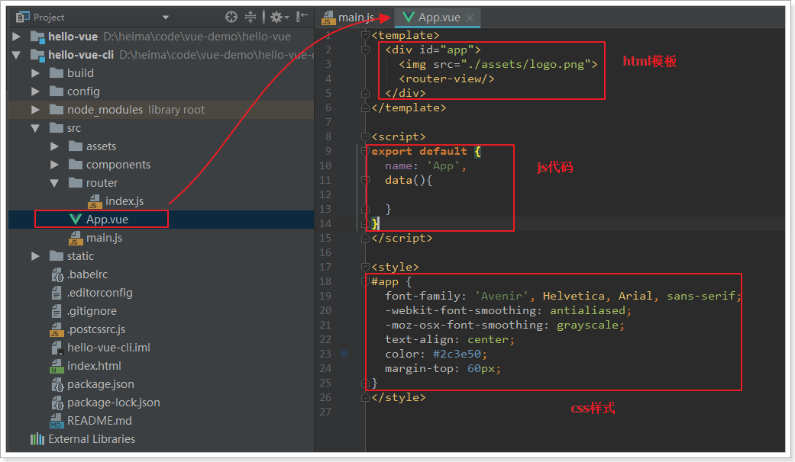

每一个.vue文件，就是一个独立的vue组件。类似于我们刚才写的loginForm.js和registerForm.js

只不过，我们在js中编写 html模板和样式非常的不友好，而且没有语法提示和高亮。


而单文件组件中包含三部分内容：

- template：模板，支持html语法高亮和提示
- script：js脚本，这里编写的就是vue的组件对象，看到上面的data(){}了吧
- style：样式，支持CSS语法高亮和提示

每个组件都有自己独立的html、JS、CSS，互不干扰，真正做到可独立复用。


## 3.5.运行

看看生成的package.json：

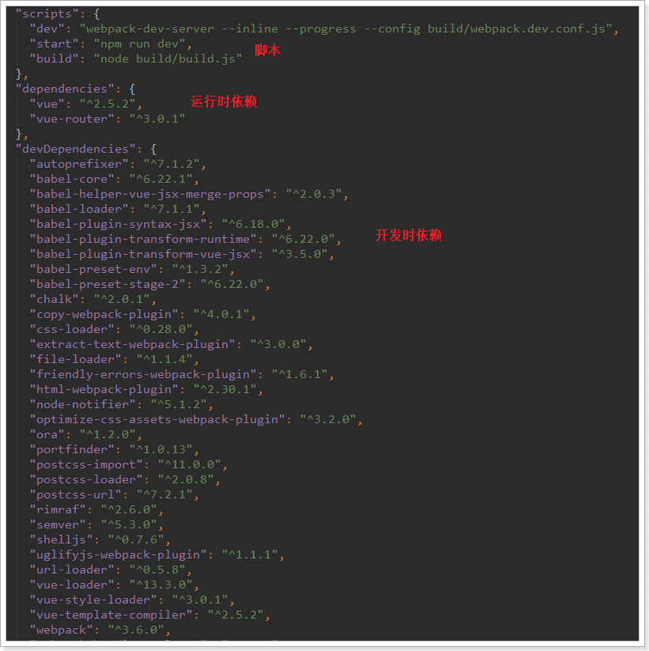

- 可以看到这引入了非常多的依赖，绝大多数都是开发期依赖，比如大量的加载器。
- 运行时依赖只有vue和vue-router
- 脚本有三个：
  - dev：使用了webpack-dev-server命令，开发时热部署使用
  - start：使用了npm run dev命令，与上面的dev效果完全一样
  - build：等同于webpack的打包功能，会打包到dist目录下。

我们执行`npm run dev` 或者 `npm start` 都可以启动项目：

 


页面：


# 4.搭建后台管理前端

## 4.1.导入已有资源

后台项目相对复杂，为了有利于教学，我们不再从0搭建项目，而是直接使用课前资料中给大家准备好的源码：

 

我们解压缩，放到工作目录中：

 


然后在eclipse中导入新的工程：

 

选中我们的工程：

 


这正是一个用vue-cli构建的webpack工程，是不是与昨天的一样：

 

## 4.2.安装依赖

你应该注意到，这里并没有node_modules文件夹，方便给大家下发，已经把依赖都删除了。不过package.json中依然定义了我们所需的一切依赖：

 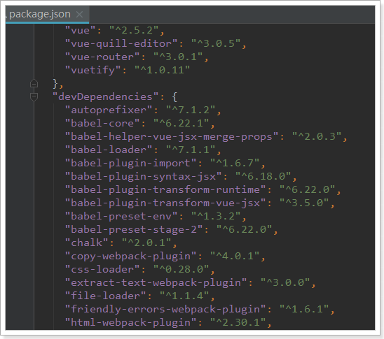

我们只需要通过命令来安装所需依赖即可。打开终端，进入项目目录，输入：`npm install`

 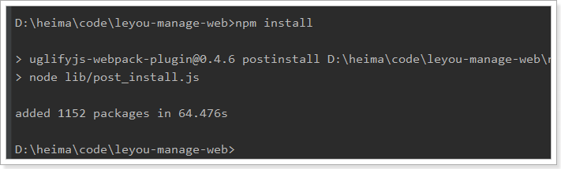

大概需要1分钟。

## 4.3.运行一下看看

输入命令：

```
npm run dev
```

 

发现默认的端口是9001。访问：http://localhost:9001

会自动进行跳转：


# 5.Vuetify框架

## 5.1.为什么要学习UI框架

Vue负责的是虽然会帮我们进行视图的渲染，但是样式是有我们自己来完成。这显然不是我们的强项，因此后端开发人员一般都喜欢使用一些现成的UI组件，拿来即用，常见的例如：

- BootStrap
- LayUI
- EasyUI
- ZUI

然而这些UI组件的基因天生与Vue不合，因为他们更多的是利用DOM操作，借助于jQuery实现，而不是MVVM的思想。

而目前与Vue吻合的UI框架也非常的多，国内比较知名的如：

- element-ui：饿了么出品
- i-view：某公司出品

然而我们都不用，我们今天推荐的是一款国外的框架：Vuetify

官方网站：https://vuetifyjs.com/zh-Hans/


## 5.2.为什么是Vuetify

有中国的为什么还要用外国的？原因如下：

- Vuetify几乎不需要任何CSS代码，而element-ui许多布局样式需要我们来编写
- Vuetify从底层构建起来的语义化组件。简单易学，容易记住。
- Vuetify基于Material Design（谷歌推出的多平台设计规范），更加美观，动画效果酷炫，且风格统一

这是官网的说明：

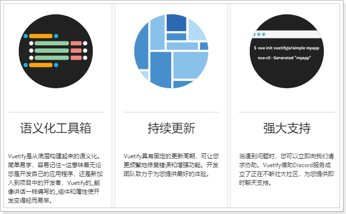

缺陷：

- 目前官网虽然有中文文档，但因为翻译问题，几乎不太能看。


## 5.3.怎么用？

基于官方网站的文档进行学习：


我们重点关注`UI components`即可，里面有大量的UI组件，我们要用的时候再查看，不用现在学习，先看下有什么：

 


 

以后用到什么组件，就来查询即可。


# 6.项目结构

开始编码前，我们先了解下项目的结构：

## 6.1.目录结构

首先是目录结构图：


## 6.2.调用关系

我们最主要理清index.html、main.js、App.vue之间的关系：


理一下：

- index.html中定义了空的`div`，其id为`app`。
- main.js中定义了Vue对象，并且绑定通过id选择器，绑定到index.html的div中，因此**main.js的内容都将在index.html的div中显示**。
- 而main.js中只有一行内容：`<App/>`,这是使用了App组件，即App.vue，也就是说index.html中最终展现的是App.vue中的内容。
- App.vue中也没有内容，而是定义了vue-router的锚点：`<router-view>`,我们之前讲过，vue-router路由后的组件将会在锚点展示。
- 最终的结论是：**一切路由后的内容都将通过App.vue在index.html中显示。**


## 6.3.页面布局

接下来我们一起看下页面布局：

Layout组件是我们的整个页面的布局组件：


一个典型的三块布局。包含左，上，中三部分：

 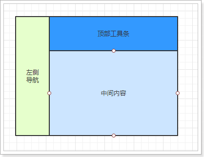


里面使用了Vuetify中的2个组件和一个布局元素：

- `v-navigation-drawer` ：导航抽屉，主要用于容纳应用程序中的页面的导航链接。 

   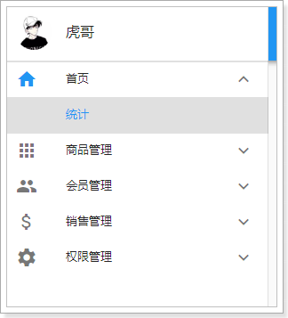

- `v-toolbar `：工具栏通常是网站导航的主要途径。可以与导航抽屉一起很好地工作，动态选择是否打开导航抽屉，实现可伸缩的侧边栏。

  

- `v-content`：并不是一个组件，而是标记页面布局的元素。可以根据您指定的**app**组件的结构动态调整大小，使得您可以创建高度可定制的组件。

那么问题来了：`v-content`中的内容来自哪里？

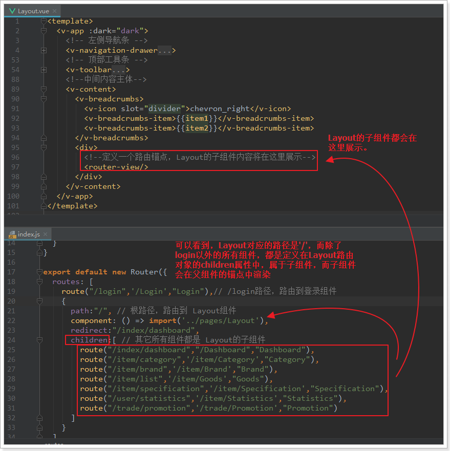

- Layout映射的路径是`/`
- 除了Login以为的所有组件，都是定义在Layout的children属性，并且路径都是`/`的下面
- 因此当路由到子组件时，会在Layout中定义的锚点中显示。
- 并且Layout中的其它部分不会变化，这就实现了布局的共享。