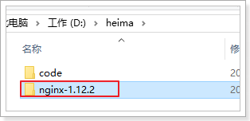
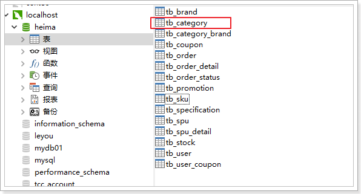
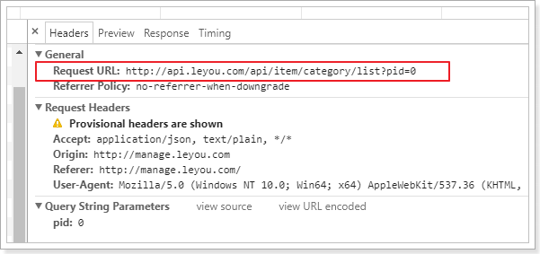
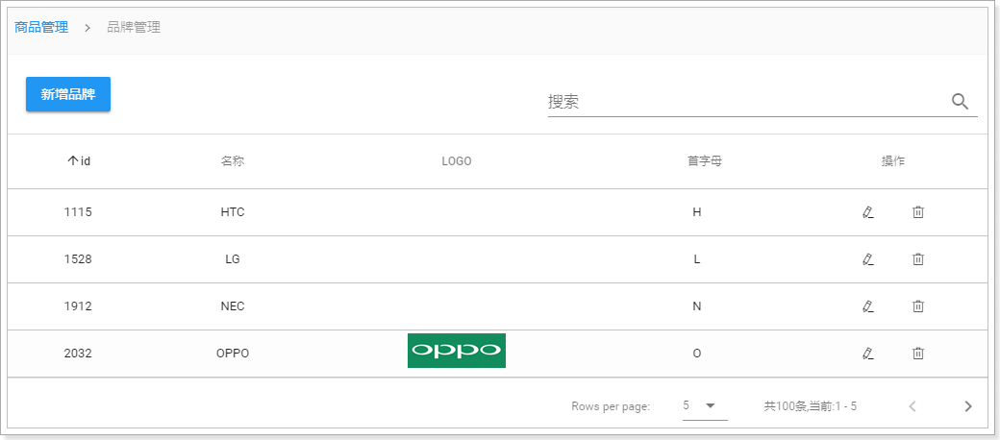
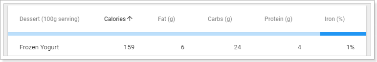
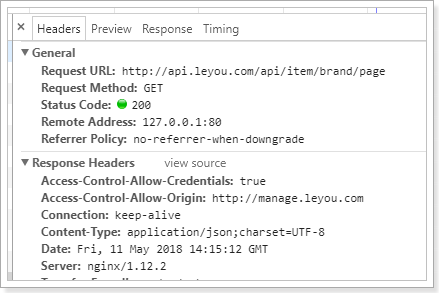
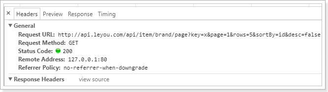

# 0.学习目标

- 使用资料搭建后台系统
- 会使用nginx进行反向代理
- 实现商品分类查询功能
- 掌握cors解决跨域
- 实现品牌查询功能


# 1.使用域名访问本地项目

## 1.1.统一环境

我们现在访问页面使用的是：http://localhost:9001

有没有什么问题？

实际开发中，会有不同的环境：

- 开发环境：自己的电脑
- 测试环境：提供给测试人员使用的环境
- 预发布环境：数据是和生成环境的数据一致，运行最新的项目代码进去测试
- 生产环境：项目最终发布上线的环境

如果不同环境使用不同的ip去访问，可能会出现一些问题。为了保证所有环境的一致，我们会在各种环境下都使用域名来访问。

我们将使用以下域名：

- 主域名是：www.leyou.com，
- 管理系统域名：manage.leyou.com
- 网关域名：api.leyou.com
- ...

但是最终，我们希望这些域名指向的还是我们本机的某个端口。

那么，当我们在浏览器输入一个域名时，浏览器是如何找到对应服务的ip和端口的呢？

## 1.2.域名解析

一个域名一定会被解析为一个或多个ip。这一般会包含两步：

- 本地域名解析

  浏览器会首先在本机的hosts文件中查找域名映射的IP地址，如果查找到就返回IP ，没找到则进行域名服务器解析，一般本地解析都会失败，因为默认这个文件是空的。

  - Windows下的hosts文件地址：C:/Windows/System32/drivers/etc/hosts
  - Linux下的hosts文件所在路径： /etc/hosts 

  样式：

  ```
  # My hosts
  127.0.0.1 localhost
  0.0.0.0 account.jetbrains.com
  127.0.0.1 www.xmind.net
  ```

- 域名服务器解析

  本地解析失败，才会进行域名服务器解析，域名服务器就是网络中的一台计算机，里面记录了所有注册备案的域名和ip映射关系，一般只要域名是正确的，并且备案通过，一定能找到。


## 1.3.解决域名解析问题

我们不可能去购买一个域名，因此我们可以伪造本地的hosts文件，实现对域名的解析。修改本地的host为：

```
127.0.0.1 api.leyou.com
127.0.0.1 manage.leyou.com
```

这样就实现了域名的关系映射了。

每次在C盘寻找hosts文件并修改是非常麻烦的，给大家推荐一个快捷修改host的工具，在课前资料中可以找到：

 

效果：

 

我们添加了两个映射关系：

- 127.0.0.1 api.leyou.com ：我们的网关Zuul
- 127.0.0.1 manage.leyou.com：我们的后台系统地址

现在，ping一下域名试试是否畅通：

 

OK！

## 1.4.nginx解决端口问题

虽然域名解决了，但是现在如果我们要访问，还得自己加上端口：`http://manage.taotao.com:9001`。

这就不够优雅了。我们希望的是直接域名访问：`http://manage.taotao.com`。这种情况下端口默认是80，如何才能把请求转移到9001端口呢？

这里就要用到反向代理工具：Nginx

### 1.4.1.什么是Nginx


NIO：not-blocking-io 非阻塞IO

BIO：blocking-IO 阻塞IO

nginx可以作为web服务器，但更多的时候，我们把它作为网关，因为它具备网关必备的功能：

- 反向代理
- 负载均衡
- 动态路由
- 请求过滤

### 1.4.2.nginx作为web服务器

Web服务器分2类：

- web应用服务器，如：
  - tomcat
  - resin
  - jetty

- web服务器，如：
  - Apache 服务器
  - Nginx
  - IIS

区分：web服务器不能解析jsp等页面，只能处理js、css、html等静态资源。
并发：web服务器的并发能力远高于web应用服务器。

Nginx + tomcat

### 1.4.3.nginx作为反向代理

什么是反向代理？

- 代理：通过客户机的配置，实现让一台服务器代理客户机，客户的所有请求都交给代理服务器处理。
- 反向代理：用一台服务器，代理真实服务器，用户访问时，不再是访问真实服务器，而是代理服务器。

nginx可以当做反向代理服务器来使用：

- 我们需要提前在nginx中配置好反向代理的规则，不同的请求，交给不同的真实服务器处理
- 当请求到达nginx，nginx会根据已经定义的规则进行请求的转发，从而实现路由功能


利用反向代理，就可以解决我们前面所说的端口问题，如图


### 1.4.4.安装和使用

> ### 安装

安装非常简单，把课前资料提供的nginx直接解压即可，绿色免安装，舒服！

 

我们在本地安装一台nginx：

 

目录结构：

 


> ### 使用

nginx可以通过命令行来启动，操作命令：

- 启动：`start nginx.exe`
- 停止：`nginx.exe -s stop`
- 重新加载：`nginx.exe -s reload`


> ### 反向代理配置

示例：

 

nginx中的每个server就是一个反向代理配置，可以有多个server


完整配置：

```nginx

#user  nobody;
worker_processes  1;

events {
    worker_connections  1024;
}

http {
    include       mime.types;
    default_type  application/octet-stream;
    sendfile        on;
   
    keepalive_timeout  65;

    gzip  on;
	server {
        listen       80;
        server_name  manage.leyou.com;

        proxy_set_header X-Forwarded-Host $host;
        proxy_set_header X-Forwarded-Server $host;
        proxy_set_header X-Forwarded-For $proxy_add_x_forwarded_for;

        location / {
			proxy_pass http://127.0.0.1:9001;
			proxy_connect_timeout 600;
			proxy_read_timeout 600;
        }
    }
	server {
        listen       80;
        server_name  api.leyou.com;

        proxy_set_header X-Forwarded-Host $host;
        proxy_set_header X-Forwarded-Server $host;
        proxy_set_header X-Forwarded-For $proxy_add_x_forwarded_for;

        location / {
			proxy_pass http://127.0.0.1:10010;
			proxy_connect_timeout 600;
			proxy_read_timeout 600;
        }
    }
}
```


## 1.5.测试

启动nginx，然后用域名访问后台管理系统：


现在实现了域名访问网站了，中间的流程是怎样的呢？


1. 浏览器准备发起请求，访问http://mamage.leyou.com，但需要进行域名解析

2. 优先进行本地域名解析，因为我们修改了hosts，所以解析成功，得到地址：127.0.0.1

3. 请求被发往解析得到的ip，并且默认使用80端口：http://127.0.0.1:80

   本机的nginx一直监听80端口，因此捕获这个请求

4. nginx中配置了反向代理规则，将manage.leyou.com代理到127.0.0.1:9001，因此请求被转发

5. 后台系统的webpack server监听的端口是9001，得到请求并处理，完成后将响应返回到nginx

6. nginx将得到的结果返回到浏览器


# 2.实现商品分类查询

商城的核心自然是商品，而商品多了以后，肯定要进行分类，并且不同的商品会有不同的品牌信息，其关系如图所示：


- 一个商品分类下有很多商品
- 一个商品分类下有很多品牌
- 而一个品牌，可能属于不同的分类
- 一个品牌下也会有很多商品


因此，我们需要依次去完成：商品分类、品牌、商品的开发。

## 2.1.导入数据

首先导入课前资料提供的sql：

 

我们先看商品分类表：

 

```mysql
CREATE TABLE `tb_category` (
  `id` bigint(20) NOT NULL AUTO_INCREMENT COMMENT '类目id',
  `name` varchar(20) NOT NULL COMMENT '类目名称',
  `parent_id` bigint(20) NOT NULL COMMENT '父类目id,顶级类目填0',
  `is_parent` tinyint(1) NOT NULL COMMENT '是否为父节点，0为否，1为是',
  `sort` int(4) NOT NULL COMMENT '排序指数，越小越靠前',
  PRIMARY KEY (`id`),
  KEY `key_parent_id` (`parent_id`) USING BTREE
) ENGINE=InnoDB AUTO_INCREMENT=1424 DEFAULT CHARSET=utf8 COMMENT='商品类目表，类目和商品(spu)是一对多关系，类目与品牌是多对多关系';
```

因为商品分类会有层级关系，因此这里我们加入了`parent_id`字段，对本表中的其它分类进行自关联。


## 2.2.页面实现

### 2.2.1.页面分析

首先我们看下要实现的效果：


商品分类之间是会有层级关系的，采用树结构去展示是最直观的方式。

一起来看页面，对应的是/pages/item/Category.vue：

 

页面模板：

```html
<v-card>
    <v-flex xs12 sm10>
        <v-tree url="/item/category/list"
                :treeData="treeData"
                :isEdit="isEdit"
                @handleAdd="handleAdd"
                @handleEdit="handleEdit"
                @handleDelete="handleDelete"
                @handleClick="handleClick"
                />
    </v-flex>
</v-card>
```

- `v-card`：卡片，是vuetify中提供的组件，提供一个悬浮效果的面板，一般用来展示一组数据。

  

- `v-flex`：布局容器，用来控制响应式布局。与BootStrap的栅格系统类似，整个屏幕被分为12格。我们可以控制所占的格数来控制宽度：

  

  本例中，我们用`sm10`控制在小屏幕及以上时，显示宽度为10格

- `v-tree`：树组件。Vuetify并没有提供树组件，这个是我们自己编写的自定义组件：

   

  里面涉及一些vue的高级用法，大家暂时不要关注其源码，会用即可。

### 2.2.2.树组件的用法

也可参考课前资料中的：《自定义Vue组件的用法.md》


这里我贴出树组件的用法指南。

> 属性列表：

| 属性名称 | 说明                             | 数据类型 | 默认值 |
| :------- | :------------------------------- | :------- | :----- |
| url      | 用来加载数据的地址，即延迟加载   | String   | -      |
| isEdit   | 是否开启树的编辑功能             | boolean  | false  |
| treeData | 整颗树数据，这样就不用远程加载了 | Array    | -      |

这里推荐使用url进行延迟加载，**每当点击父节点时，就会发起请求，根据父节点id查询子节点信息**。

当有treeData属性时，就不会触发url加载

远程请求返回的结果格式：

```json
[
    { 
        "id": 74,
        "name": "手机",
        "parentId": 0,
        "isParent": true,
        "sort": 2
	},
     { 
        "id": 75,
        "name": "家用电器",
        "parentId": 0,
        "isParent": true,
        "sort": 3
	}
]
```


> 事件：

| 事件名称     | 说明                                       | 回调参数                                         |
| :----------- | :----------------------------------------- | :----------------------------------------------- |
| handleAdd    | 新增节点时触发，isEdit为true时有效         | 新增节点node对象，包含属性：name、parentId和sort |
| handleEdit   | 当某个节点被编辑后触发，isEdit为true时有效 | 被编辑节点的id和name                             |
| handleDelete | 当删除节点时触发，isEdit为true时有效       | 被删除节点的id                                   |
| handleClick  | 点击某节点时触发                           | 被点击节点的node对象,包含全部信息                |

> 完整node的信息

回调函数中返回完整的node节点会包含以下数据：

```json
{
    "id": 76, // 节点id
    "name": "手机", // 节点名称
    "parentId": 75, // 父节点id
    "isParent": false, // 是否是父节点
    "sort": 1, // 顺序
    "path": ["手机", "手机通讯", "手机"] // 所有父节点的名称数组
}
```

## 2.3.实现功能

### 2.3.1.url异步请求

给大家的页面中，treeData是假数据，我们删除数据treeData属性，只保留url看看会发生什么：

```html
<v-tree url="/item/category/list"
        :isEdit="isEdit"
        @handleAdd="handleAdd"
        @handleEdit="handleEdit"
        @handleDelete="handleDelete"
        @handleClick="handleClick"
        />
```

刷新页面，可以看到：


页面中的树没有了，并且发起了一条请求：http://localhost/api/item/category/list?pid=0 


大家可能会觉得很奇怪，我们明明是使用的相对路径，讲道理发起的请求地址应该是：

http://manage.leyou.com/item/category/list

但实际却是：

http://localhost/api/item/category/list?pid=0 

这是因为，我们有一个全局的配置文件，对所有的请求路径进行了约定：

 

 

路径是localhost，并且默认加上了/api的前缀，这恰好与我们的网关设置匹配，我们只需要把地址改成网关的地址即可,因为我们使用了nginx反向代理，这里可以写域名：

 

再次查看页面，发现地址已经变成了正确的地址了：

 

接下来，我们要做的事情就是编写后台接口，返回对应的数据即可。


### 2.3.2.实体类

在`ly-item-interface`中添加category实体类：

```java
@Table(name="tb_category")
public class Category {
	@Id
	@GeneratedValue(strategy=GenerationType.IDENTITY)
	private Long id;
	private String name;
	private Long parentId;
	private Boolean isParent;
	private Integer sort;
	// getter和setter略
    // 注意isParent的get和set方法
}
```

需要注意的是，这里要用到jpa的注解，因此我们在`ly-item-iterface`中添加jpa依赖

```xml
<dependency>
    <groupId>javax.persistence</groupId>
    <artifactId>persistence-api</artifactId>
    <version>1.0</version>
</dependency>
```

结构：

 

### 2.3.3.controller

编写一个controller一般需要知道四个内容：

- 请求方式：决定我们用GetMapping还是PostMapping
- 请求路径：决定映射路径
- 请求参数：决定方法的参数
- 返回值结果：决定方法的返回值

在刚才页面发起的请求中，我们就能得到绝大多数信息：

 

- 请求方式：Get

- 请求路径：/api/item/category/list。其中/api是网关前缀，/item是网关的路由映射，真实的路径应该是/category/list

- 请求参数：pid=0，根据tree组件的说明，应该是父节点的id，第一次查询为0，那就是查询一级类目

- 返回结果：？？

  根据前面tree组件的用法我们知道，返回的应该是json数组：

  ```json
  [
      { 
          "id": 74,
          "name": "手机",
          "parentId": 0,
          "isParent": true,
          "sort": 2
  	},
       { 
          "id": 75,
          "name": "家用电器",
          "parentId": 0,
          "isParent": true,
          "sort": 3
  	}
  ]
  ```

  对应的java类型可以是List集合，里面的元素就是类目对象了。

controller代码：

```java
@RestController
@RequestMapping("category")
public class CategoryController {

    @Autowired
    private CategoryService categoryService;

    /**
     * 根据父节点查询商品类目
     * @param pid
     * @return
     */
    @GetMapping("list")
    public ResponseEntity<List<Category>> queryByParentId(
            @RequestParam(value = "pid", defaultValue = "0") Long pid) {
        List<Category> list = this.categoryService.queryListByParent(pid);
        if (list == null || list.size() < 1) {
            return new ResponseEntity<>(HttpStatus.NOT_FOUND);
        }
        return ResponseEntity.ok(list);
    }
}
```


### 2.3.4.service

一般service层我们会定义接口和实现类，不过这里我们就偷懒一下，直接写实现类了：

```java
@Service
public class CategoryService {

    @Autowired
    private CategoryMapper categoryMapper;

    public List<Category> queryListByParent(Long pid) {
        Category category = new Category();
        category.setParentId(pid);
        return this.categoryMapper.select(category);
    }
}
```


### 2.3.5.mapper

我们使用通用mapper来简化开发：

```java
public interface CategoryMapper extends Mapper<Category> {
}
```

要注意，我们并没有在mapper接口上声明@Mapper注解，那么mybatis如何才能找到接口呢？

我们在启动类上添加一个扫描包功能：

```java
@SpringBootApplication
@EnableDiscoveryClient
@MapperScan("com.leyou.item.mapper") // 扫描mapper包
public class LyItemService {
    public static void main(String[] args) {
        SpringApplication.run(LyItemService.class, args);
    }
}
```

### 2.3.6.启动并测试

我们不经过网关，直接访问：

 

然后试试网关是否畅通：

  

一切OK！

然后刷新页面查看：


发现报错了！

浏览器直接访问没事，但是这里却报错，什么原因？


## 2.4.跨域问题

### 2.4.1.什么是跨域

跨域是指跨域名的访问，以下情况都属于跨域：

| 跨域原因说明       | 示例                                   |
| ------------------ | -------------------------------------- |
| 域名不同           | `www.jd.com` 与 `www.taobao.com`       |
| 域名相同，端口不同 | `www.jd.com:8080` 与 `www.jd.com:8081` |
| 二级域名不同       | `item.jd.com` 与 `miaosha.jd.com`      |

如果**域名和端口都相同，但是请求路径不同**，不属于跨域，如：

`www.jd.com/item` 

`www.jd.com/goods`


而我们刚才是从`manage.leyou.com`去访问`api.leyou.com`，这属于二级域名不同，跨域了。


### 2.4.2.为什么有跨域问题？

跨域不一定会有跨域问题。

因为跨域问题是浏览器对于ajax请求的一种安全限制：**一个页面发起的ajax请求，只能是于当前页同域名的路径**，这能有效的阻止跨站攻击。

因此：**跨域问题 是针对ajax的一种限制**。

但是这却给我们的开发带来了不变，而且在实际生成环境中，肯定会有很多台服务器之间交互，地址和端口都可能不同，怎么办？


### 2.4.3.解决跨域问题的方案

目前比较常用的跨域解决方案有3种：

- Jsonp

  最早的解决方案，利用script标签可以跨域的原理实现。

  限制：

  - 需要服务的支持
  - 只能发起GET请求

- nginx反向代理

  思路是：利用nginx反向代理把跨域为不跨域，支持各种请求方式

  缺点：需要在nginx进行额外配置，语义不清晰

- CORS

  规范化的跨域请求解决方案，安全可靠。

  优势：

  - 在服务端进行控制是否允许跨域，可自定义规则
  - 支持各种请求方式

  缺点：

  - 会产生额外的请求

我们这里会采用cors的跨域方案。

## 2.5.cors解决跨域

### 2.5.1.什么是cors

CORS是一个W3C标准，全称是"跨域资源共享"（Cross-origin resource sharing）。

它允许浏览器向跨源服务器，发出[`XMLHttpRequest`](http://www.ruanyifeng.com/blog/2012/09/xmlhttprequest_level_2.html)请求，从而克服了AJAX只能[同源](http://www.ruanyifeng.com/blog/2016/04/same-origin-policy.html)使用的限制。

CORS需要浏览器和服务器同时支持。目前，所有浏览器都支持该功能，IE浏览器不能低于IE10。

- 浏览器端：

  目前，所有浏览器都支持该功能（IE10以下不行）。整个CORS通信过程，都是浏览器自动完成，不需要用户参与。

- 服务端：

  CORS通信与AJAX没有任何差别，因此你不需要改变以前的业务逻辑。只不过，浏览器会在请求中携带一些头信息，我们需要以此判断是否运行其跨域，然后在响应头中加入一些信息即可。这一般通过过滤器完成即可。

### 2.5.2.原理有点复杂

浏览器会将ajax请求分为两类，其处理方案略有差异：简单请求、特殊请求。

#### 简单请求

只要同时满足以下两大条件，就属于简单请求。：

（1) 请求方法是以下三种方法之一：

- HEAD
- GET
- POST

（2）HTTP的头信息不超出以下几种字段：

- Accept
- Accept-Language
- Content-Language
- Last-Event-ID
- Content-Type：只限于三个值`application/x-www-form-urlencoded`、`multipart/form-data`、`text/plain`


当浏览器发现发现的ajax请求是简单请求时，会在请求头中携带一个字段：`Origin`.

 

Origin中会指出当前请求属于哪个域（协议+域名+端口）。服务会根据这个值决定是否允许其跨域。

如果服务器允许跨域，需要在返回的响应头中携带下面信息：

```http
Access-Control-Allow-Origin: http://manage.leyou.com
Access-Control-Allow-Credentials: true
Content-Type: text/html; charset=utf-8
```

- Access-Control-Allow-Origin：可接受的域，是一个具体域名或者*，代表任意
- Access-Control-Allow-Credentials：是否允许携带cookie，默认情况下，cors不会携带cookie，除非这个值是true

注意：

如果跨域请求要想操作cookie，需要满足3个条件：

- 服务的响应头中需要携带Access-Control-Allow-Credentials并且为true。
- 浏览器发起ajax需要指定withCredentials 为true
- 响应头中的Access-Control-Allow-Origin一定不能为*，必须是指定的域名

#### 特殊请求

不符合简单请求的条件，会被浏览器判定为特殊请求,，例如请求方式为PUT。

> 预检请求

特殊请求会在正式通信之前，增加一次HTTP查询请求，称为"预检"请求（preflight）。

浏览器先询问服务器，当前网页所在的域名是否在服务器的许可名单之中，以及可以使用哪些HTTP动词和头信息字段。只有得到肯定答复，浏览器才会发出正式的`XMLHttpRequest`请求，否则就报错。

一个“预检”请求的样板：

```http
OPTIONS /cors HTTP/1.1
Origin: http://manage.leyou.com
Access-Control-Request-Method: PUT
Access-Control-Request-Headers: X-Custom-Header
Host: api.leyou.com
Accept-Language: en-US
Connection: keep-alive
User-Agent: Mozilla/5.0...
```

与简单请求相比，除了Origin以外，多了两个头：

- Access-Control-Request-Method：接下来会用到的请求方式，比如PUT
- Access-Control-Request-Headers：会额外用到的头信息

> 预检请求的响应

服务的收到预检请求，如果许可跨域，会发出响应：

```http
HTTP/1.1 200 OK
Date: Mon, 01 Dec 2008 01:15:39 GMT
Server: Apache/2.0.61 (Unix)
Access-Control-Allow-Origin: http://manage.leyou.com
Access-Control-Allow-Credentials: true
Access-Control-Allow-Methods: GET, POST, PUT
Access-Control-Allow-Headers: X-Custom-Header
Access-Control-Max-Age: 1728000
Content-Type: text/html; charset=utf-8
Content-Encoding: gzip
Content-Length: 0
Keep-Alive: timeout=2, max=100
Connection: Keep-Alive
Content-Type: text/plain
```

除了`Access-Control-Allow-Origin`和`Access-Control-Allow-Credentials`以外，这里又额外多出3个头：

- Access-Control-Allow-Methods：允许访问的方式
- Access-Control-Allow-Headers：允许携带的头
- Access-Control-Max-Age：本次许可的有效时长，单位是秒，**过期之前的ajax请求就无需再次进行预检了**


如果浏览器得到上述响应，则认定为可以跨域，后续就跟简单请求的处理是一样的了。

### 2.5.3.实现非常简单

虽然原理比较复杂，但是前面说过：

- 浏览器端都有浏览器自动完成，我们无需操心
- 服务端可以通过拦截器统一实现，不必每次都去进行跨域判定的编写。

事实上，SpringMVC已经帮我们写好了CORS的跨域过滤器：CorsFilter ,内部已经实现了刚才所讲的判定逻辑，我们直接用就好了。

在`ly-api-gateway`中编写一个配置类，并且注册CorsFilter：

```java
import org.springframework.context.annotation.Bean;
import org.springframework.context.annotation.Configuration;
import org.springframework.web.cors.CorsConfiguration;
import org.springframework.web.cors.UrlBasedCorsConfigurationSource;
import org.springframework.web.filter.CorsFilter;

@Configuration
public class GlobalCorsConfig {
    @Bean
    public CorsFilter corsFilter() {
        //1.添加CORS配置信息
        CorsConfiguration config = new CorsConfiguration();
        //1) 允许的域,不要写*，否则cookie就无法使用了
        config.addAllowedOrigin("http://manage.leyou.com");
        //2) 是否发送Cookie信息
        config.setAllowCredentials(true);
        //3) 允许的请求方式
        config.addAllowedMethod("OPTIONS");
        config.addAllowedMethod("HEAD");
        config.addAllowedMethod("GET");
        config.addAllowedMethod("PUT");
        config.addAllowedMethod("POST");
        config.addAllowedMethod("DELETE");
        config.addAllowedMethod("PATCH");
        // 4）允许的头信息
        config.addAllowedHeader("*");

        //2.添加映射路径，我们拦截一切请求
        UrlBasedCorsConfigurationSource configSource = new UrlBasedCorsConfigurationSource();
        configSource.registerCorsConfiguration("/**", config);

        //3.返回新的CorsFilter.
        return new CorsFilter(configSource);
    }
}
```

结构：

 


4.5.4.重启测试：

访问正常：

 

页面也OK了：


分类的增删改功能暂时就不做了，页面已经预留好了事件接口，有兴趣的同学可以完成一下。


# 3.品牌的查询

商品分类完成以后，自然轮到了品牌功能了。

先看看我们要实现的效果：




接下来，我们从0开始，实现下从前端到后端的完整开发。

## 3.1.从0开始

为了方便看到效果，我们新建一个MyBrand.vue（注意先停掉服务器），从0开始搭建。

 

内容初始化一下：

```vue
<template>
  <span>
    hello
  </span>
</template>

<script>
    export default {
        name: "my-brand"
    }
</script>

<style scoped>

</style>
```

改变router新的index.js，将路由地址指向MyBrand.vue


打开服务器，再次查看页面：


干干净净了。


## 3.2.品牌查询页面

### 3.2.1.data-tables组件

大家看到这个原型页面肯定能看出，其主体就是一个table。我们去Vuetify查看有关table的文档：


仔细阅读，发现`v-data-table`中有以下核心属性：

- dark：是否使用黑暗色彩主题，默认是false

- expand：表格的行是否可以展开，默认是false

- headers：定义表头的数组，数组的每个元素就是一个表头信息对象，结构：

  ```js
  {
    text: string, // 表头的显示文本
    value: string, // 表头对应的每行数据的key
    align: 'left' | 'center' | 'right', // 位置
    sortable: boolean, // 是否可排序
    class: string[] | string,// 样式
    width: string,// 宽度
  }
  ```

- items：表格的数据的数组，数组的每个元素是一行数据的对象，对象的key要与表头的value一致

- loading：是否显示加载数据的进度条，默认是false

- no-data-text：当没有查询到数据时显示的提示信息，string类型，无默认值

- pagination.sync：包含分页和排序信息的对象，将其与vue实例中的属性关联，表格的分页或排序按钮被触发时，会自动将最新的分页和排序信息更新。对象结构：

  ```js
  {
      page: 1, // 当前页
      rowsPerPage: 5, // 每页大小
      sortBy: '', // 排序字段
      descending:false, // 是否降序
  }
  ```

- total-items：分页的总条数信息，number类型，无默认值

- select-all ：是否显示每一行的复选框，Boolean类型，无默认值

- value：当表格可选的时候，返回选中的行


我们向下翻，找找有没有看起来牛逼的案例。

找到这样一条：


其它的案例都是由Vuetify帮我们对查询到的当前页数据进行排序和分页，这显然不是我们想要的。我们希望能在服务端完成对整体品牌数据的排序和分页，而这个案例恰好合适。

点击按钮，我们直接查看源码，然后直接复制到MyBrand.vue中

模板：

```vue
<template>
  <div>
    <v-data-table
      :headers="headers"
      :items="desserts"
      :search="search"
      :pagination.sync="pagination"
      :total-items="totalDesserts"
      :loading="loading"
      class="elevation-1"
    >
      <template slot="items" slot-scope="props">
        <td>{{ props.item.name }}</td>
        <td class="text-xs-right">{{ props.item.calories }}</td>
        <td class="text-xs-right">{{ props.item.fat }}</td>
        <td class="text-xs-right">{{ props.item.carbs }}</td>
        <td class="text-xs-right">{{ props.item.protein }}</td>
        <td class="text-xs-right">{{ props.item.iron }}</td>
      </template>
    </v-data-table>
  </div>
</template>
```


### 3.2.2.分析

接下来，就分析一下案例中每一部分是什么意思，搞清楚了，我们也可以自己玩了。

先看模板中table上的一些属性：

```vue
<v-data-table
              :headers="headers"
              :items="desserts"
              :search="search"
              :pagination.sync="pagination"
              :total-items="totalDesserts"
              :loading="loading"
              class="elevation-1"
              >
</v-data-table>
```

- headers：表头信息，是一个数组

- items：要在表格中展示的数据，数组结构，每一个元素是一行

- search：搜索过滤字段，用不到，暂时不管

- pagination.sync：分页信息，包含了当前页，每页大小，排序字段，排序方式等。加上.sync代表服务端排序，当用户点击分页条时，该对象的值会跟着变化。监控这个值，并在这个值变化时去服务端查询，即可实现页面数据动态加载了。

- total-items：总条数

- loading：boolean类型，true：代表数据正在加载，会有进度条。false：数据加载完毕。

  


另外，在`v-data-tables`中，我们还看到另一段代码：

```vue
<template slot="items" slot-scope="props">
        <td>{{ props.item.name }}</td>
        <td class="text-xs-right">{{ props.item.calories }}</td>
        <td class="text-xs-right">{{ props.item.fat }}</td>
        <td class="text-xs-right">{{ props.item.carbs }}</td>
        <td class="text-xs-right">{{ props.item.protein }}</td>
        <td class="text-xs-right">{{ props.item.iron }}</td>
</template>
```

这段就是在渲染每一行的数据。Vue会自动遍历上面传递的`items`属性，并把得到的对象传递给这段`template`中的`props.item`属性。我们从中得到数据，渲染在页面即可。


我们需要做的事情，主要有两件：

- 给items和totalItems赋值
- 当pagination变化时，重新获取数据，再次给items和totalItems赋值


### 3.2.3.初步实现

我们先弄点假品牌数据：

```json
[
  {
    "id": 2032,
    "name": "OPPO",
    "image": "http://img10.360buyimg.com/popshop/jfs/t2119/133/2264148064/4303/b8ab3755/56b2f385N8e4eb051.jpg",
    "letter": "O"
  },
  {
    "id": 2033,
    "name": "飞利浦（PHILIPS）",
    "image": "http://img12.360buyimg.com/popshop/jfs/t18361/122/1318410299/1870/36fe70c9/5ac43a4dNa44a0ce0.jpg",
    "letter": "F"
  },
  {
    "id": 2034,
    "name": "华为（HUAWEI）",
    "image": "http://img10.360buyimg.com/popshop/jfs/t5662/36/8888655583/7806/1c629c01/598033b4Nd6055897.jpg",
    "letter": "H"
  },
  {
    "id": 2036,
    "name": "酷派（Coolpad）",
    "image": "http://img10.360buyimg.com/popshop/jfs/t2521/347/883897149/3732/91c917ec/5670cf96Ncffa2ae6.jpg",
    "letter": "K"
  },
  {
    "id": 2037,
    "name": "魅族（MEIZU）",
    "image": "http://img13.360buyimg.com/popshop/jfs/t3511/131/31887105/4943/48f83fa9/57fdf4b8N6e95624d.jpg",
    "letter": "M"
  }
]
```

品牌中有id,name,image,letter字段。


#### 修改模板

```vue
  <div>
    <v-data-table
      :headers="headers"
      :items="brands"
      :search="search"
      :pagination.sync="pagination"
      :total-items="totalBrands"
      :loading="loading"
      class="elevation-1"
    >
      <template slot="items" slot-scope="props">
        <td>{{ props.item.id }}</td>
        <td class="text-xs-center">{{ props.item.name }}</td>
        <td class="text-xs-center">
          
          <span v-else>无</span>
        </td>
        <td class="text-xs-center">{{ props.item.letter }}</td>
      </template>
    </v-data-table>
  </div>
```

我们修改了以下部分：

- items：指向一个brands变量，等下在js代码中定义
- total-items：指向了totalBrands变量，等下在js代码中定义
- template模板中，渲染了四个字段：
  - id：
  - name
  - image，注意，我们不是以文本渲染，而是赋值到一个`img`标签的src属性中，并且做了非空判断
  - letter

#### 编写数据

接下来编写要用到的数据：

```js
{
	data() {
      return {
        search: '', // 搜索过滤字段
        totalBrands: 0, // 总条数
        brands: [], // 当前页品牌数据
        loading: true, // 是否在加载中
        pagination: {}, // 分页信息
        headers: [ // 头信息
          {text: 'id', align: 'center', value: 'id'},
          {text: '名称', align: 'center', sortable: false, value: 'name'},
          {text: 'LOGO', align: 'center', sortable: false, value: 'image'},
          {text: '首字母', align: 'center', value: 'letter', sortable: true,}
        ]
      }
  }
}
```


#### 编写函数，初始化数据

接下来就是对brands和totalBrands完成赋值动作了。

我们编写一个函数来完成赋值，提高复用性：

```js
methods:{
      getDataFromServer(){ // 从服务的加载数据的方法。
        // 伪造假数据
        const brands = [
          {
            "id": 2032,
            "name": "OPPO",
            "image": "http://img10.360buyimg.com/popshop/jfs/t2119/133/2264148064/4303/b8ab3755/56b2f385N8e4eb051.jpg",
            "letter": "O",
            "categories": null
          },
          {
            "id": 2033,
            "name": "飞利浦（PHILIPS）",
            "image": "http://img12.360buyimg.com/popshop/jfs/t18361/122/1318410299/1870/36fe70c9/5ac43a4dNa44a0ce0.jpg",
            "letter": "F",
            "categories": null
          },
          {
            "id": 2034,
            "name": "华为（HUAWEI）",
            "image": "http://img10.360buyimg.com/popshop/jfs/t5662/36/8888655583/7806/1c629c01/598033b4Nd6055897.jpg",
            "letter": "H",
            "categories": null
          },
          {
            "id": 2036,
            "name": "酷派（Coolpad）",
            "image": "http://img10.360buyimg.com/popshop/jfs/t2521/347/883897149/3732/91c917ec/5670cf96Ncffa2ae6.jpg",
            "letter": "K",
            "categories": null
          },
          {
            "id": 2037,
            "name": "魅族（MEIZU）",
            "image": "http://img13.360buyimg.com/popshop/jfs/t3511/131/31887105/4943/48f83fa9/57fdf4b8N6e95624d.jpg",
            "letter": "M",
            "categories": null
          }
        ];
        // 模拟延迟一段时间，随后进行赋值
        setTimeout(() => {
          // 然后赋值给brands
          this.brands = brands;
          this.totalBrands = brands.length;
          // 完成赋值后，把加载状态赋值为false
          this.loading = false;
        },400)
      }
}
```

然后使用钩子函数，在Vue实例初始化完毕后调用这个方法，这里使用mounted（渲染后）函数：

```js
mounted(){ // 渲染后执行
    // 查询数据
    this.getDataFromServer();
}
```


#### 完整代码

```vue
<template>
  <div>
    <v-data-table
      :headers="headers"
      :items="brands"
      :search="search"
      :pagination.sync="pagination"
      :total-items="totalBrands"
      :loading="loading"
      class="elevation-1"
    >
      <template slot="items" slot-scope="props">
        <td>{{ props.item.id }}</td>
        <td class="text-xs-center">{{ props.item.name }}</td>
        <td class="text-xs-center"></td>
        <td class="text-xs-center">{{ props.item.letter }}</td>
      </template>
    </v-data-table>
  </div>
</template>

<script>
  export default {
    name: "my-brand",
    data() {
      return {
        search: '', // 搜索过滤字段
        totalBrands: 0, // 总条数
        brands: [], // 当前页品牌数据
        loading: true, // 是否在加载中
        pagination: {}, // 分页信息
        headers: [
          {text: 'id', align: 'center', value: 'id'},
          {text: '名称', align: 'center', sortable: false, value: 'name'},
          {text: 'LOGO', align: 'center', sortable: false, value: 'image'},
          {text: '首字母', align: 'center', value: 'letter', sortable: true,}
        ]
      }
    },
    mounted(){ // 渲染后执行
      // 查询数据
      this.getDataFromServer();
    },
    methods:{
      getDataFromServer(){ // 从服务的加载数的方法。
        // 伪造假数据
        const brands = [
          {
            "id": 2032,
            "name": "OPPO",
            "image": "http://img10.360buyimg.com/popshop/jfs/t2119/133/2264148064/4303/b8ab3755/56b2f385N8e4eb051.jpg",
            "letter": "O",
            "categories": null
          },
          {
            "id": 2033,
            "name": "飞利浦（PHILIPS）",
            "image": "http://img12.360buyimg.com/popshop/jfs/t18361/122/1318410299/1870/36fe70c9/5ac43a4dNa44a0ce0.jpg",
            "letter": "F",
            "categories": null
          },
          {
            "id": 2034,
            "name": "华为（HUAWEI）",
            "image": "http://img10.360buyimg.com/popshop/jfs/t5662/36/8888655583/7806/1c629c01/598033b4Nd6055897.jpg",
            "letter": "H",
            "categories": null
          },
          {
            "id": 2036,
            "name": "酷派（Coolpad）",
            "image": "http://img10.360buyimg.com/popshop/jfs/t2521/347/883897149/3732/91c917ec/5670cf96Ncffa2ae6.jpg",
            "letter": "K",
            "categories": null
          },
          {
            "id": 2037,
            "name": "魅族（MEIZU）",
            "image": "http://img13.360buyimg.com/popshop/jfs/t3511/131/31887105/4943/48f83fa9/57fdf4b8N6e95624d.jpg",
            "letter": "M",
            "categories": null
          }
        ];
        // 模拟延迟一段时间，随后进行赋值
        setTimeout(() => {
          // 然后赋值给brands
          this.brands = brands;
          this.totalBrands = brands.length;
          // 完成赋值后，把加载状态赋值为false
          this.loading = false;
        },400)
      }
    }
  }
</script>

<style scoped>

</style>
```


刷新页面查看：


### 3.2.4.优化页面

#### 编辑和删除按钮

我们将来要对品牌进行增删改，需要给每一行数据添加 修改删除的按钮，一般放到改行的最后一列：


其实就是多了一列，只是这一列没有数据，而是两个按钮而已。

我们先在头（headers）中添加一列：

```js
headers: [
    {text: 'id', align: 'center', value: 'id'},
    {text: '名称', align: 'center', sortable: false, value: 'name'},
    {text: 'LOGO', align: 'center', sortable: false, value: 'image'},
    {text: '首字母', align: 'center', value: 'letter', sortable: true,},
    {text: '操作', align: 'center', value: 'id', sortable: false}
]
```

然后在模板中添加按钮：

```vue
<template slot="items" slot-scope="props">
  <td>{{ props.item.id }}</td>
  <td class="text-xs-center">{{ props.item.name }}</td>
  <td class="text-xs-center"></td>
  <td class="text-xs-center">{{ props.item.letter }}</td>
  <td class="justify-center">
    编辑/删除
  </td>
</template>
```

因为不知道按钮怎么写，先放个普通文本看看：


然后在官方文档中找到按钮的用法：


修改我们的模板：

```vue
<template slot="items" slot-scope="props">
    <td>{{ props.item.id }}</td>
    <td class="text-xs-center">{{ props.item.name }}</td>
    <td class="text-xs-center"></td>
    <td class="text-xs-center">{{ props.item.letter }}</td>
    <td class="justify-center layout">
        <v-btn color="info">编辑</v-btn>
        <v-btn color="warning">删除</v-btn>
    </td>
</template>
```


#### 新增按钮

因为新增根某个品牌无关，是独立的，因此我们可以放到表格的外面：

 

效果：


#### 卡片（card）

为了不让按钮显得过于孤立，我们可以将按`新增按钮`和`表格`放到一张卡片（card）中。

我们去官网查看卡片的用法：


卡片`v-card`包含四个基本组件：

- v-card-media：一般放图片或视频
- v-card-title：卡片的标题，一般位于卡片顶部
- v-card-text：卡片的文本（主体内容），一般位于卡片正中
- v-card-action：卡片的按钮，一般位于卡片底部

我们可以把`新增的按钮`放到`v-card-title`位置，把`table`放到下面，这样就成一个上下关系。

```vue
  <v-card>
    <!-- 卡片的头部 -->
    <v-card-title>
      <v-btn color="primary">新增</v-btn>
    </v-card-title>
    <!-- 分割线 -->
    <v-divider/>
    <!--卡片的中部-->
    <v-data-table
      :headers="headers"
      :items="brands"
      :search="search"
      :pagination.sync="pagination"
      :total-items="totalBrands"
      :loading="loading"
      class="elevation-1"
    >
      <template slot="items" slot-scope="props">
        <td>{{ props.item.id }}</td>
        <td class="text-xs-center">{{ props.item.name }}</td>
        <td class="text-xs-center"></td>
        <td class="text-xs-center">{{ props.item.letter }}</td>
        <td class="justify-center layout">
          <v-btn color="info">编辑</v-btn>
          <v-btn color="warning">删除</v-btn>
        </td>
      </template>
    </v-data-table>
  </v-card>
```

效果：


#### 添加搜索框

我们还可以在卡片头部添加一个搜索框，其实就是一个文本输入框。

查看官网中，文本框的用法：


- name：字段名，表单中会用到
- label：提示文字
- value：值。可以用v-model代替，实现双向绑定


修改模板，添加输入框：

```html
<v-card-title>
    <v-btn color="primary">新增品牌</v-btn>
    <!--搜索框，与search属性关联-->
    <v-text-field label="输入关键字搜索" v-model="search"/>
</v-card-title>
```

效果：


发现输入框变的超级长！！！

这个时候，我们可以使用Vuetify提供的一个空间隔离工具：


修改代码：

```html
    <v-card-title>
      <v-btn color="primary">新增品牌</v-btn>
      <!--空间隔离组件-->
      <v-spacer />
      <!--搜索框，与search属性关联-->
      <v-text-field label="输入关键字搜索" v-model="search"/>
    </v-card-title>
```


#### 给搜索框添加搜索图标

查看textfiled的文档，发现：

 

通过append-icon属性可以为 输入框添加后置图标，所有可用图标名称可以到 [material-icons官网](https://material.io/tools/icons/)去查看。

修改我们的代码：

```html
<v-text-field label="输入关键字搜索" v-model="search" append-icon="search"/>
```


#### 把文本框变紧凑

搜索框看起来高度比较高，页面不够紧凑。这其实是因为默认在文本框下面预留有错误提示空间。通过下面的属性可以取消提示：


修改代码：

```html
<v-text-field label="输入关键字搜索" v-model="search" append-icon="search" hide-details/>
```

效果：


几乎已经达到了原来一样的效果了吧！


## 3.3.后台提供查询接口

前台页面已经准备好，接下来就是后台提供数据接口了。

### 3.3.1.数据库表

```mysql
CREATE TABLE `tb_brand` (
  `id` bigint(20) NOT NULL AUTO_INCREMENT COMMENT '品牌id',
  `name` varchar(50) NOT NULL COMMENT '品牌名称',
  `image` varchar(200) DEFAULT '' COMMENT '品牌图片地址',
  `letter` char(1) DEFAULT '' COMMENT '品牌的首字母',
  PRIMARY KEY (`id`)
) ENGINE=InnoDB AUTO_INCREMENT=325400 DEFAULT CHARSET=utf8 COMMENT='品牌表，一个品牌下有多个商品（spu），一对多关系';

```

简单的四个字段，不多解释。

这里需要注意的是，品牌和商品分类之间是多对多关系。因此我们有一张中间表，来维护两者间关系：

```mysql
CREATE TABLE `tb_category_brand` (
  `category_id` bigint(20) NOT NULL COMMENT '商品类目id',
  `brand_id` bigint(20) NOT NULL COMMENT '品牌id',
  PRIMARY KEY (`category_id`,`brand_id`)
) ENGINE=InnoDB DEFAULT CHARSET=utf8 COMMENT='商品分类和品牌的中间表，两者是多对多关系';

```

但是，你可能会发现，这张表中并**没有设置外键约束**，似乎与数据库的设计范式不符。为什么这么做？

- 外键会严重影响数据库读写的效率
- 数据删除时会比较麻烦

在电商行业，性能是非常重要的。我们宁可在代码中通过逻辑来维护表关系，也不设置外键。


### 3.3.2.实体类

```java
@Table(name = "tb_brand")
public class Brand {
    @Id
    @GeneratedValue(strategy = GenerationType.IDENTITY)
    private Long id;
    private String name;// 品牌名称
    private String image;// 品牌图片
    private Character letter;
    // getter setter 略
}
```


### 3.3.3.mapper

通用mapper来简化开发：

```java
public interface BrandMapper extends Mapper<Brand> {
}
```

### 3.3.4.controller

编写controller先思考四个问题，这次没有前端代码，需要我们自己来设定

- 请求方式：查询，肯定是Get

- 请求路径：分页查询，/brand/page

- 请求参数：根据我们刚才编写的页面，有分页功能，有排序功能，有搜索过滤功能，因此至少要有5个参数：

  - page：当前页，int
  - rows：每页大小，int
  - sortBy：排序字段，String
  - desc：是否为降序，boolean
  - key：搜索关键词，String

- 响应结果：分页结果一般至少需要两个数据

  - total：总条数
  - items：当前页数据
  - totalPage：有些还需要总页数

  这里我们封装一个类，来表示分页结果：

  ```java
  public class PageResult<T> {
      private Long total;// 总条数
      private Long totalPage;// 总页数
      private List<T> items;// 当前页数据
  
      public PageResult() {
      }
  
      public PageResult(Long total, List<T> items) {
          this.total = total;
          this.items = items;
      }
  
      public PageResult(Long total, Long totalPage, List<T> items) {
          this.total = total;
          this.totalPage = totalPage;
          this.items = items;
      }
  
      public Long getTotal() {
          return total;
      }
  
      public void setTotal(Long total) {
          this.total = total;
      }
  
      public List<T> getItems() {
          return items;
      }
  
      public void setItems(List<T> items) {
          this.items = items;
      }
  
      public Long getTotalPage() {
          return totalPage;
      }
  
      public void setTotalPage(Long totalPage) {
          this.totalPage = totalPage;
      }
  }
  ```

  另外，这个PageResult以后可能在其它项目中也有需求，因此我们将其抽取到`ly-common`中，提高复用性：

   

接下来，我们编写Controller

```java
@RestController
@RequestMapping("brand")
public class BrandController {

    @Autowired
    private BrandService brandService;

    @GetMapping("page")
    public ResponseEntity<PageResult<Brand>> queryBrandByPage(
            @RequestParam(value = "page", defaultValue = "1") Integer page,
            @RequestParam(value = "rows", defaultValue = "5") Integer rows,
            @RequestParam(value = "sortBy", required = false) String sortBy,
            @RequestParam(value = "desc", defaultValue = "false") Boolean desc,
            @RequestParam(value = "key", required = false) String key) {
        PageResult<Brand> result = this.brandService.queryBrandByPageAndSort(page,rows,sortBy,desc, key);
        if (result == null || result.getItems().size() == 0) {
            return new ResponseEntity<>(HttpStatus.NOT_FOUND);
        }
        return ResponseEntity.ok(result);
    }
}

```


### 3.3.5.Service

```java
@Service
public class BrandService {

    @Autowired
    private BrandMapper brandMapper;

    public PageResult<Brand> queryBrandByPageAndSort(
            Integer page, Integer rows, String sortBy, Boolean desc, String key) {
        // 开始分页
        PageHelper.startPage(page, rows);
        // 过滤
        Example example = new Example(Brand.class);
        if (StringUtils.isNotBlank(key)) {
            example.createCriteria().andLike("name", "%" + key + "%")
                    .orEqualTo("letter", key);
        }
        if (StringUtils.isNotBlank(sortBy)) {
            // 排序
            String orderByClause = sortBy + (desc ? " DESC" : " ASC");
            example.setOrderByClause(orderByClause);
        }
        // 查询
        Page<Brand> pageInfo = (Page<Brand>) brandMapper.selectByExample(example);
        // 返回结果
        return new PageResult<>(pageInfo.getTotal(), pageInfo);
    }
}
```


### 3.3.6.测试

通过浏览器访问试试：http://api.leyou.com/api/item/brand/page

 

接下来，去页面请求数据并渲染


## 4.4.异步查询工具axios

异步查询数据，自然是通过ajax查询，大家首先想起的肯定是jQuery。但jQuery与MVVM的思想不吻合，而且ajax只是jQuery的一小部分。因此不可能为了发起ajax请求而去引用这么大的一个库。

### 4.3.1.axios入门

Vue官方推荐的ajax请求框架叫做：axios，看下demo：


axios的Get请求语法：

```js
axios.get("/item/category/list?pid=0") // 请求路径和请求参数拼接
    .then(function(resp){
    	// 成功回调函数
	})
    .catch(function(){
    	// 失败回调函数
	})
// 参数较多时，可以通过params来传递参数
axios.get("/item/category/list", {
        params:{
            pid:0
        }
	})
    .then(function(resp){})// 成功时的回调
    .catch(function(error){})// 失败时的回调
```

axios的POST请求语法：

比如新增一个用户

```js
axios.post("/user",{
    	name:"Jack",
    	age:21
	})
    .then(function(resp){})
    .catch(function(error){})
```

- 注意，POST请求传参，不需要像GET请求那样定义一个对象，在对象的params参数中传参。post()方法的第二个参数对象，就是将来要传递的参数

PUT和DELETE请求与POST请求类似

### 4.3.2.axios的全局配置

而在我们的项目中，已经引入了axios，并且进行了简单的封装，在src下的http.js中：

 

http.js中对axios进行了一些默认配置：

```js
import Vue from 'vue'
import axios from 'axios'
import config from './config'
// config中定义的基础路径是：http://api.leyou.com/api
axios.defaults.baseURL = config.api; // 设置axios的基础请求路径
axios.defaults.timeout = 2000; // 设置axios的请求时间

Vue.prototype.$http = axios;// 将axios赋值给Vue原型的$http属性，这样所有vue实例都可使用该对象

```

- http.js中导入了config的配置，还记得吗？

    

- http.js对axios进行了全局配置：`baseURL=config.api`，即`http://api.leyou.com/api`。因此以后所有用axios发起的请求，都会以这个地址作为前缀。

- 通过`Vue.property.$http = axios`，将`axios`赋值给了 Vue原型中的`$http`。这样以后所有的Vue实例都可以访问到$http，也就是访问到了axios了。

### 4.3.3.测试一下：

我们在组件`MyBrand.vue`的getDataFromServer方法，通过$http发起get请求，测试查询品牌的接口，看是否能获取到数据：

   

网络监视：

 

控制台结果：


可以看到，在请求成功的返回结果response中，有一个data属性，里面就是真正的响应数据。

响应结果中与我们设计的一致，包含3个内容：

- total：总条数，目前是165
- items：当前页数据
- totalPage：总页数，我们没有返回


## 4.5.异步加载品牌数据

虽然已经通过ajax请求获取了品牌数据，但是刚才的请求没有携带任何参数，这样显然不对。我们后端接口需要5个参数：

- page：当前页，int
- rows：每页大小，int
- sortBy：排序字段，String
- desc：是否为降序，boolean
- key：搜索关键词，String

而页面中分页信息应该是在pagination对象中，我们通过浏览器工具，查看pagination中有哪些属性：

 

分别是：

- descending：是否是降序，对应请求参数的desc
- page：当前页，对应参数的page
- rowsPerpage：每页大小，对应参数中的rows
- sortBy：排序字段，对应参数的sortBy

缺少一个搜索关键词，这个应该是通过v-model与输入框绑定的属性：search。这样，所有参数就都有了。


另外，不要忘了把查询的结果赋值给brands和totalBrands属性，Vuetify会帮我们渲染页面。


接下来，我们在`getDataFromServer`方法中完善请求参数：

```js
// 发起请求
this.$http.get("/item/brand/page",{
        params:{
            key: this.search, // 搜索条件
            page: this.pagination.page,// 当前页
            rows: this.pagination.rowsPerPage,// 每页大小
            sortBy: this.pagination.sortBy,// 排序字段
            desc: this.pagination.descending// 是否降序
        }
    }).then(resp => { // 这里使用箭头函数
        // 将得到的数据赋值给本地属性
        this.brands = resp.data.items;
        this.totalBrands = resp.data.total;
        // 完成赋值后，把加载状态赋值为false
        this.loading = false;
    })
```

查看网络请求：

 

效果：


## 4.6.完成分页和过滤

### 4.6.1.分页

现在我们实现了页面加载时的第一次查询，你会发现你点击分页或搜索不会发起新的请求，怎么办？


虽然点击分页，不会发起请求，但是通过浏览器工具查看，会发现pagination对象的属性一直在变化：

 

我们可以利用Vue的监视功能：watch，当pagination发生改变时，会调用我们的回调函数，我们在回调函数中进行数据的查询即可！

具体实现：


成功实现分页功能：


### 4.6.2.过滤

分页实现了，过滤也很好实现了。过滤字段对应的是search属性，我们只要监视这个属性即可:

 

查看网络请求：

 

页面结果：


## 4.7.完整代码

```vue
<template>
  <v-card>
    <v-card-title>
      <v-btn color="primary" @click="addBrand">新增品牌</v-btn>
      <!--搜索框，与search属性关联-->
      <v-spacer/>
      <v-text-field label="输入关键字搜索" v-model.lazy="search" append-icon="search" hide-details/>
    </v-card-title>
    <v-divider/>
    <v-data-table
      :headers="headers"
      :items="brands"
      :search="search"
      :pagination.sync="pagination"
      :total-items="totalBrands"
      :loading="loading"
      class="elevation-1"
    >
      <template slot="items" slot-scope="props">
        <td>{{ props.item.id }}</td>
        <td class="text-xs-center">{{ props.item.name }}</td>
        <td class="text-xs-center"></td>
        <td class="text-xs-center">{{ props.item.letter }}</td>
        <td class="justify-center layout">
          <v-btn color="info">编辑</v-btn>
          <v-btn color="warning">删除</v-btn>
        </td>
      </template>
    </v-data-table>
  </v-card>
</template>

<script>
  import MyBrandForm from './MyBrandForm'
  export default {
    name: "my-brand",
    data() {
      return {
        search: '', // 搜索过滤字段
        totalBrands: 0, // 总条数
        brands: [], // 当前页品牌数据
        loading: true, // 是否在加载中
        pagination: {}, // 分页信息
        headers: [
          {text: 'id', align: 'center', value: 'id'},
          {text: '名称', align: 'center', sortable: false, value: 'name'},
          {text: 'LOGO', align: 'center', sortable: false, value: 'image'},
          {text: '首字母', align: 'center', value: 'letter', sortable: true,},
          {text: '操作', align: 'center', value: 'id', sortable: false}
        ]
      }
    },
    mounted() { // 渲染后执行
      // 查询数据
      this.getDataFromServer();
    },
    watch: {
      pagination: { // 监视pagination属性的变化
        deep: true, // deep为true，会监视pagination的属性及属性中的对象属性变化
        handler() {
          // 变化后的回调函数，这里我们再次调用getDataFromServer即可
          this.getDataFromServer();
        }
      },
      search: { // 监视搜索字段
        handler() {
          this.getDataFromServer();
        }
      }
    },
    methods: {
      getDataFromServer() { // 从服务的加载数的方法。
        // 发起请求
        this.$http.get("/item/brand/page", {
          params: {
            key: this.search, // 搜索条件
            page: this.pagination.page,// 当前页
            rows: this.pagination.rowsPerPage,// 每页大小
            sortBy: this.pagination.sortBy,// 排序字段
            desc: this.pagination.descending// 是否降序
          }
        }).then(resp => { // 这里使用箭头函数
          this.brands = resp.data.items;
          this.totalBrands = resp.data.total;
          // 完成赋值后，把加载状态赋值为false
          this.loading = false;
        })
      }
    }
  }
</script>

<style scoped>

</style>

```


